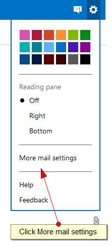
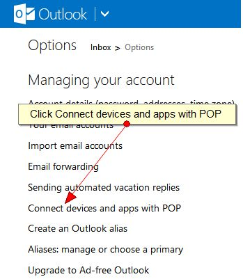
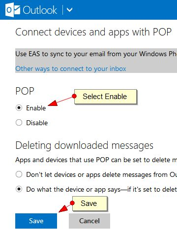
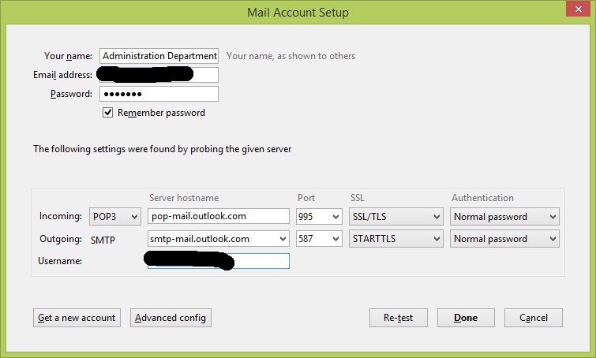

**Steps:**

1. Login to **outlook.com** to enable **POP3** mail downloads
2. Click on **Settings** and then **More mail settings**
    
    
3. Select **Connect devices and apps with POP**
    
    
4. Select **Enable** and click on **SAVE**
    
    
5. Now open **Thunderbird** and select **File**\->**New**\->**Existing Mail Account**
6. Fill in your **Name**, **Email address** and **Password** and click on **Continue**
7. Set the following settings to the details below: **INCOMING:** POP3**
    
    Server hostname**: pop-mail.outlook.com **Port**: 995 **SSL**: SSL/TLS **Authentication**: Normal password
    
    **OUTGOING: SMTP
    
    Server hostname**: smtp-mail.outlook.com **Port**: 587 **SSL**: STARTTLS **Authentication**: Normal password
    
    
8. Click on **Done**
