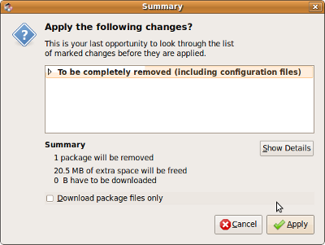

**STEP 1**

On the **Top Menu Bar** click on **System->Administration->Synaptic Package Manager**

**STEP 2**

Search for **Skype**

**STEP 3**

Click on the **checkbox** next to the **package skype** and click on **MARK FOR COMPLETE REMOVAL**

 

**STEP 4**

Click on **Apply** and a **Summary** **Window** will pop up. Click on **Apply** again.

 

**STEP 5**

The **uninstall** process should start by **Removing Skype** and **Applying Changes**.  Then **Skype** should be removed from Computer with operating system **Ubuntu**.

 

**NOTE**: This has been tested on **Ubuntu 9.04**
