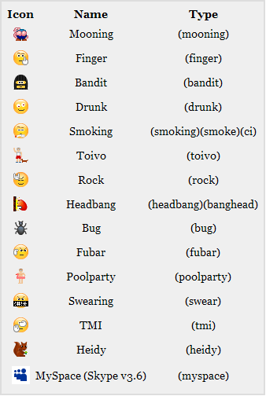

Did you know that  **Skype** has **hidden** **emoticons**? Below you'll find a list of **hidden****Skype** **emoticons**. In order to use these, open **Skype** type in _**(rock)**_ in the message writing box and hit the **enter** key, and the **Rock** **emoticon** will appear.

Have fun!!!

