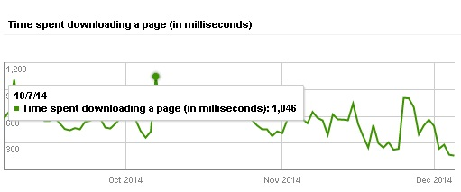
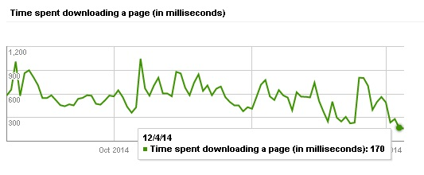

This month, i decided to switch hosting from \*\*\*\*\*\*\* to some other service. As there are many website hosting companies, i was confused to decide which one should I signup for. I was impressed with reviews on Hostgator, Inmotion, Bluehost and A2webhosting but I ended signing up for a small orange. ASO was suggested by some that folks have their blogs deployed on ASO servers. It has been a week since I moved my blog. I'm very satisfied with the performance of my new host. Here's **my review of a small orange hosting**.

## Plans and Pricing of a small orange hosting

**A small orange hosting plans** are cheap, in fact better than most of its competitors. The plans are categorized in 5 different types - tiny, small, medium, super and large) on the basis of bandwidth. I've signed for ASO small plan as it suits my requirements. If you website transfers more than 50GB of data every month then you should signup for medium, large or super hosting plan.

## Host unlimited domains

If you own multiple domains, you can use your existing hosting plan to run all of your sites provided that the bandwidth usage doesn't exceed the limit. The setup hardly takes a couple of minutes. **Asmallorange CPanel** comes with a useful tool to help you in this process.

## Fast and easy to use CPANEL

I was disappointed with the file manager and CPanel of my earlier web-hosting service and this was one of the major reason i decided to move to ASO. A small orange's CPanel doesn't take much time to load. The file manager is simple, quick to respond and is easy to use. It has buttons to upload, edit, move, copy, delete files.

## Faster page load times

My blog loads much faster ever since i starting using ASO hosting. The domain lookup, redirection and average server response times are lower than it used to be. Unlike many other hosting companies, a small orange has configured their servers with solid state drives (SSD) instead of traditional HDD. Thus, your blog will load fast. The CPANEL features a page speed optimizer tool.

If you haven't optimized your blog's HTML, CSS or JavaScript code, this utility can be of great use for you. The Page speed optimizer is easy to use and it will make your website load fast. For proof, please have a look at the below two screenshots.

The CPANEL features a page speed optimizer tool. If you haven't optimized your blog's HTML, CSS or JavaScript code, this utility can be of great use for you. The Page speed optimizer is easy to use and it will make your website load fast. For proof, please have a look at the below two screenshots.

In the 1st screenshot, you can see that Google got took 1 sec to download a page (before using a small orange). The 2nd screenshot clearly shows the difference. I started using a small orange hosting from 1st December onwards. Google now takes 150 to 180 seconds to download my website content.

## Inbuilt IP address blocker

If you want to block a bad bot or a user that is responsible for the invalid AdSense activity, you can use this tool to block its IP address. This utility will add or deny IP rules to your blog's htaccess file.

## Customer support

Customer support of my earlier host took 1 or 2 days to close open service tickets. The phone support was handled by a bunch of idiots that used Google to solve user queries. ASO customer support is great. When users log into their account, they'll find a live chat window at the bottom right corner of the webpage. Users can use this utility to get in touch directly with a small orange customer support. Your questions will be answered in real-time.

## Free analytics

When you'll log into a small orange CPanel, you'll find 2 of most widely used analytics tools - Webalizer and AWStats. You'll also find a utility that displays a log of 404 errors. Server related or 404 errors can affect your blog's performance in search results. Although there are Drupal, WordPress plugins to detect such errors or monitor website traffic, it would be a wise decision if you start using the preloaded CPANEL utilities to analyze website traffic.

## One click installation

If you want to setup content management system like WordPress, Drupal, Joomla, you can use the softaculous app installer tool from the CPANEL. With softaculous, you can also install popular frameworks like OpenCart, Magento, PHPBB, MyBB, SMF, etc.

**Signup for aso web-hosting here or use the 5EJ7E coupon code to save 15%.**

https://www.youtube.com/watch?v=sQoqhokXiIQ
