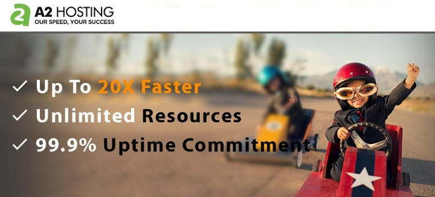

A2 is one of the top 10 hosting companies in the world. The company has been operating since 2001/2002 and it has launched several hosting plans for every budget. As of today, over 10K sites are hosted on A2 servers.

A2 offers cloud, VPS, dedicated and shared hosting service. Is it a reliable hosting firm? Are its plans affordable? Is its support staff customer friendly? Let's find it out!

## A2 hosting review

A2 is easy to get started with. Once you buy hosting from A2, you must log in to your account (CPanel or Plesk). CPanel and Plesk make website management easy for the users. You can install applications, backup up the data, install SSL certificate, see logs, manage databases, files, DNS with these 2 tools.

### Windows and Linux hosting

A2 servers are powered by Windows or Linux OS. Depending on the technology stack of your website, you can choose between Linux and Windows OS.

The A2 Windows hosting supports ASP.NET, MS SQL, Silverlight, etc. You don't have to log in to the server via SSH and type commands. A2 offers a Plesk control panel with which you can install and manage the Web and DB server.

The A2 Linux hosting platform provides a CPanel tool through which you can install and manage PHP, Apache, MySQL, Perl, Python, Node.JS, etc.

Also read: Bluehost hosting review

### Plans

A2 offers several hosting plans. As mentioned earlier, the company provides shared, reseller, VPS, dedicated, and cloud hosting services.

A2 has classified its shared hosting plans into three types - Lite, Swift, and Turbo. The Lite hosting plan supports 1 website and 5 databases. It costs $3.92/month.

**Difference between Swift and Turbo**

The Turbo plan gives users access to the A2 accelerator tool that boosts the page loading time significantly. It costs $9.3 per month.

The Swift plan doesn't support the A2 accelerator, but it offers more resources than the Lite plan. It will cost you $4.92 every month.

Each plan of A2 shared hosting provides unlimited storage space, bandwidth, free SSL, SSH. It also gives you access to the CPanel application.

A2 VPS hosting plans start at $5. The cheapest VPS plan provides 1 core processor, 512 megabytes RAM, 2 TB bandwidth, SSD and 20 GB storage memory.

The $10 plan offers a single core CPU, 1 GB RAM, 30 GB HDD, and 2 TB bandwidth. The $15 plan provides a four-core processor, 1 GB system memory and 50 GB storage memory.

Visit A2 hosting

### Server configuration and software

#### SSD

A2's servers employ SSD aka solid state drives. For those who don't know, SSDs are faster than mechanical hard disk drives. They use NAND based flash memory. Don't worry! The data won't be wiped off when you reboot the server. SSDs can write data to the chips at a blistering speed of 550 Mb/seconds.

#### PHP 7

Facebook HHVM was a great alternative to PHP until Zend Technologies/PHP development team introduced PHP 7.0. The latest version of the world's most popular scripting language delivers the same performance as HHVM.

#### Free SSL and SSH

SSH is a protocol that allows users to manage files, web or database servers from a remote location. If you have knowledge of Unix, you can manage the files on your server via SSH. A2 hosting allows users to install SSL certificate on their server with a single click. When you enable SSL for your site, the browser will display a green colored "https" text to the left of website URL in the address bar.

Visit A2 hosting

#### Supported applications

A2 hosting supports several popular applications. It provides a one-click installer for Drupal, WordPress, OpenCart, Joomla, Magento, etc.

Once you install an application and DB server, you can create a new DB and import the data from a backup file. If this a daunting task for you, create an "Account Migration" ticket and the support staff will move your website from the old server to A2 server.

### Data Centers

A2 Hosting enables users to chose the location of the server. As of now, the firm has a data center in the following countries.

1. USA
2. Asia
3. Europe

If the maximum visitors to your website are from the US, Canda, Brazil or the countries nearby it, you can deploy your site on a US server.

Likewise, if your website gets maximum traffic from India, UAE, Japan, Australia, Pakistan, Russia or New Zealand, you can launch your website on A2's Singapore server.

If most visitors to your website are from the Eurozone, make sure that you deploy your website on a Europe server.

Must see: Hostgator review

### Uptime

If a site is down for a few hours, your daily revenue will fall. If this happens daily, search engines will begin hating your site. A2 hosting promises an uptime of 99.9%. To make sure that your website is always up, the company has hired several skilled system admins that monitor the servers 24 x 7. If you're not able to access your website, contact the support team or see the status page of A2 Hosting. The page will display the issues A2 hosting users are currently facing.

### Support

A2 allows users to chat with the support staff in real-time. It lets users raise a support, billing and sales ticket. If you're not able to get in touch with the staff or if the support team hasn't replied to your email, you can dial A2 hosting support number and talk with the staff member. You can also contact A2 executives on Facebook or Twitter.

Visit A2 hosting

#### Conclusion:

A2 is one of the few hosting companies that you can trust. It offers many features for a great price. Its plans ship with a money back guarantee. Hence, if you're not satisfied with its service, you can request your money back. Although A2 has a few data centers, the company has a solid infrastructure to ensure that your sites are always serving the visitors and accessible to the search engines.
