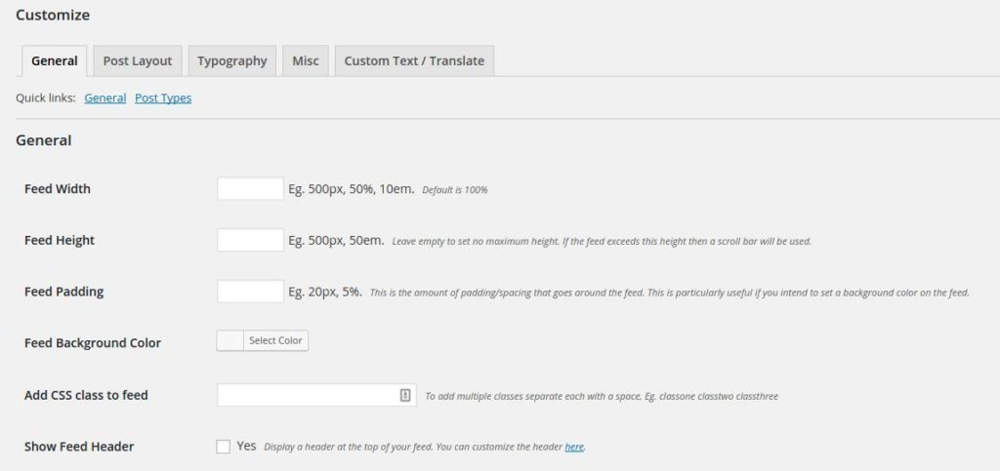
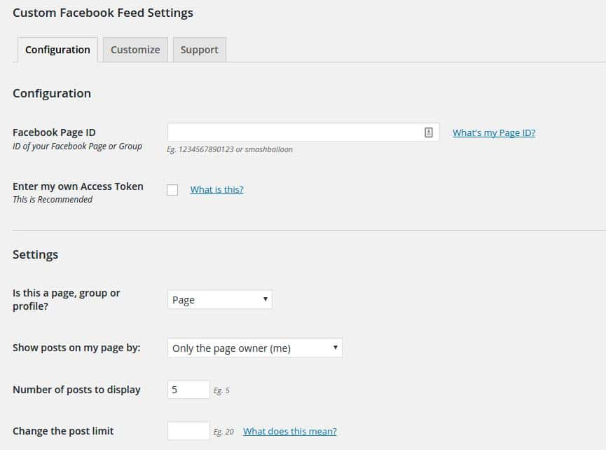

Facebook allows the webmasters to add the Facebook comment form, like box or the page feed to their websites.

In WordPress CMS, adding a comment form or the like box is easy, but inserting a page feed is usually a tricky task for a webmaster. Even if the user manages to add FB feed to the sidebar, he won't be able to customize it unless the user knows the working knowledge of CSS. In such cases, the user should use the free custom Facebook feed plugin.

When installed, the plugin adds to pages under its sidebar entry. The 1st page i.e. settings allow you to set up the Facebook feed and customize it.

The page has an option to enter the Facebook page ID. By default, the plugin will use its token to generate the Facebook feed. If you've created a Facebook app, you can use the app's token in this plugin.

Under settings, the user should select a page type (group, page or profile). He must also specify whose posts the page should display i.e. post from the owner or some other user. There's an option to limit the number of posts displayed at a given time.

In case your page is frequently updated, the custom Facebook feed plugin can be configured to refresh the list of posts in every 1 minute, hour or day. The plugin can generate a Facebook feed for a particular locale. It allows a user to specify a timezone.

As mentioned earlier, customization of a Facebook feed is possible with this plugin. In its customization page, the user will find five tabs, general, post layout, typography, misc and translate.

In the **General tab**, you can manage the width, height, padding, background color of the feed. If you want to use your custom CSS,  then add the CSS code to the style.css file and enter the class name in the class text field (in the General settings).

**The Post layout:** This is a premium feature in which you can choose one of these three feed layouts: Thumbnail, Half-Width, and Full-Width. The feed may include several details i.e., author name, post text, links, event title, etc. You can specify what details the customized Facebook feed should display.

**Typography:** In this section, the user can customize the feed header, post author text size/color, post text, link, photos, video description, post date, events, hyperlinks, date, etc.

Download the plugin here for your blog.

**Conclusion**: If you want to give your popular posts even a better exposure, install and configure the custom Facebook feed plugin in your WordPress blog. The plugin makes customization of FB page feed an easy task for a user. It doesn't matter whether the user is a newbie who's getting started with the WordPress CMS or an advanced user who knows PHP, WordPress and CSS every well. Anyone using WordPress CMS can add or customize an FB feed with this free plugin.
