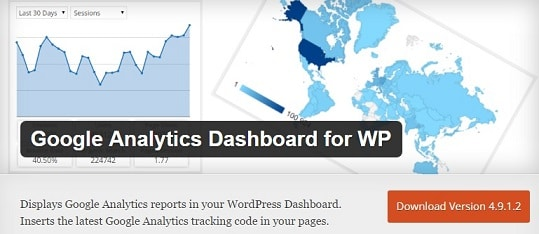

Google Analytics is one of the most valuable free tools for webmasters. With it, you can easily track traffic to your website.

Analytics makes you aware of many details like visitor source, average visit time, page views, website loading speed, device, operating system, the browser of the visitor and much more. It is easy to understand the tool. Even new bloggers or website owners will find it intuitive and easy to use. To start tracking the visitor behavior and traffic, the user has to install a tracking code to the header or footer section of their website.

Monitoring will start instantly, and data for generating various analytics reports will be collected every second.

Google has launched an Android app for Google Analytics. There's a dedicated, responsive website too.

Although analytics website is fast and it supports all browsers, some WordPress bloggers would like to see the tracking data on their dashboard. This is possible with the below two free plugins:

### Adding the Google Analytics dashboard to a WordPress blog

**GA by Yoast:**

This free plugin by Yoast is easy to install. Using it not a rocket science. It works if you confirm the ownership of the website by authenticating the google analytics account.

The plugin can add tracking code if you're not comfortable with editing the header and footer .php files of your WordPress theme.

The GA plugin from Yoast can track outbound link clicks. It cannot track Google Adsense clicks. It can make you aware of the current events and overall page views for the day, year or month.

If you don't want analytics to track your IP address, this plugin has an option to disable this. Users can easily enable demographics and interest reports in GA by Yoast. This plugin supports debugging with powerful tools like Mozilla Firebug, etc. \[download\]

**GA dashboard for WordPress**

This plugin makes you aware of the real time visitors to your website in the WordPress dashboard. It shares important details like bounce rate, page views, sessions, page visits and much more. GA Dashboard generates many types of useful reports.

The demographics report will let you know your website visitors country-wise. It will make the users aware of the popular posts on their website or blog. If you want to share your website statistics with other users (advertisers), just add the analytics widget in the sidebar or footer of the website.

You can link your AdSense account if you want to track performance and earnings of your individual pages of the site. If you're looking for an alternative to the above plugin, install GA dashboard. \[download link\]

**Conclusion**: Google Analytics is a powerful and a free tool that every webmaster should use. As there's a website to track the visitors and traffic data, you shouldn't add an analytics dashboard to your site because it may impact the page load time. For proof, install any one of the above plugins and test your site's performance with the free P3 Profile plugin.
