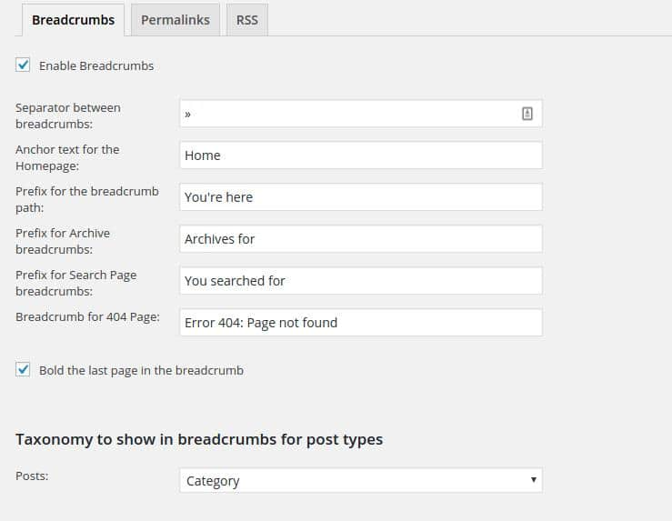
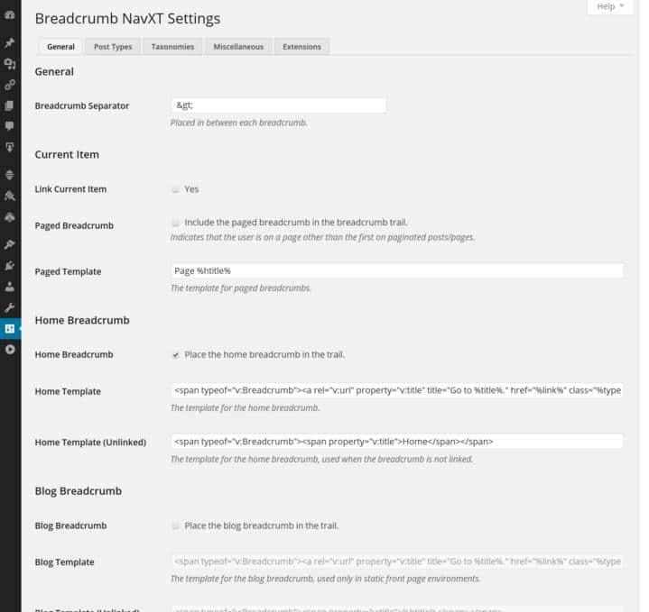

WordPress supports taxonomies. In the WP CMS (content management system), the user can create as many tags and categories as they want.

A category is different from a tag. It is used to build a menu. If you create a treemap of WordPress structure, then the categories will always be the child of index or root page. They make navigation easier for the search bots and the visitors. On a small blog or a website, the webmaster should create only a few of them.

Multi niche blogs or WordPress based e-commerce site will have a lot of categories. WordPress supports two types of menu, simple and drop-down. A Simple menu bar should have a limited number of items else it will look ugly. You can add as many items you want in the drop-down menu bars.

The problem with drop-down navigation bar is that if the user adds a lot of elements to it, the menu bar will look cluttered, and it will confuse the visitor. In such cases, the webmaster should implement a WordPress breadcrumbs navigation on their website.

Breadcrumbs will help search engines understand the structure of the site. It is advisable to use only of a big multi-niche blog or a shopping portal. If a webmaster is not using a premium theme, he can quickly **add breadcrumbs to WordPress blog with the below free plugins**:

**1) Yoast**

This free WordPress SEO plugin has an advanced section where you can enable or disable the breadcrumbs feature. If you enable breadcrumbs, Yoast will display options to customize the breadcrumbs.

The plugin allows you to specify a separator, anchor text, prefix for archive/search/404 pages, etc. It supports breadcrumbs based on category, tag and format taxonomies. Yoast will not insert the breadcrumbs code in the theme file. Users should manually edit the single.php file to add the code.

**2) The Seo Framework:**

This is a Yoast alternative SEO plugin that adds the breadcrumbs code in the <head> </head> section of your WordPress blog. The code is added to each and every post immediately after you activate the plugin. Unlike Yoast, you're not allowed to customize the breadcrumb.

**3) Breadcrumbs NavXT**

This is the best WordPress breadcrumbs navigation plugin. It offers more customization features than Yoast. NavXT creates schema.org standards compatible RDFa format breadcrumbs whose appearance and behavior can be easily managed through the settings page of this free plugin. NavXT can be used on WordPress websites powered by the bbPress forums. It supports WPML tool. Visit the WordPress directory to download this plugin.

**Bonus Tip**

Tags are the children of categories. They should be created wisely and only when needed. They can be responsible for duplicate content issues on a site. The SEO plugin should be configured to add a no-index robots archive to the tag pages for preventing this problem.

A Category page will be updated every time you publish a new post. Thus, allowing search engines to index them will only be good for your website.

**Conclusion**: The above plugins are free, and they can quickly generate Google and SEO friendly breadcrumbs code. If you have a large site, download, install and activate any one of the above plugins to increase the SEO score.
