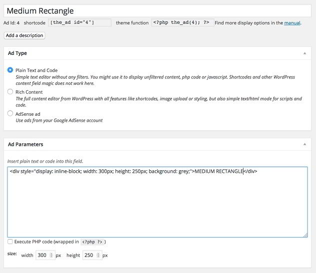
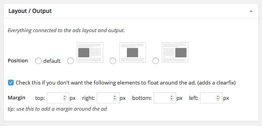
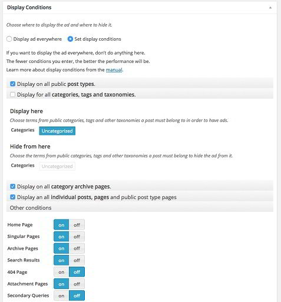

Yesterday, I felt the need to install a new third party plugin for inserting advertisements to my blog. My favorite plugin i.e. Quick Adsense has not been updated for over 1.5 years, and it has become unreliable because it has not been tested with latest WordPress versions. I searched the WordPress repository to find a reliable and frequently updated plugin for insert adverts. After a few minutes, I found Advanced ads. I was tempted to try out the plugin after going through its ratings and reviews shared by the real users.

The plugin is easy to configure. All you have to do is create the advertisement tool and select ad type. There are three options to select i.e., Plain text and code, Rich content and Adsense. In the parameters section, the user has to paste the code provided by the advertisement network.

Now the user has to select display position, i.e., left, center, right or default and set the margins as desired. Advanced ads plugin can be configured to display adverts on all posts and pages. It allows you to prevent posting ads on 404, archive, singular, search and attachment pages. This is a compelling option because displaying Adsense units on useless pages is against their terms and conditions. The plugin can block posting ads on specific categories that you select.

You can insert ads after n paragraphs or any headlines in your post. The plugin is compatible with Chitika and affiliate programs like Amazon. For smarter delivery of advertisements, there's an option to generate and insert the shortcode. If you know the most clicked and seen area on your website, you can increase your revenue and earnings by placing ads on it.

The users can set an expiry time for individual ad units. They can easily categorize the units in groups. If you're using a forum plugin like BBpress, Advanced ads for WordPress features an option to turn off ads for logged in users. The plugin can also hide ads from visitors browsing your site from a mobile device or using a particular browser.

If you think ad blockers are impacting your revenue, the plugin has a utility to force the browser to display ads.

AA plugin comes with powerful features for Adsense. It supports page-level ads. If you want the website to show specific ad units on different screen sizes, there's a responsive ads add-on available for the plugin. The add-on costs 19 dollars.

Download link for WordPress blogs and websites.

I've already compiled the list of best Adsense plugins for WordPress. Should we add advanced Ads to the list? What do you think?
