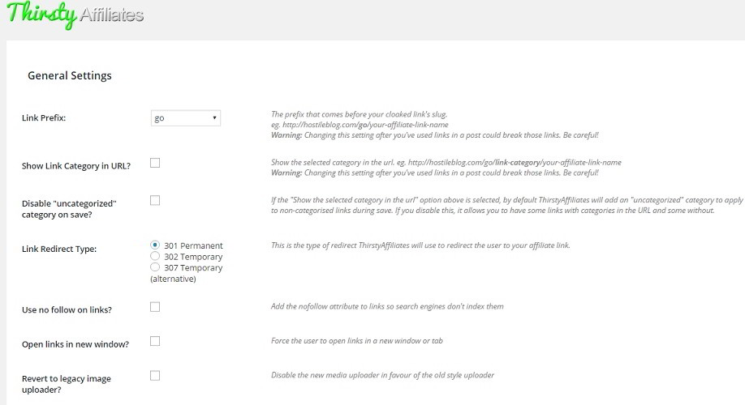
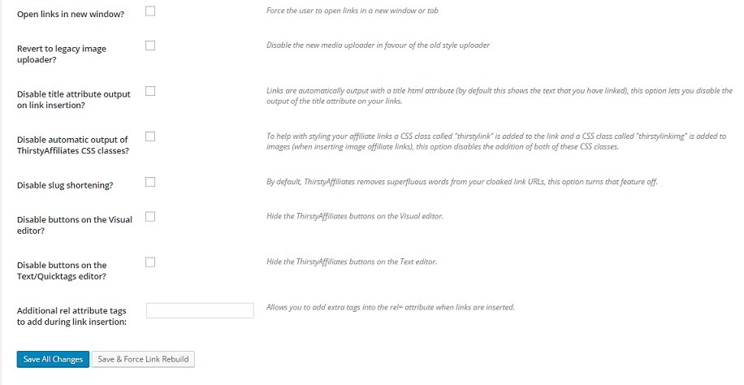
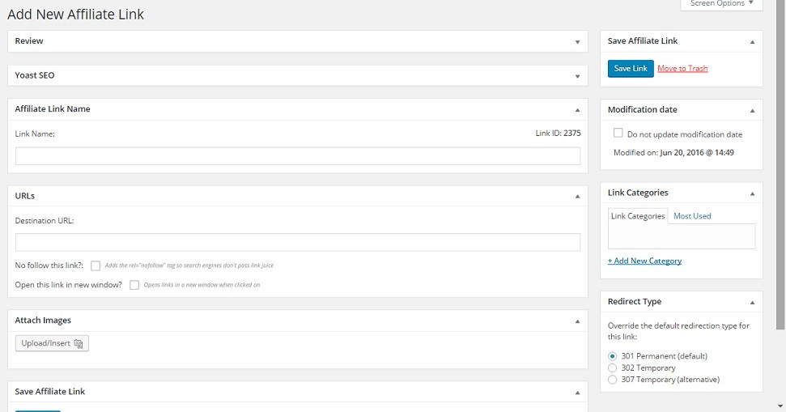

Affiliate links are ugly and long. When the user hovers your mouse on an affiliate link and finds your tracking code in the URL, he may not click the link.

If you're not a seasoned webmaster, you should use a plugin to create and manage affiliate links.

GoCodes was one of the best affiliate link Cloaker plugins. I was using it until I update the PHP on my VPS server. Unfortunately, the plugin has become useless because it has not been updated for 2 years. GoCodes will not work on sites using the latest version of PHP because several functions that GoCodes uses have been deprecated.

I've replaced GoCodes with the thirsty affiliates plugin.

Thirsty affiliate plugin has a detailed settings page where you can specify a link prefix of your choice. The prefix is nothing but a small word which should be in the cloaked affiliate link. Once you define the prefix, update your website's robots.txt file with the below rule:

`Disallow: /prefix_name/` Relace prefix\_name with the one you've defined in the thirst affiliates plugin settings page.

The plugin allows you to use 301, 307 or 302 redirects in the aff links. It has the option to insert current category of the blog post in the cloaked URL. The plugin can be configured to open the external affiliate URLs in a new window. It can make the links Nofollow too.

By default, the thirsty affiliates plugin will add buttons to quickly insert cloaked URLs in the visual post editor. It also removes unwanted words from the links to make them look clean. If you don't want to use these two features, thirsty affiliates plugin lets you disable them from its settings page.

The plugin lets users enter additional rel HTML attributes to their cloaked links. To use this feature, the user must enter the custom attributes in the additional rel attribute tabs textbox.

Once you've saved the settings, navigate to the All Affiliate Links page to get started. This page will display a list of all the affiliate links you've created with this plugin. It displays the ID, title, target, category, publish date of each link. If you're a first time, the list will be empty.

To add a link, click on the add new button. Now you'll see a page which asks you to enter a link name and destination URL. Enter the name of your aff link in the 1st text box and the target URL in the 2nd box. Now click on the save button. Your new affiliate link will be saved. Note down the link so that you can easily use it in your blog posts.

The above features are exclusive to the free version of Thirst Affiliates plugin. The pro version of TA offers the below exciting features:

Autolinker: When enabled, this add-on will automatically insert the cloaked affiliate links in all your blog posts. This feature will save your time and it will increase your blog's revenue.

Stats: With this add-on, users can get information on how many links are being clicked everyday. The stats module is smart. It will automatically filter the link hits from search engine bots and logged in users.

Azon: If you're using Amazon Associates program to monetize your website, the Azon add-on of thirsty-affiliates will be of great use for you. This add-on will help you in searching a relevant product on amazon so that you can quickly get its affiliate link for inserting in the blog post.

CSV import: This add-on lets you import affiliate URLs saved in CSV file to the plugin's database table.

Other features are as follows:

- Blogger pack.
- Gren Ninja Bundle.
- The lot.
- Google Click tracking.
- GeoLocations.
- HTAccess.

For complete information on the above features, please visit the official page of the thirsty affiliates plugin.
