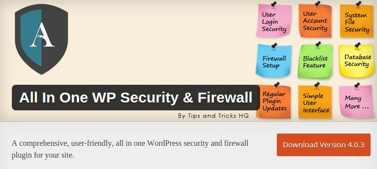
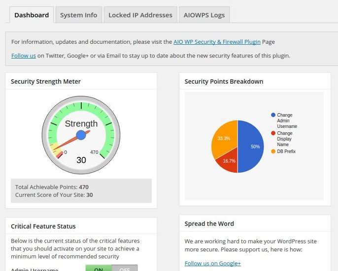
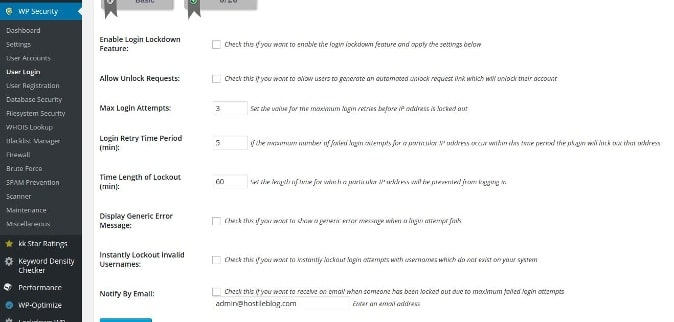
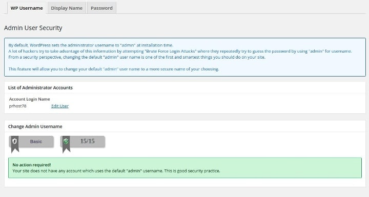
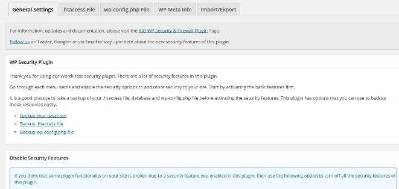

WordPress is claimed to be one of the most secure content management systems of the decade, but you need to take some precautions while using it.

The login page is accessible to everyone using the Internet. To access the page, the user has to enter example.com/wp-login.php simply. If you're using a weak password, then a software or a bot can easily hack your website.

Some hackers will target your site with a DOS or DDOS attack. If your hosting provider has not set up a firewall for your account, your website and web server will be down. If the site has many visitors, you'll lose some revenue. If the access to the wp-config file is not restricted, the hacker will get your database name and its password.

Some plugins have security flaws, and if you use such plugin, the hacker will quickly gain access to your WordPress database. For the safety of your WordPress blog, forum or your precious website, you should install a security plugin.

 

Today, we'll try our best to make you guys aware of the free all in one security and firewall plugin for WordPress. According to its official page on WordPress.org, AIOSF has been developed by WordPress experts. Though it's a security plugin, the user will find it easy to use on their websites.

All in One Security and firewall plugin has more than 15 powerful security features. It detects and removes the default WordPress admin user so that the wp-login.php page will return an error when someone tries to log in as an admin user. The plugin makes sure that the user enters a secure password. It also ensures that no two or more users have the same username.

When a visitor to your blog tries to log in to your website dashboard repeatedly, the AIOSF features an option to lock down the user's IP Address automatically.

If a DDOS attack is live on your site, there's a robust option of blocking a range of IP Addresses. The plugin makes webmasters aware of the date on which a failed login attempt was made. If you have a multi-author or a member registration website, you can easily find out which users are currently logged into your site.

If you don't want a user to stay logged in for a specific time duration, you can force him out with the All in one security. The plugin has a function for disabling modification of PHP codes from the WordPress dashboard. If you know how an IP that is trying to destroy your website, you can block it easily in the All in One Security and Firewall for WordPress.

The plugin comes with a smart code scanner that will analyse each and every line of PHP code of the theme and plugins to find malicious lines. Spam can run your blog. All in One security can block all types of spam comments as it adds a captcha module in the visitor comments form.

Right-click on WordPress posts and pages can be easily disabled via AIOSF. If a user is trying to link his website to yours using the comment form, you can get his details with the inbuilt who is information tool. You can secure your htaccess file from the WordPress dashboard. Users can create a backup of your websites with this free security plugin.

The plugin comes with a lot more exciting and robust security features. Thus, you should download it from the WordPress.org site.
