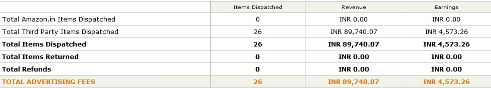

Warren buffet says that you should not depend on a single source of income. This statement from the US-based Billionaire and one of the richest man in the world is brilliant and it makes sense in many ways. If you’re a blogger, go through the below article to know why the statement from Warren Buffet is excellent.

There are many online sources that can generate revenue from a blog. Google AdSense is at the top. If you own a technology blog, you can start earning money by registering an affiliate account with eCommerce sites. Most of these sites will accept you into their affiliate program in a couple of days. But to achieve success with them, you'll have to follow some genuine tips. This article will reveal tips that I follow. I'm using amazon, Flipkart and SnapDeal affiliate links on one of my site along with Adsense. Thus, I make a fair income working from the comfort of my home. Amazon is the best affiliate network for technology niche blogs. It has the highest commission rates. It was initially difficult for me to make money with the affiliate networks as I was a newbie or a beginner. But now, I'm happy with my earnings. Anyways, here are the tips that you should follow. Please note that you use the below tips for any affiliate network.

**Use hyperlinks instead of banners**: Amazon associates affiliate program started generated a decent income for me once i ditched the banner images and started using the direct affiliate links. I used keywords like the top, best, buy, check in the anchor text for links. For example, if I'm trying to promote Playstation 4 through my blog, I'll use the anchor text as Buy PS4 here.

**Write quality articles**: If you're serious about amazon affiliate program, make sure that you write and publish very high-quality content. If your article has 1000+ words and it features low competition keywords, your site will rank high in search engines. Thus, you'll start earning money with amazon associates.

**Don't stuff your article with affiliate links**: Some blogs were penalized by Google panda update for having too many affiliate links on a single page. Add an amazon affiliate link only if your content has at least 300 words.

**Use No-Follow attribute**: To keep your blog safe from Google penguin or panda penalty, use the rel="nofollow" attribute for every affiliate link. If you've already added tons of affiliate links, you can use the search and replace plugin to add the attribute to each link within 1 or 2 minutes.

**Experiment with link colors**: Color plays a very important role in our lives. We choose clothes on the basis of colors. In blogging, your bounce rates can reduce and affiliate commissions can increase if you experiment with link colors. The conversion rate on my tech blog increased after I change the hyperlink color from red to blue. You can try out the same.

I hope that you've found these tips useful.
