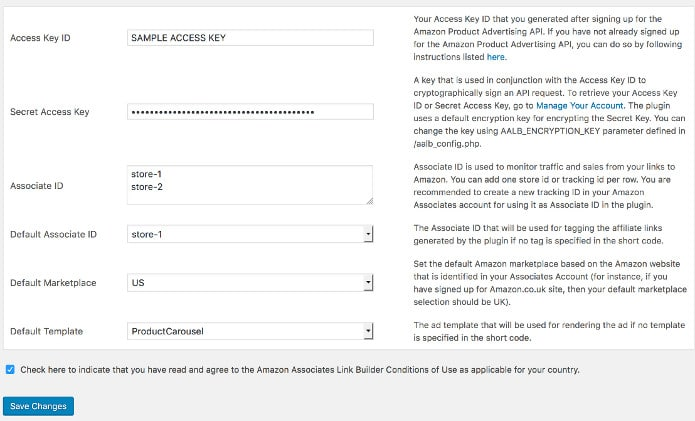

Amazon is one of the world's most popular affiliate program. Until December 2016, the user had to place affiliate URLs manually in the blog post.

The manual method of inserting affiliate URLs in the blog post is cumbersome. The user should first create affiliate link using the Amazon Site Stripe tool or with the AA dashboard. Then, they must use the WordPess post editor to insert the affiliate URL.

Amazon, for the first time, has introduced a WordPress plugin that lets users find products on Amazon and create affiliate links for them from the WordPress dashboard.

The Beta version of Amazon's WordPress plugin was launched last month. The plugin is intuitive and has several interesting features.

### Link builder plugin overview

The plugin adds a settings page where you must enter the access key ID, secret access key, associates ID, and select a marketplace and a default template for the Ad.

The access key ID should be generated by the user. To do so, the user must sign up for the Amazon Product advertising API. The eCommerce giant provides free access to the API.

Once you get API access, you can easily generate the secret access key.

The Amazon associates ID is not but the Associate tag ID. You can find your tag ID or generate a new one from the dashboard of your affiliate account.

Once you enter the correct details about your account in the settings page of the plugin, the Associate's plugin will add a special search box to the post editor.

To find a product, you must enter its name in the box. Then, you must click on the yellow colored search button. Once you do so, the relevant products will be displayed on the screen. You must select the product you want to insert in the blog post.

In addition to the search box, the Amazon Associates link builder enables users to create shortcodes for the selected products.

The plugin lets users create responsive Ad units as well. It has the option to create a beautiful carousel of products or display products in a grid interface.

Download the plugin here.

### Final thoughts

The official affiliate link builder plugin launched by Amazon is pretty good. It is in beta stage. Hence, we expect the plugin to have plenty of features when its newer versions are rolled out.

The plugin is easy to set up and it makes easier for the WordPress user to create affiliate URLs. The biggest advantage of the plugin is that you don't have to log into the Associate's account or visit Amazon to create affiliate links. If you're addicted to seeing your Amazon affiliate sales reports, you won't be able to stop yourself from accessing the dashboard.
