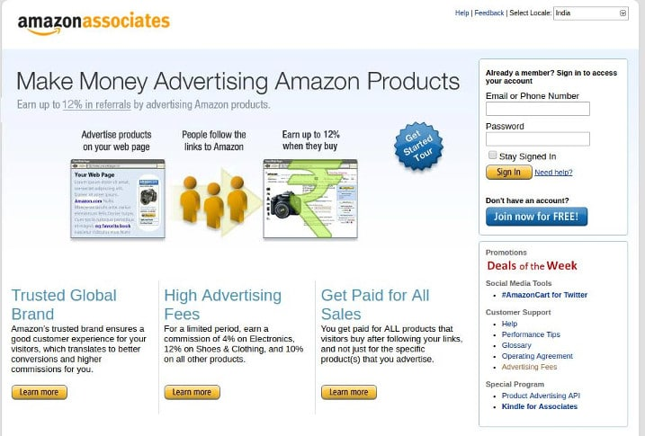
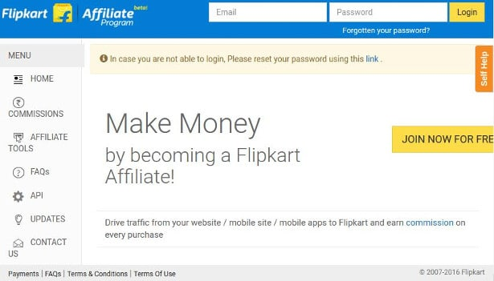

Affiliate programs from e-commerce portals are the best way to earn money online in India. If you have a website with decent traffic and a bank account, you can quickly join them.

I'm one of the 1000s of affiliate marketers who are earning decent money with e-commerce based affiliate programs. I've signed up with Amazon, Snapdeal, and Flipkart.

Amazon is the biggest online retailer, and its affiliate program is active in every country it operates.

The Amazon Associates affiliate program has excellent commission rates. For every sale you deliver, you'll get a handsome 3 to 12 percent commission. The best thing about this affiliate network is transparency. Users can get information on what products have been ordered.

For me, Amazon has a better conversion rate. Users who buy from this website will hardly return a product.

In Amazon Associates, you can generate an affiliate link from any page of the site. You can promote any product you like.

The earning's dashboard is updated once a day. I don't know the exact time, but the panel is updated early in the morning.

The dashboard allows you to access the earnings, orders, link-type reports and daily trends.

Like Amazon, Flipkart has excellent commission rates. Apart from the commission, it also pays you Rs 40 to 60 when a visitor installs the Flipkart app on their phones. In its dashboard, you'll find a tool to generate an affiliate link for the product as well as for the app.

The order report is confusing. Unlike Amazon Associates, you cannot get details on pending orders.

The earning's dashboard in Flipkart is updated as soon as a Flipkart executive has approved a sale.

If Flipkart and Amazon executives find that you're not following their terms and conditions, they'll ban you from the affiliate program.

My website sends more traffic to Flipkart than Amazon because some products are Flipkart exclusive. To earn commission from it, I've no other option than adding its affiliate link on my website.

For me, the conversion rate on Flipkart is much lower than that on Amazon. This happens because of the customer returning a product. If a product is not returned, my affiliate earnings from Flipkart will be more than that from the Amazon Associates program.

Snapdeal is yet another portal from which you can earn money online in India. Commission rates on this site are very small. Thus, many of you may think of staying away from it. There are some Snapdeal exclusive products. If your blog post is about information on such products, you can add Snapdeal affiliate link to earn an extra income.

People buy products online only from a trusted source. Amazon is a world-renowned brand, and it delivers excellent services.

Flipkart on another hand, is known to be the biggest e-commerce player in India. When the same product has been listed on Amazon, Flipkart, SnapDeal, Shopclues, Infibean or Naaptol, it is very likely a customer will buy the product from either Amazon, Snapdeal or Flipkart. Thus you join one of these networks and start earning additional income from your website.
