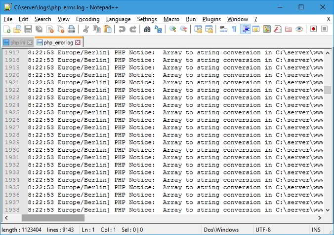

A log file generated by a web/database server is one of the most important files. It contains useful information on visitors, errors, warnings, etc. Some people think log files as server resource killer. Hence, they disable them in Apache, DB or NGINX configuration file. One more reason why people disable or ignore server logs is because the content of logs is difficult to understand. Hence, most noob webmasters use a log file analyzer program to check server logs.

A log file created/updated by Apache, Nginx or any other server may have millions of records depending on the traffic your site gets. The best way to analyze log file content is to create smaller log files and use basic Unix commands to check its content.

Here's what I do for creating a smaller error or access log file for monitoring visitor activity, checking errors, etc.

### Create a new log file

Unlike Windows OS, Unix-based operating systems provide powerful command through which you can automate or perform various tasks. One of my favorite UNIX commands is GREP. Grep is one of the most widely used commands.

Open Linux terminal and go to the folder where the server has saved the log file. Use Grep to shortlist content in the NGINX or Apache raw access log or error logs. For example, if I want to get details or all URLs with two words and a separator Ex. hello-world, I'll fire the below command in the terminal

`grep "hello-world" access.log > hw.log   `  
The above create will create a new log file with the name hw and all information that grep command has found.

You can use the above command for various purposes. Example:

- Check which IPs want to get access to your CMS dashboard i.e. admin or login page.
- Find a specific IP address, device, OS, date, etc

### Analyze the pattern

Use tail command to check the content of the log file which may have the following information:

- Device information.
- Operating system.
- IP address, and more.

You must use the tail Unix command to check the Nginx or Apace LOG format.

An error log file will have information about the error caused while processing a server side script. Use Chrome's inbuilt developer tools to find JS, CSS, errors. You must also check the /var/log directory.

If the new log file has few records, It is easy to find an IP address trying to kill your site. If there are plenty of entries in the file, use GREP command to find the IP. The powerful GREP utility of Unix/Linux also helps us in finding a particular error.

**Conclusion**: As I use third-party advertisement networks to monetize my website, LFs help me in tracking invalid clicks. I check LF every day to monitor my site's health. If you're ignoring server logs, you're committing a big mistake. Use the methods I've shared above to get started with the log files.
