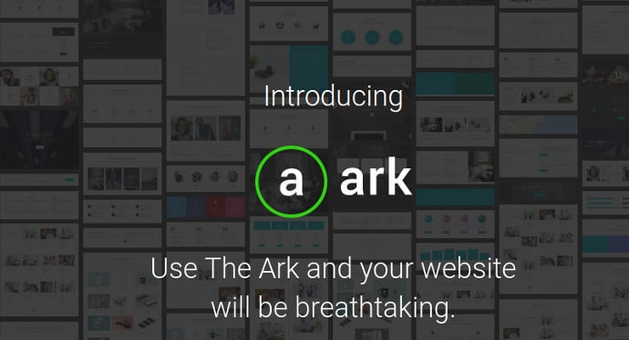
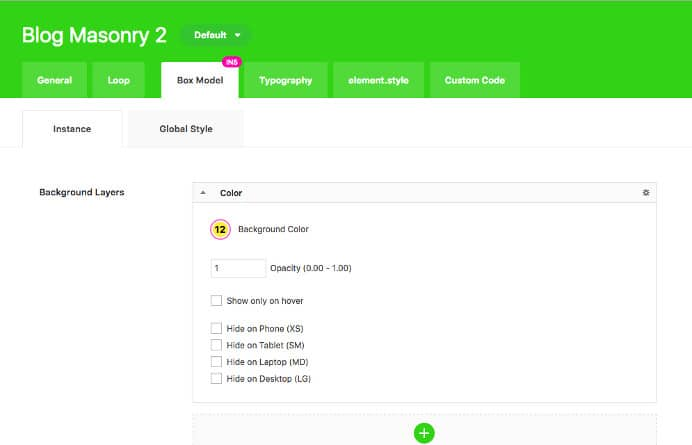
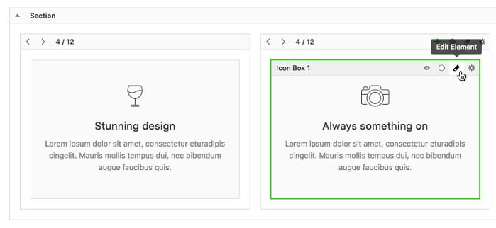

The Ark theme for WordPress was introduced on Themeforest marketplace in December 2016. Within a month of its launch, Ark has registered 1000+ downloads. It has an excellent rating of 5 from 50+ users. The theme has 200+ customizable elements and 1000+ customization options.

Ark was declared the top-selling WordPress theme last month. It has become a popular item on ThemeForest within a month of its launch is because FreshLance (developer) is selling the powerful feature rich Ark template for an unbelievable price of $29.

You might be wondering why the developer has priced the feature packed theme below $30. Well, $29 is the introductory price. After few weeks, the price of Ark theme will be $78.

Buy Ark for $29 from ThemeForest (75% off).

### Review

The Ark WordPress theme comes with over 290 demo pages. As the theme is customizable you can adapt the theme as per your requirements.

The template is powerful and you can launch over 100 types of websites with it. The theme is ideal for WP based e-commerce portals, personal website, and business site for restaurants, gyms, grocery or electronics store, clinics, dentists, hair salon, spa, construction, etc.

See the demo here.

### Heavy customization and amazing design

Ark WP theme comes with 199+ unique sections and elements which you can quickly customize. Some of the sections are as follows:

- Contact, About us pages.
- Banner, Charts, sections, Portfolio, testimonial.
- Business opening hours, Address widget, Google Maps.
- Icons, process.
- Service section, and more.

Like the Elegant Divi Theme 3.0, Ark allows users to add elements of their choice to their sites with a single click.

As the Ark template provides several essential modules, you won't have to kill time in finding a WordPress plugin which adds new features to your WP website. Unlike other multi-purpose WP templates, ARK supports context menus. You can right-click on an element and choose customization option of your choice.

The Ark WordPress theme supports integration with WooCommerce and WPML plugins. According to its developers, ARK is compatible with most of the WordPress plugins which include WordPress SEO by Yoast, WP Super Cache, MailChimp, Revolution slider, etc.

ARK theme offers multi-level menu bar that comes integrated with a search box.

Ark is a fast theme. When you test the demo pages with website speed checker tools, you won't see "reduce server response time" warning. This means the code is clean and error free.

For the proof, open the Google Chrome Developer tool and load any page of the Ark WordPress theme. Chrome will not report any error for the Ark template.

Download Ark WP theme here.

### Header, footer, and sidebar

The ARK theme for WordPress is SEO friendly. It lets users enable or disable breadcrumbs with a single click of button/mouse. It has eight great footer designs which you can customize.

The template provides an option to align the menu bar at left, right or center of the header area.

Like the ThemeForest TagDiv Newspaper template, Ark supports unlimited sidebars. For each category, you can define a unique sidebar.

The theme offers responsive design. It is mobile friendly and supports typography customization. If you're using ARK theme, you can easily change fonts of various elements on your website.

ARK theme includes 3000+ free icons of HD quality, 9+ types of customizable buttons.

It includes an option to hide a specific element on a mobile device such os smartphone, tablet, and desktops.

We have mentioned earlier that Ark theme offers portfolio section. The template enables you to use one of the following three portfolio designs:

- Slider.
- Grid.
- Masonry.

The responsive theme features form builder tool with which you can build powerful forms of various types. You can create as many forms as you want.

Ark WordPress theme supports customization without a mouse. It supports keyboard shortcuts.

### Updates

The theme is new. Developers are updating it on regular basis.

Purchase the ARK template here for just $29 (limited time offer).
