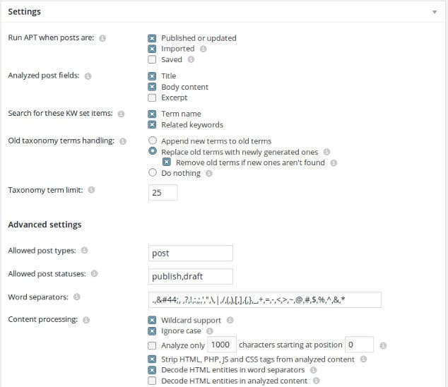

WordPress tags are important, no matter how small or large a site is. Tags allow users to group posts. They make website navigation easier. They allow search engines to discover and index new posts quickly. WordPress Related posts plugins use tags to calculate post relevancy and display related articles below blog posts.

Human beings make mistakes. Sometimes, a webmaster may delete an important tag unintentionally. Once a tag is removed, the structure of the related post on your site may change. If you have a small blog with 10 to 20 posts, readding tags manually shouldn't be a problem. If you own a large site, readding tags to posts is an annoying task. The best way to add tags to blog posts is to use Automatic Post Tagger WordPress plugin.

### How to tag WP posts automatically?

APT is a powerful plugin for tagging posts. You can configure this plugin to tag WordPress post immediately after the post is published or updated.

The plugin analyzes the post title and body to accomplish the task of tagging. To tag WP post, you must first specify the tags you want the plugin to generate. If you want to create many tags, enter the keywords in one column of a spreadsheet and save the spreadsheet as a CSV file. Now, use the import CSV option of APT. Don't worry if your list contains duplicate keywords. The plugin will remove old terms with the same new with the new one.

Once you enter the tags, scroll down and set the number of posts you want the plugin to process at a time and time the plugin should wait for processing the next batch of posts. If your site is hosted on a shared hosting platform, you should set this value to below 10 to avoid warnings from the hosting provider. If you're using an unmanaged VPS, you can set the value to 20+. Once you do so, click on the "Process posts now" button. When you do so, APT will run a task and will display the progress for the same.

APT has many features. It allows users to export/import the plugin settings. It has the option to schedule bulk tagging tasks. The plugin enables users to create configuration groups. It works like a charm with various popular plugins. APT can process text content with UTF-8 and Non-English characters.

\[themify\_button bgcolor="red" link="https://wordpress.org/plugins/automatic-post-tagger/" target="\_blank"\]Download the plugin\[/themify\_button\]

**Conclusion**: Automatic Post Tagger is a great plugin to tag few or several posts automatically. It has several interesting features. It works well on large sites.
