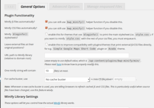
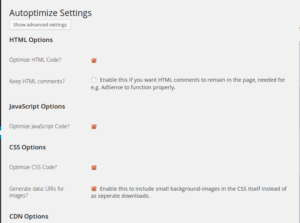

Page load times of WordPress CMS powered blogs can decrease if webmasters start using a caching plugin. The two most widely used plugins for caching are W3TC and WordPress super cache. These 2 plugins create static HTML files from all of your blog posts and it saves these files to the cache folder on a disk.

WordPress saves blog posts in database tables. When a search engine or a visitor requests it via permalink, WordPress loads the post from the database and it renders it as an HTML file.

WP Caching system automates this task and it adds expiry times to the files it caches. Thus instead of firing an SQL query, the caching plugin makes WordPress load your blog posts from the disk. W3TC is pretty good but its CSS and JSS minification can break the site.

Minification can save bandwidth. Thus, it's a must use features for webmasters who own self-hosted blogs. Anyways, W3TC is an excellent plugin whose minification feature works on some themes and breaks the layout of other sites.

WordPress super cache doesn't support the minification feature and its caching system is pretty solid. If W3TC breaks your site or of you want to use minification with WP-super cache, you can use **Autoptimize or better WordPress Minify plugins**.

## Better WordPress minify

This is a good plugin to minify CSS and JS files of your site. It allows you to add or exclude files that you don't want to be minified. Better WP Minify can save the compressed files to any folder of your choice.

The plugin allows you to set the cache age. You can use this plugin to save minified static content to the CDN. If you don't configure this plugin correctly, it will minify the files that build the WordPress dashboard (wp-admin). I've faced this problem on my site. Thus, I've stopped using this plugin.

## Autoptimize

Frankly speaking, this is a better plugin than Better WP Minify. When you open its setting page, Autoptimize will display 5 checkboxes to minify HTML, CSS, JS files, create CSS image sprites, preserve HTML comments.

To save bandwidth and improve page loading speed (check it here on Google page speed insights), all you have to do its tick mark all the checkboxes and click on the save button.

Autoptimize comes with advanced options that allow you to:

- Change the place of the compressed files in the HTML code from header to footer or vice versa.
- Add scripts that you don't want to be compressed.
- Inline CSS code.
- Ignore all the files in the head section of the HTML, etc

Have you used Better WordPress Minify or Autoptimze on your WordPress site? If yes then please share your review on the plugin with us.
