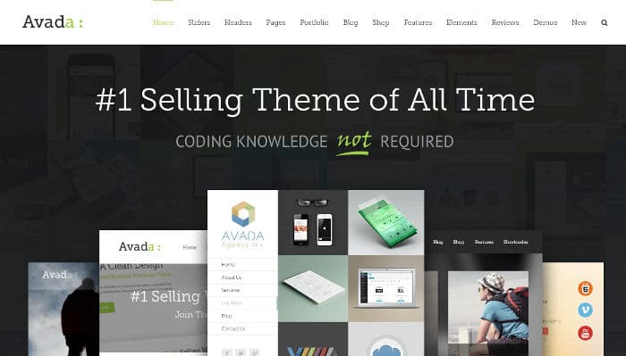
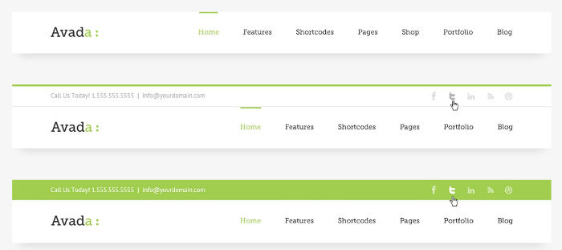
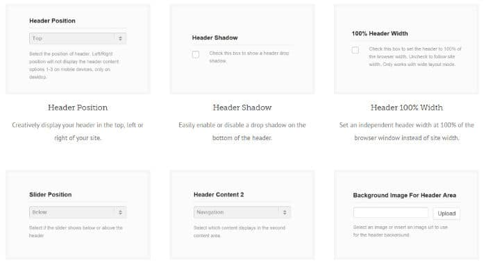
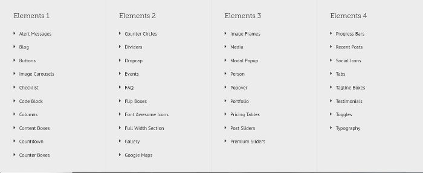
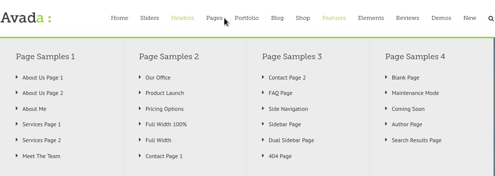
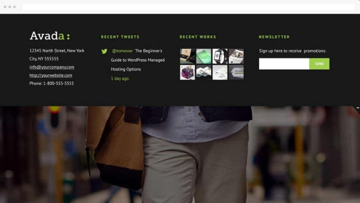

Avada is a top-rated premium WP theme, which you can download from ThemeForest marketplace. There are plenty of free themes that haven't surpassed 1000 downloads. Interestingly, Avada has 300K+ users. It is not only best-selling WordPress theme on the ThemeForest market place but also the most popular premium WP template. Themeforest is a marketplace where developers across from various parts of the world publish their products. As the ratings and reviews are not in control of theme and plugin developers, you can consider ThemeForest as a transparent marketplace.

Avada has an impressive rating of 4.77. It has been rated by 180000+ users. Avada theme hit the ThemeForest marketplace in 2012. It consistently ranks at #1 position on the list of top-selling themes of the week, month and year on Themeforest. If you'll see its changelog section, you'll find that Avada has been updated on regular basis.

Avada 5.2 is the latest release and it is a killer theme. Flexibility and numerous customization options make Avada a special theme. You can use this premium WP template on any type of site.

## Avada WordPress theme review

Avada template from Theme Fusion is easy to install and customize. It has 100+ customization options and a superb design. Here are the various features and options of the Avada theme:

### Demo Importer

According to its developer, Avada has the best demo importer utility among premium themes. While importing demo, you'll see options to activate plugins that you want to use. The importer also provides an option to import post content, images, FAQs, portfolio, etc. Demo importers of many premium plugins import content, menus, forms, etc. They also enable plugins which can kill your site's SEO. This can create problems on a large site. If you're using Avada, you don't have to worry about irrelevant content issues, SEO and images.

See theme demo

### Layouts and design

Because of its flexible design, Avada can be modeled into various sites. You can use Avada on a niche site focussed on only one topic, business portal, blog, personal site, etc. If you're a developer, you can use Avada to promote your product.

To make sure that your site looks different from other sites powered by Avada, you can customize the theme as per your requirements. Avada has one of the most sophisticated theme customization panel through which you can choose a header style, change colors, fonts, logo, post/page layouts, footer layouts, etc. Avada enables you to create and manage online portfolios. It lets you set background color or picture.

The Avada theme allows you to set a layout for the home page. You can customize the home page. Avada supports boxed and wide layouts. Most premium themes provide limited customization options. Such themes don't have the option to change padding and height of HTML elements. To customize HTML elements, the developer or support staff of the themes will ask you to hire a freelancer.

If you're an Avada theme user, you don't have to contact freelancers. Avada theme has a wide range of customization options. You can specify padding, height, menu bar width, etc in the theme settings panel.

 

Avada provides 7 unique header styles. It supports three header positions - top, left, and right. Avada is one of the few themes that supports 6 column footer layout. Below the footer section, Avada features a copyright area where you can add a text block, hyperlinks, etc. Users can customize the color, font of this section.

Download the theme

### Creating pages with the Avada Builder

Apart from the default pages and layouts, Avada theme ships with a powerful page builder utility called Fusion Builder. You can create attractive pages embedded with buttons, content boxes, text blocks, separators with the Avada page builder. The builder tool provides pre-defined layouts. You can edit the existing layouts with it.

Fusion Builder is a versatile tool. You can drag and drop the supported HTML elements anywhere on a page. FB saves your time and lets you edit the Theme demos.

Fusion Builder allows you to change the name of HTML elements. Like Visual Composer, it gives you access to many elements. As of today, FB has 50 elements. You can generate a shortcode for each element. To let users find the elements faster, the builder tool ships with a search tool.

Also see: Elegant Themes Review

### Posts, menus, pages

The Avada theme allows you to create powerful post sliders. It enables you to set a custom size for featured images. The theme generates thumbnails automatically when you upload images. You can set the number of posts you want to see on a page. The Avada WP template provides advanced sorting options. It generates SEO friendly pagination system automatically. It lets you reorder posts.

Avada supports Font Awesome icon library. Hence, you can add cool icons to the menu bar, boxes, buttons, etc. The theme provides an option to filter icons by shape and size.

Must read: Best Newspaper WordPress themes

Avada lets you enable 5 level mega menu on your site. You can also add widgets to your Avada theme powered website. You can create unlimited sidebars if you use this theme.

See the demo

### Widget

Avada theme includes several customized widgets. It ships with a tabbed widget that displays the recent, popular posts and comments. The theme provides social network icon, Flickr, Facebook page widgets.

### SEO

Avada is an SEO friendly premium WordPress theme. It has a clean code based on the latest HTML standards. Hence, search engines won't find it difficult to crawl, understand and index the web pages of your site. Avada is compatible with the Yoast SEO plugin. Other supported plugins are W3TC, Contact Form 7, BuddyPress, JetPack, NexGen gallery, etc.

### Avada theme support and updates

The theme has a great documentation. If you don't understand a theme feature or if you're having a difficult time in customzing your site, you can get help from the Avada theme support forum.

Before posting your question, you must use the forum's search option. Most of the time, users post the same question and wait for the support staff to post a reply. If the question has been asked and answered before, you must refer the answer to get your problem solved.

Avada theme users enjoy lifetime updates. You have to buy a license only one time. You won't be asked to renew the license to update the theme.

Buy Avada theme from ThemeForest

Conclusion: Avada is a powerful WordPress theme with several features. It is customizable and can be used on all types of sites. The Avada theme developers provide good support to the users.
