AWS offers an immense array of features for deploying and managing complex sites. There are however a lot of use cases where you want to quickly setup an easy to use pipeline for deploying static websites (without a build process). I am going to cover how to get started using AWS to setup a basic no-frills web server using an easy-to-use deployment setup via AWS code repository and deployment services.

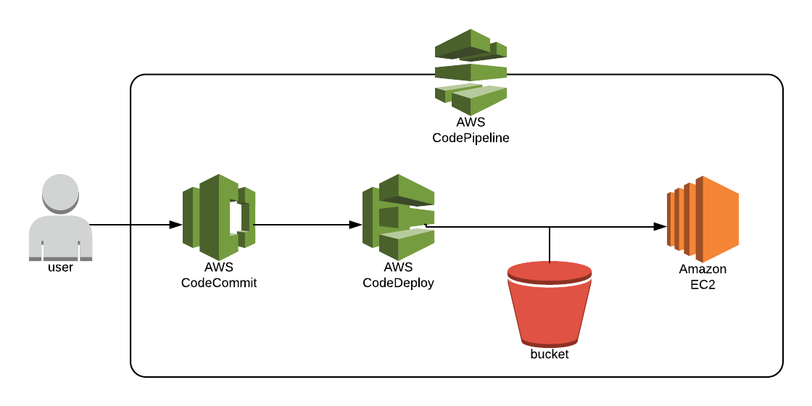

Before we get started, there are a couple of pre-requisites needed in order to follow along:

1. AWS account with EC2,  S3, CodePipeline, CodeDeploy, and CodeCommit permissions. If you don't have an AWS account, you can sign up for the free tier for one year.
2. Git client: For Mac, I recommend Homebrew (brew install git). On the PC, you can use Git SCM.

There are a number of steps we need to complete in order to setup our code pipeline with a new web server. These steps include creating a new security group, setting up a key pair, which we will use to access our AWS EC2 instance, provisioning a new EC2 instance, and setting up our code pipeline for Continuous Integration/Continuous Delivery (CI/CD).

## Roles and Permissions

When setting up a CodeDeploy (later in this article), we will need to use service roles for to provide needed permissions for both the CodeDeploy service (service role) as well as for our EC2 instance that we are deploying code to (instance role). Let's go ahead and set these up. There are more detailed directions available within AWS documentation and I've provided links should you want to learn more.

### CodeDeploy Service Role

- Using the AWS console, browse to IAM Management and select Roles - Create Role.
- Next select CodeDeploy and under Use Case choose 'CodeDeploy'.
- Click 'Next: Permissions' leaving defaults and 'Next: Tags' leaving blank.
- Click 'Next: Review'.

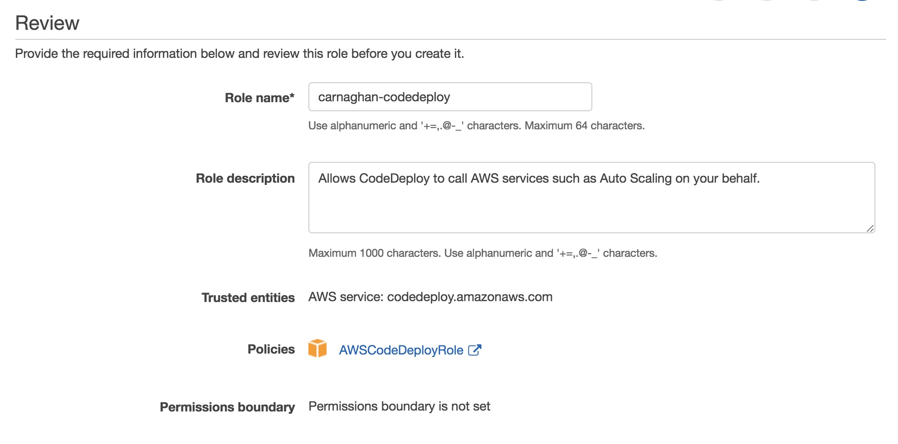

Here you can provide a name for your service role. I am using the name **carnaghan-codedeploy**. Keep a note of the name you choose as you will need this later.

> For more information, see: Create a Service Role for AWS CodeDeploy.

### IAM EC2 Instance Role

In order for our EC2 server to work with CodeDeploy, we need to create an IAM instance role. In IAM Management select 'Create Role'. Under service select 'EC2' and then click 'Next: Permissions'. Under 'Filter Policies' type 'S3' and then select 'AmazonS3ReadOnlyAccess'. Select 'Next: Tags' and then 'Next: Review'. Provide a name for your role, I used **carnaghan-dev**. Keep a note of whatever name you choose for later.

Note: for simplicity I chose AmazonS3ReadOnlyAccess', however for better security you can create your own policy and choose only those parts of S3 needed for CodeDeploy.

> For more information see: CodeDeploy: Create an IAM Instance Profile for Your Amazon EC2 Instances.

## Creating our EC2 Security Group and Key Pair

Before we can setup a new EC2 instance which will serve as our web server, we need to create a security group. The security group will determine ingoing and outgoing traffic. Security groups in AWS are simply firewalls at the server level. They will enable us to allow traffic from various sources access to our server. To keep things simple, I am going to enable all incoming traffic for HTTP and SSH connections, which we will need for our setup. Ideally, SSH traffic should be restricted to your own set of IP addresses which you will access the EC2 instance from for security purposes. Within the AWS Console, select EC2 under the Compute group. Under Network and Security select 'Security Groups'. Select 'Create Security Group' and provide a name. In my example, I am using **carnaghan-dev**. Next we will configure the inbound traffic our security group will permit. Under the Inbound tab, select Add Rule. You should add two rules (one for SSH and one for HTTP) with IP address 0.0.0.0, ::/0 for each (which allows all incoming traffic for that protocol by default). Click Create to save your new security group. We will now be able to use this when provisioning our new EC2 instance.

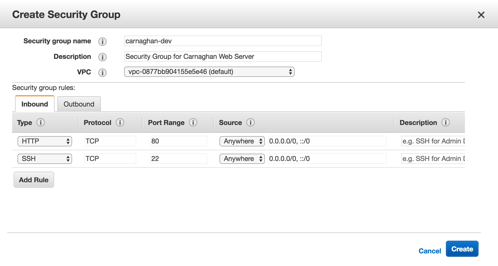

Next we need to create a key pair. This is a set of credentials we will use to access our EC2 instance once it is setup.Under the same Network and Security section we accessed Security Groups, select Key Pairs. Click on Create Key Pair and provide a name. In my example I am using the name **carnaghan-dev**. Once created, you will receive a download file with a .pem extension. This is your private RSA key, which will be used later to SSH into our server. For now store this in a safe place.

## Creating our EC2 Instance

Next we are going to provision our web server. From the AWS console, select Services -> Compute -> EC2. Next click the Launch Instance button. We are going to choose **Amazon Linux 2 AMI (HVM), SSD Volume Type**, which should be the very first entry under Amazon Machine Images (AMIs).

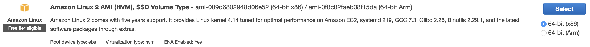

Click **Select**. On the next screen for instance type, choose **t2.micro (free tier eligible)**. Click **Next - Configure Instance Details**. Scroll down to **Advanced** and click to expand. Under User Data, paste the following code:

```
#!/bin/bash
sudo yum update -y
sudo yum install -y httpd
sudo service httpd start
sudo chkconfig httpd on

sudo yum install ruby -y
sudo yum install wget -y
cd /home/ec2-user
wget https://aws-codedeploy-us-east-1.s3.amazonaws.com/latest/install
chmod +x ./install
sudo ./install auto
```

AWS provides User Data to allow us to pass one time commands to our server once it is provisioned, or booted up for the first time. The first part of the above code runs updates on the operating system, followed by installing and running our Apache web server. The second set of commands provisions our CodeDeploy agent, which we will be using later on for our Continuous Deployment. Click **Next - Add Storage** and leave all defaults as is. AWS automatically provisions an **8Gb Elastic Block Storage (EBS) volume** for our instance, which will act as our hard drive or storage. Click **Next - Add Tags** and add a Name tag for your instance. In my example I am using Name: **carnaghan-dev** as below.

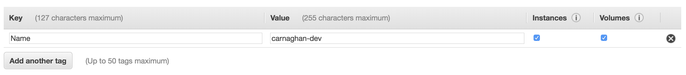

Click **Next - Configure Security Group**. Here you will choose the security group you setup above. Be sure to complete this step correctly or you may not be able to access your instance.

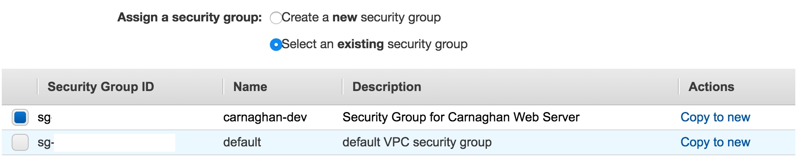

After you have chosen your security group, click Review and Launch and on the following screen select Launch. You will be prompted to create or choose a key pair to access your server. Select the key pair you created above and then click launch instance.

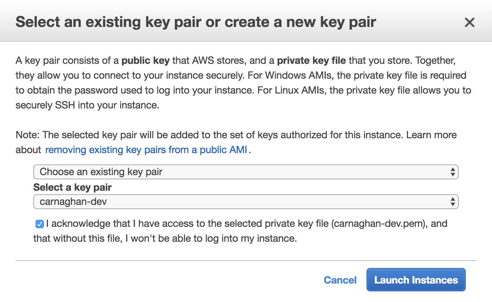

At this stage you have completed all steps to launch your EC2 instance. It will take several minutes to provision and run our user data commands specified above. To view the status of your EC2 instance select **View Instances** on the confirmation page. After several minutes have passed, the status of your instance should change from Initializing to Running. At this time, copy the public DNS address, it should look something like ec2-99-99-999-99.compute-1.amazonaws.com. Paste this address into your web browser. If everything is running as expected with your new Apache webserver, you should see the test page below.

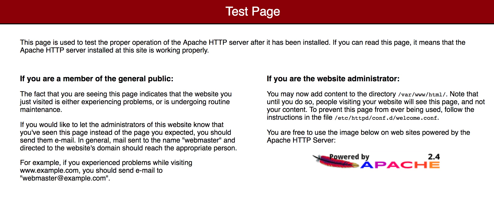

If you don't see the test page, give your instance another few minutes to fully initialize.

## Setting up Code Commit

There are two main ways you can manage CodeCommit repositories:

- Install the AWS Command Line Interface (CLI) and provide CodeCommit to your AWS account
- Create a public SSH Key which you can then upload to your repository (in a similar way you would manage a Github repository)

For this setup, I am going to recommend using the CLI as it provides a lot more options out of the box and the more you work with AWS the more you will come to use this tool. In order to install the CLI, follow this guide: Installing the AWS CLI. If you prefer to use a public key, see Setup for SSH Users Not Using the AWS CLI.

Next we will setup our code repository, which will enable us to update our website. Using the AWS console, head over to CodeCommit and create a new repository.

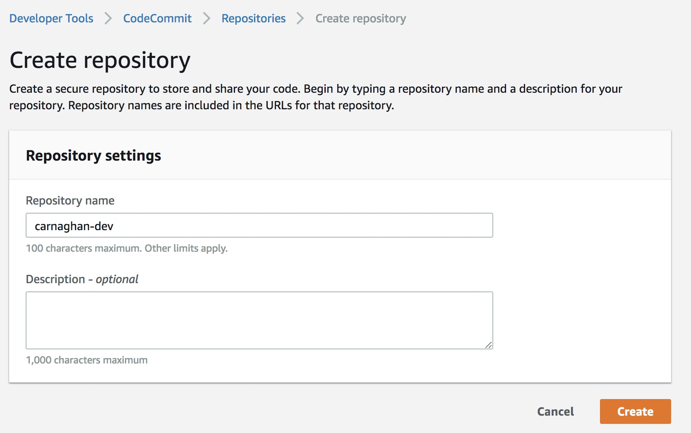

I am again using the name carnaghan-dev for consistency. Once you have setup your repository you will need to clone a local copy. If you don't have a git client, please see the links I provided at the beginning of this article (Homebrew for Mac, GitSCM for PC). Once your client is setup and you have installed the AWS CLI or uploaded your public key, you should be able to clone your repository. In your command line / terminal, run the following command replacing 'your-repo-name':

```
git clone https://git-codecommit.us-east-1.amazonaws.com/v1/repos/your-repo-name
```

Once cloned you will be able to begin adding new files. We are going to create two different files needed for our code deployment, a test index file, and a file called appspec.yml.

index.html 

<script src="https://gist.github.com/icarnaghan/d51fd7cc05bbd9b30c12d1a4e38b6985.js?file=index.html"></script>

appspec.yml 

<script src="https://gist.github.com/icarnaghan/d51fd7cc05bbd9b30c12d1a4e38b6985.js?file=appspec.yml"><span data-mce-type="bookmark" style="display: inline-block; width: 0px; overflow: hidden; line-height: 0;" class="mce_SELRES_start"></span></script>

Once you have added these files to your empty repository directory we will need to commit them.

```
git add -A
git commit -m "Initial commit"
git push
```

Next, head back over to your repository in the AWS console to confirm your files have been uploaded.

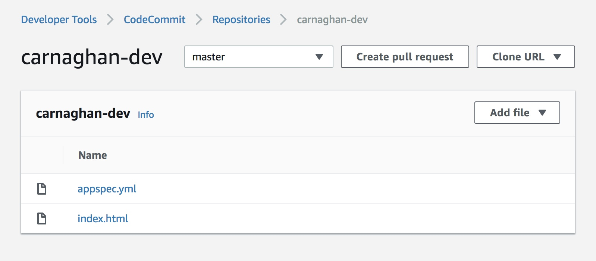

You have completed the first steps in our code pipeline by initializing your CodeCommit repository and adding our appspec.yml and index.html files.

### What is appspec.yml?

You might be wondering what appspec.yml is needed for? This is a basic yaml file that defines where our code will be deployed. Since this is going to be a simple static file deployment, we just need to specify our server path, which by default with Apache is /var/www/html/. AWS CodeDeploy will use this file once deploying the latest updates to our site. For a better overview of appspec.yml, take a look at AWS CodeDeploy AppSpec File Reference.

## CodeDeploy

Now that we have our code repository setup with our basic file structure, the next step is to setup our CodeDeploy application. To do this, navigate to CodeDeploy within the AWS console and select 'Create Application'. Fill out the form including your application name and choose EC2/On-Premesis.

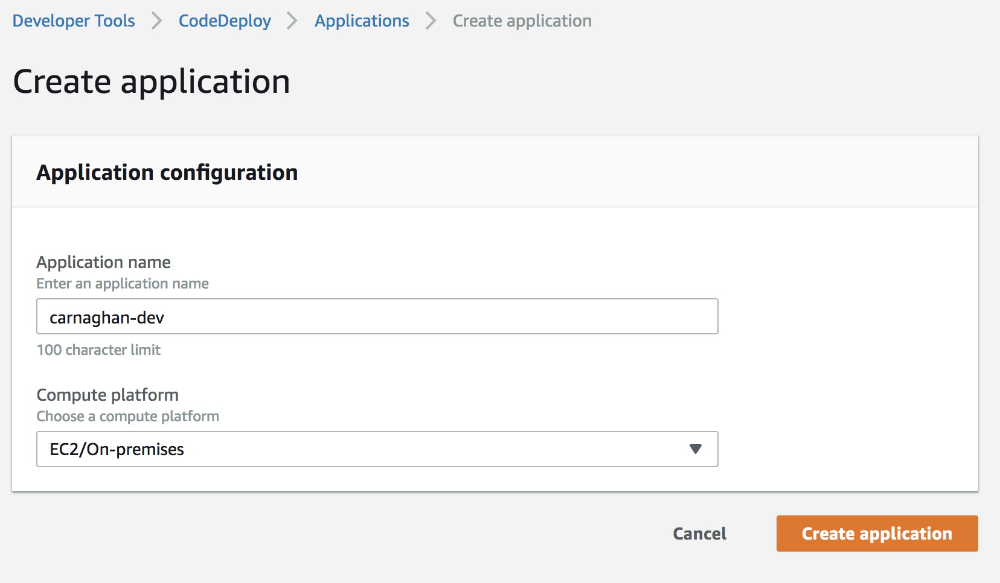

Next, you will need to select 'Create Deployment Group' and provide the following information:

- Deployment group name (I chose carnaghan-dev-group)
- Service Role (Choose the service role you created earlier)
- Deployment Type (In-place)
- Environment configuration (EC2 Instance / Key: Name, Value: your-ec2-instance)
- Deployment Settings (CodeDeployDefault.AllAtOnce)
- Load Balancer (Uncheck this option)

## CodePipeline

Now that we have defined our source (CodeCommit) and our target (CodeDeploy), let's tie it all together using CodePipeline. Note that usually in larger applications that require build processes we would also use CodeBuild. For the sake of simplicity and since we are dealing with a small static website, we only need CodeCommit and CodeDeploy for our pipeline. From the AWS console, select CodePipeline and then select 'Create Pipeline'. You will need to provide the following information:

- Pipeline Name (I am using the name carnaghan-pipeline)
- Choose 'New Service Role' and leave the new default role name (Note this is different from the CodeDeploy service role you created at the beginning of this article).
- Make sure 'Allow AWS CodePipeline to create a service role so it can be used with this new pipeline' is checked
- Choose Default Location - AWS will create an S3 Bucket for your revisions to deploy
- Select Next and then choose CodeCommit for Source Provider, choose your repository and select 'Master' branch
- Leave Amazon CloudWatch Events selected and select 'Next'
- Select Skip Build Stage
- Choose AWS CodeDeploy for Deployment Provider and select your application and deployment group
- Review everything and then select 'Create Pipeline'

Once you have completed these steps you should be returned to the main CodePipeline screen and a new deployment will run. If everything was setup correctly you should see a screen similar to the one below.

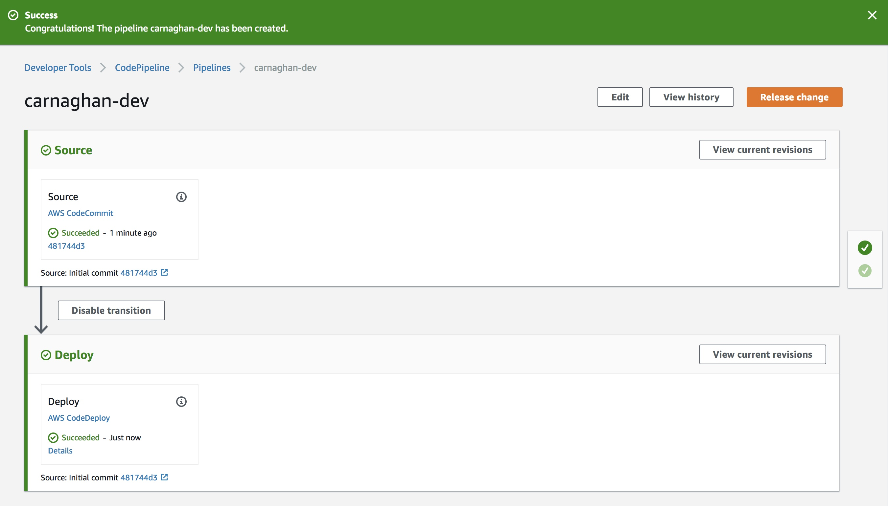

To verify everything worked as planned, visit your EC2 server homepage. If you forgot the URL, visit EC2 in the AWS Console, click 'Running Instances' and select your instance to review the Public DNS address. You should now see a new HTML page displaying:

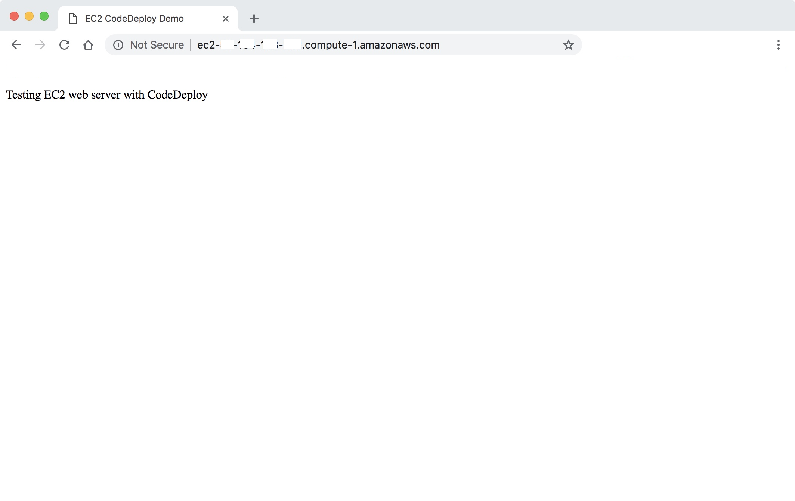

## Testing The Pipeline

Congratulations, you have setup a basic CodePipeline for your webpage. Let's try one last thing. Update your HTML page by adding the sentence 'AWS CodePipeline complete'.

<script src="https://gist.github.com/icarnaghan/d51fd7cc05bbd9b30c12d1a4e38b6985.js?file=index2.html"><span data-mce-type="bookmark" style="display: inline-block; width: 0px; overflow: hidden; line-height: 0;" class="mce_SELRES_start"></span></script>

Add this file to Git and push your changes.

```
git add -A 
git commit -m "Modifying index.html" 
git push
```

If you visit the CodePipeline page you should see it momentarily running a new deployment. Your final changes will appear once deployment has been completed.

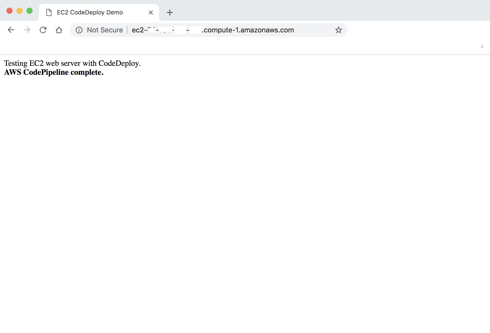

For more information on CodePipeline and another tutorial on setting up a basic pipeline, visit Create a Simple Pipeline (AWS CodeCommit Repository). Also be sure to read the documentation on CodeCommit, CodeDeploy, and CodePipeline. If you have a more complex application that requires build processes, the AWS CodeBuild Documentation is a great place to start. Hopefully you found this helpful.
