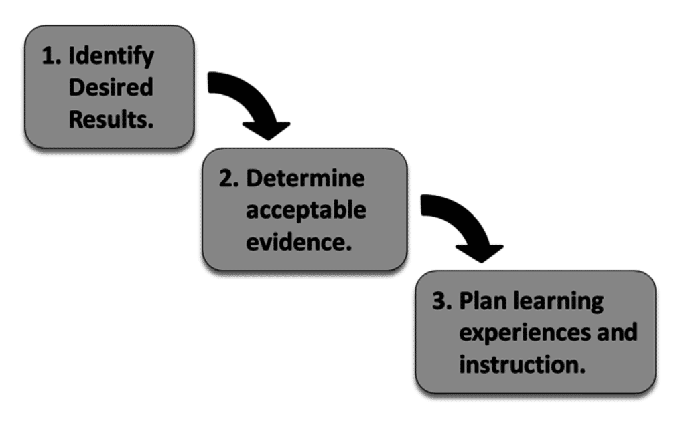
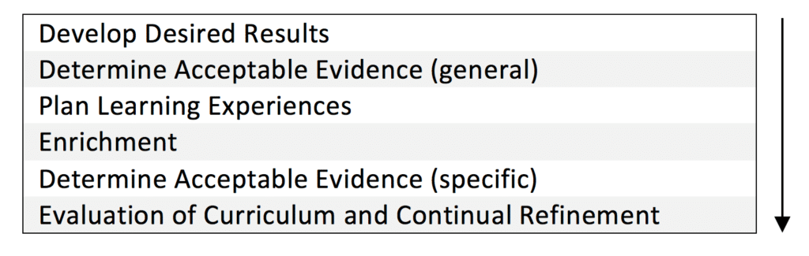

Backwards design is a methodology used to develop curriculum, which promotes the identification of learning results at the start of the design process.  Wiggins and McTighe defined this term as part of their Understanding by Design (UbD) framework.  Backwards design is not a new concept, it has been around for a long time and this paper explores some of the underlying research behind Wiggins and McTighe’s work.  Backwards design promotes a focus on teaching for understanding and learning, as well as designing the curriculum in way that meets learning goals while aligning results with state requirements.  (McTighe & Wiggins, 2012).  Often within education, learning goals are set first, before considering the assessment strategies that will be used to measure students’ understanding.  Without considering the results that are expected of a student, the chances of goals and assessment aligning with required results, or outputs are greatly diminished.

The backwards design approach is compatible with other educational models including Expeditionary Learning (EL), which is detailed in a separate qualifying exam paper.  This paper explores the concept of backwards design within the larger UbD framework and examines real life models where its application has yielded successful results.  The relationship between Expeditionary Learning and the backwards design approach is also discussed along with the importance of curriculum mapping.  Some of the concepts that have been covered in more depth in the curriculum mapping qualifying exam question will be referenced in order to solidify their relationship with Understanding by Design.

## Understanding by Design (UbD)

Understanding by Design (UbD) is a planning Framework developed by Grant Wiggins and Jay McTighe.  The idea behind UbD is that understanding should not happen by accident, it should be designed or planned into the curriculum.  The framework itself advocates for keeping long-term goals (student understanding) within view, while using the right blend of content, instruction and interaction to engage learners.  Long term educational goals should be a part of the short term day-to-day lesson planning for the classroom.  According to Grant Wiggins, there are certain design tools that can help teachers more likely reach their educational goals, regardless of their student population and other constraints.  These tools flow from a basic design strategy called backwards design.  Wiggins makes it very clear that backwards design refers to a backwards design approach to goals, not content.  The end result should not be to ensure that their students covered all assigned content within the classroom, but to instead provide students with content and learning experiences they can use and apply.

### Backwards Design

Backwards design is an educational methodology that promotes _results_\-focused design in place of _content_\-focused design.  Content-focused design can be described as a process where a particular topic may be chosen to base a lesson on.  Wiggins and McTigue (2005) used an example to describe this concept.  Imagine a teacher bases a lesson on racial prejudice.  A resource is then chosen, ‘To Kill a Mockingbird’, and then specific instructional methods are based on this resource and topic.  These methods could include for example a Socratic seminar to discuss the book with cooperative groups to analyze stereotypical images in films and on television.  The overall hope is to thereby cause learning and at the same time meet certain common core or state requirements for English language / arts.  Assessment is then baked into this process in the form of a few essay questions for assessing the student’s understanding of the book.

This approach is common within the school system and some may question what could be wrong with planning this way.  In order to better understand the root problem, we need to take a step back and ask ourselves why we are asking the student to read this particular novel to begin with.  What is it we are expecting the student to understand and to be able to apply in relation to the subject of racial prejudice?  Does the student see the purpose in this resource and does it tie into the overall learning goals beyond the book?  If the goals are met in this situation, it wouldn’t have been by design, but by chance.  The fact that the overall goal was vague to begin with in terms of specific understandings the students were to acquire, causes further problems.  Wiggins and McTigue label this as an approach more “by hope” than “by design”.  By simply “throwing some content at the wall and hoping it will stick” will ultimately lead to failure.

Another set of problems are common throughout K-12 education.  These include activity-oriented design and coverage, also known as the twin sins of design.  Activity-oriented design refers to the flawed approach of designing learning experiences by crafting engaging activities, without considering the overall educational goals.  Wiggins and McTighe refer to this type of design as ‘hands-on without being minds-on’.  Coverage refers to the misguided approach of assigning complete textbooks, or entire sets of lecture material in an effort to cover all the factual material within a specified period of time.  This is common in K-12 schools, but also particularly prevalent within higher education institutions.

Content-driven design and the twin sins should be avoided and instead results-driven design should be promoted within the classroom.    Results-driven design drives the backwards design methodology, which first subscribes to identifying desired results of learning, and then determines acceptable evidence (assessment).  Finally after both of these have been completed the learning experiences are planned out.

**Figure 1: Backwards Design, Wiggins and McTigue (2005)**

#### 1\. Identify Desired Results

In the first stage of backwards design should involve to review the overall state common core requirements and to determine what it is that the student should be able to know, understand and be able to do in the end.  During this stage of design, it should be decided what concepts are important as well as what enduring understandings are desired from the student.  The main constraint during this stage is that teachers typically have more content than can be reasonably covered in a specific amount of time.  Therefore clarity of prioritization and careful choices must be made.

#### 2\. Determine Acceptable Evidence

Determining acceptable evidence ensures that we know if the student has achieved the desired results.  The process of determining acceptable evidence encourages the curriculum planner and teacher to first think like an assessor before moving forward and designing specific units and lessons.  This ensures that careful thought is given at the beginning on how it will be determined that students have attained the desired knowledge.  Wiggins & McTighe (2005).  During this phase of backwards design the following questions must be considered.  How will we know students have achieved the desired results?  What will we accept as evidence of student understanding and proficiency?  In the end, students with full understanding should be able to demonstrate what Wiggins and McTighe refer to as the six facets of understanding:

1. **explain** concepts in their own words
2. **interpret** by making sense of data, text and experiences,
3. **apply** by effectively using and adapting what they know in new and complex contexts
4. demonstrate **perspective** by seeing the big picture and recognizing different points of view
5. display **empathy** by perceiving sensitivity and walking in someone else’s shoes
6. have **self-knowledge** by showing mega-cognitive awareness, using productive habits of mind, and reflecting on the meaning of learning and experience

Not all six facets are typically used together in every assessment, however they provide a guide for measurement when considering acceptable evidence.

#### 3\. Plan Learning Experiences

After the desired results have been identified and acceptable evidence and assessments have been determined, the process of planning the individual learning experiences can begin.  This is counter to many traditional methods of developing lessons and curriculum within education, however it is essential in order to ensure that results-driven learning happens within the classroom.  At this stage, several things need to be addressed.  First of all the teacher or curriculum designer must consider what enabling knowledge and skills the students will need in order to perform effectively and achieve the desired results.  Secondly, the activities that will equip students with the needed knowledge and skills must be determined.  What will need to be taught and coached?  And finally the material and resources that are best suited to accomplish these goals need to be identified.

### Supporting Research

Wiggins and McTighe built the UbD framework with the help of previous research in the field of cognitive psychology.  A readable synthesis of cognitive psychology and its impact on education was published in the book How People Learn: Brain, Mind, Experience and School (Bransford, Brown, & Cocking, 2002).  This recent publication of the National Research Council summarized the past 30 years of research in learning and cognition.  It offered new conceptions of the learning process and explained how skill and understanding in key subjects were most effectively acquired.  A listing of the key findings from this publication that are directly relevant to UbD are listed below:

- Views on effective learning have shifted from a focus on the benefits of diligent drill and practice to a focus on students’ understanding and application of knowledge.
- Learning must be guided by generalized principles in order to be widely applicable. Knowledge learned at the level of rote memory rarely transfers; transfer most likely occurs when the learner knows and understands underlying concepts and principles that can be applied to problems in new contexts.
- Experts first seek to develop an understanding of problems, and this often involves thinking in terms of core concepts or big ideas. Novices’ knowledge is much less likely to be organized around big ideas
- Curricula that emphasize breadth of knowledge may prevent effective organization of knowledge because there is not enough time to learn anything in depth.
- Feedback is fundamental to learning, but feedback opportunities are often scarce in classrooms. What is needed are formative assessments, which provide students with opportunities to revise and improve the quality of their thinking and understanding.
- Many assessments measure only propositional (factual) knowledge and never ask whether students know when, where, and why to use that knowledge.
- Expert teachers know the structure of their disciplines and this provides them with cognitive roadmaps that guide the assignments they give students.

Summarized from McTighe (2003).

Understanding by Design also promotes deeper learning within the classroom.  Deep vs Surface learning is an area of research, which has been discussed greatly over the years.  UbD fosters an environment that influences a deeper learning approach.  Surface learners tend to fall into the category of students who value the importance on ‘minimum requirements’.  They are interested only in passing the next test or reaching the ‘needed’ grade get through their course of study.  They have little or no interest in creating and adding their own knowledge to theories or subjects in which they are learning. “Deep learning involves the critical analysis of new ideas, linking them to already known concepts and principles, and leads to understanding and long-term retention of concepts so that they can be used for problem solving in unfamiliar contexts.” (The Higher Education Academy, 2007).  Deep learning can only be achieved if the student has an understanding of why they are studying the learning the material presented in their classroom.  This is addressed in the backwards design approach by first identifying the desired results of the learning experiences and by making students aware of this.

There is also some overlap with UbD and the theories of Dr. Malcolm Knowles.  While Knowles was more concerned in andragogy, adult learning theory, much of his research is also relevant to younger students.  Knowles recommended several principles that should be applied to the design of learning experiences.  In his first principle, Knowles demonstrated that students have a need to understand why specific things are being taught.  Going back to the first phase of backwards design, this principle aligns closely with identifying desired results by determining what students know along with why they should know it.  In another principle, Knowles asserted that students should be focused on problem-centered rather than content-oriented instructions.  Here we can see a direct alignment with the UbD framework that identifies one of the twin sins of design, coverage based education, should be avoided.  Orienting lessons towards content coverage is a misguided approach and should be avoided.  Knowles also argues that adults are self-directed and want to discover things for themselves.  This is supportive of younger learners too within both UbD as well as Expeditionary Learning education.

### An Effective Model for Mapping the Curriculum

Wiggins and McTighe’s first publication on Understanding by Design provides an effective model for developing the curriculum using the backwards design approach.  It provides templates and the book format begins with a high level view of the curriculum and works through to a more detailed structure and templates.  Chapter 12 of the book focuses on what Wiggins and McTighe describe as the ‘big picture’ of using UbD as a curriculum framework.  Earlier chapters included detailed information on developing and crafting understanding at the unit level.  The curriculum framework examines the school district’s overall goals for learning and aligns these with content standards.  The framework is directly compatible with the curriculum mapping work of Jacobs (2004), covered in more depth in the curriculum mapping qualifying exam paper.

The Understanding by Design Guide was published by Wiggins and McTighe a number of years after their initial UbD book.  The goal of this publication was to provide a model that teachers and school leaders could use to design high quality UbD education.  While the first book provided templates and an overview of what UbD is, Wiggins and McTighe felt it did not go far enough in providing a guide to actually planning for understanding and designing quality essential assessment questions.  This publication also came with more in depth templates for developing a robust UbD curriculum.

### Curriculum Design with UbD in Action

Shumway & Berrett (2004) published the results of a modified approach to backwards design carried out at Brigham Young University.  The purpose was to improve their students’ knowledge of the new Standards for Technology Literacy (STL) and to help implement them within local schools.   The students in the study were in the teacher education program at the university and a strategy was devised to help educate them on the standards, while at the same time putting them into practice at schools where they participated in teacher training.  Several problems were identified early on.  The majority of teachers within the local schools had a copy of the standards and were supportive of them, however they needed support for implementing them within the classroom.  Much of the help needed was to ensure that curriculum units designed for their classes were standards based and not merely standards reflective.  At the university, teacher education students needed to have earlier and more frequent teaching and curriculum development experiences in the public school.  Students needed to become intimately familiar with the need for these standards and learn how to develop curriculum based on them.  The university needed to coordinate efforts and strengthen the partnership between the schools and local classroom technology teachers.  All of this led to the development of an initiative using a modified version of backwards design to guide the process.

 **Figure 2: Modified Backwards Design, Shumway & Berrett (2004)**

The reason a modified version of backwards design was used happened due to challenges the students ran into while trying to implement it.  The students expressed frustration when trying to determine assessment procedures when no unit or lesson plans had been developed.  In order to overcome this challenge, the first modification was implemented in the form of determining acceptable evidence at a more general level (e.g. portfolios, projects, etc.) in order to provide specifics later on after learning experiences had been planned.  Another phase called enrichment was introduced, which allowed for more collaboration and formative evaluation of the work carried out between the university students and supervising teacher.  Once the unit plan, lesson plans, assessments, and other materials had been developed, the students submitted them to the cooperating teacher for feedback.  With the cooperating teacher’s supervision, teams of students then co-taught a short lesson related to the current sixth grade unit based on the Standards for Technology Literacy (STL).  In later years, students would return to teach an entire curriculum unit with local high school teachers.  The last phase of the modified backwards design model involved evaluation of the curriculum that would happen along with continual refinement.  The modified approach served both Brigham Young University and the local district well for their unique purpose that required collaboration between the two different educational populations.

### Other Curriculum Models

Backwards design has become a very popular model for designing and implementing curriculum throughout many schools and districts.   There are however other curriculum models, which have gained popularity over the years that should also be considered when devising any type of curriculum strategy.

#### The ADDIE Model

ADDIE stands for Analysis, Design, Development, Implementation and Evaluation, which describes the various steps of the model.  The ADDIE model provides designers with the necessary structure for designing any curriculum.  Hodell (2006).  ADDIE has been revised and modified many times over the years and still remains a popular framework for designing instruction.  The ADDIE model is very similar to backwards design whereby its analysis phase is similar to identifying desired results of learning.  Much of the initial planning for the rest of the design process takes place here.   Analysis should define measurable terms and the overall desired level of performance in order to define the overall learning experience defined in the backwards design model.

ADDIE ensures that a rigorous analysis is carried out, followed by design, development and implementation of lessons and instruction that yields measurable results.  The entire process is cyclical where the evaluation phase requires revisiting and improvement on design and development activities to ensure the finished lessons or units meet the goals of the institution.  While much of ADDIE is similar to backwards design, it lacks certain elements of UbD including self-evaluation techniques such as student reflections of rethinking and revisiting concepts.  UbD is also more closely aligned with K-12 school environment, while ADDIE is commonly used in higher education.

#### The ASSURE Model

The ASSURE model was developed by Heinrich and Molenda in 1999. It is a well-known instructional design guide using constructivist perspective which integrates multimedia and technology to enhance the learning environment.  Faryadi (2007).  ASSURE is another curriculum model that uses the letters in its name to represent the various processes involved.  ‘Analyze the learner’ is the first phase where the model encourages the designer to gain an understanding of the student and their needs.  ‘State objectives’ is the second phase, which become the overall focus of the lessons to follow.  ‘Select media and materials’ comes next to ensure the correct resources are chosen for the type of instruction being designed, this is followed by ‘utilize media and materials.’  ‘Require learner performance’ is the next phase, which requires the formation of strategies to encourage student participation in the unit or lesson.  Evaluation and revision are both covered in the last phase, which refers to both evaluation of teaching and well as student achievement.

The ASSURE model draws similarities from the ADDIE model, however there are also a few similarities to the backwards design approach.  One issue of the model is that evaluation is left to the end.  While it is helpful to know what worked and what didn’t, at this stage of the design process it may be too late to intervene for student success.  Another point to note with ASSURE is its heavier reliance on technology resources, something the other models do not explicitly mandate.

There are other approaches to curriculum development and instructional design that go outside the scope of this paper.  Models such as the 5E Instructional Design Model, the Dynamic Instructional Design Model, and Gagne’s Model are just some examples of other approaches to developing instruction.  One other method or approach of designing curriculum is important to address, which can be used in combination of the models covered in this paper.  This method is called bottom-up or bottom driven approaches to designing and implementing curriculum changes within the school.

#### Bottom up Approach to Curriculum Design

Bottom up and top down can be used to describe different things.  One meaning of bottom up for example describes the design and development of a lesson or unit by starting at the lowest level or individual parts.  Top down on the other hand starts at the highest level or ‘the big picture’.  Another interpretation of top down and bottom refers to the way curriculum is planned and implemented within schools and districts.  Traditionally a top down approach in this sense has been more common where initiatives come from the top or school leaders and directed to the teachers to implement.  In recent years, bottom up strategies, those lead by teachers, have become more common with frameworks such as UbD that encourage teacher involvement in the design of units and lessons.

McCarthy (2009) discusses the benefits of this approach and asserts that the bottom-up approach helps to promote changes at the grass-roots level, which in turn has led to more consideration of the needs of learners.  At the same time decisions made about curriculum development have encouraged teacher professional growth where bottom-up strategies have been implemented.  McCarthy focused on curriculum reform in her paper, and her study found that bottom-up methods ensured success of this reform because of buy-in from the teachers where they were made aware of their power as change agents.  While there needs to be a balance of direction from the top along with grass roots involvement, backwards design promotes teacher collaboration, which ensures that appropriate lessons are developed to meet the overall goals of the school, district and common core requirements.

## UbD, EL and Curriculum Mapping

Understanding by Design is directly compatible with the Expeditionary Learning (EL) approach to education, covered in more depth in the curriculum mapping qualifying exam paper.  EL and UbD complement each other by first examining standards, or results that provide a bigger picture in terms of the overall learning goals for students.  They both promote deeper understanding through learning experiences, critical thinking, and going beyond surface based and basic learning patterns.  Students should be able to take away a thorough understanding of the ‘big ideas’ instilled in them through the process of an effectively designed curriculum.  These big ideas should contain the knowledge and experiences that will stay with a student far beyond high school graduation.

While UbD and EL complement each other, a third component or toolset can be effectively added to the mix in order to provide the right resources to effectively record, manage and maintain a standardized curriculum.  This toolset or process is known as curriculum mapping, also covered in more depth in the curriculum mapping qualifying exam paper.  Curriculum mapping is integrated into the Expeditionary Learning Core Practices.  In their publication regarding underlying research in UbD, Wiggins and McTighe cite several cases where UbD influenced curriculum mapping practices at several schools.  An existing curriculum mapping framework developed by Heidi Hayes Jacobs in the late 90s has become a gold standard of mapping within public schools.  It is compatible with UbD and EL approaches and can be used to provide an effective platform to organize, maintain and communicate curriculum design throughout the school and district, while playing a role to ensure standards are correctly aligned to these approaches.

## Conclusion

Understanding by Design and the backwards design approach provide teachers with a methodology to begin planning the curriculum alongside common core requirements.  The framework begins by first identifying the results that students should experience at the end of the lesson.  It differs from many traditional approaches to designing instruction where assessment is planned early on before the learning experiences or actual unit is finalized.  This ensures teachers continue to design and develop results-driven lessons, which can be measured against a defined set of requirements.

Wiggins and McTighe place a strong emphasis on understanding that goes beyond the classroom.  This approach is compatible with other instructional theories including the adult learning research carried out by Dr. Malcolm Knowles.  It is also directly compatible with Expeditionary Learning that values experience and understanding.  Both UbD and EL can harness the power of an effective curriculum mapping process guided by the work of Dr. Heidi Hayes Jacobs.

## References

Baran, B. (2010). Experiences from the Process of Designing Lessons with Interactive Whiteboard: ASSURE as a Road Map. _Contemporary Educational Technology_, 1(4), 367–380.

Bransford, J., D., Brown, A., L., & Cocking, R., R. (2002).  _How People Learn: Brain, Mind, Experience, and School_.  National Academies Press: Atlanta, GA.

Blonder, R., Kipnis, M., Mamlok-Naaman, R., & Hofstein, A. (2008). Increasing Science Teachers’ Ownership through the Adaptation of the PARSEL Modules: A “Bottom-up” Approach. _Science Education International_, 19(3), 285–301.

Chevalier, R. D. (2011). When did ADDIE become addie? _Performance Improvement_, 50(6), 10–14. doi:10.1002/pfi.20221

Expeditionary Learning (2011).  _Expeditionary Learning Core Practices.  A Vision for Improving Schools_.  City, State: Expeditionary Learning.

Faryadi, Q. (2007). Instructional Design Models: What a Revolution!  ERIC Online Submission.

The Higher Education Academy (2007).  Deep and Surface Approaches to Learning.  Retrieved from: http://exchange.ac.uk/learning-and-teaching-theory-guide/deep-and-surface-approaches-learning.html

Hodell, C. (2006).  _ISD From the Ground Up_.  Alexandria, VA: ASCD

Jacobs, H., H. (2004). _Getting Results with Curriculum Mapping_.  Alexandria, VA: ASCD.

Jacobs, H., H. (1997).  _Mapping the Big Picture. Integrating Curriculum & Assessment K-12_.  Alexandria, VA: ASCD.

Knowles, M. S., Holton III, E. F., Swanson, R., A. (2005). _The Adult Learner_. 6th Edition. London, UK: Elsevier Butterworth Heinemann.

McCarthy, M.  (2009). Implementing curriculum change: A “bottom-up” approach. (n.d.). Retrieved June 12, 2013, from http://www.academia.edu/2065020/Implementing\_curriculum\_change\_A\_bottom-up\_approach

McTighe, J., & Seif, E. (2003).  A Summary of the Underlying Theory and Research Base for Understanding by Design.  Retrieved from: http://assets.pearsonschool.com/asset\_mgr/current/201032/ubd\_myworld\_research.pdf

Newmann, F. M., Marks, H. M., & Gamoran, A. (1996). Authentic Pedagogy and Student Performance. _American Journal of Education_, 104(4), 280–312. doi:10.2307/1085433

Shumway, S., & Berrett, J. (2004). Standards-Based Curriculum Development for Pre-Service and In-Service: A “Partnering” Approach Using Modified Backwards Design. Technology Teacher, 64(3), 26.

Wiggins, G., & McTighe, J. (2005). Understanding by Design, Expanded 2nd Edition. Association for Supervision and Curriculum Development.

Wiggins, G., & McTighe, J. (2012).  Understanding by Design Framework.  ASCD Whitepaper.  Retrieved from: http://www.ascd.org/ASCD/pdf/siteASCD/publications/UbD\_WhitePaper0312.pdf
