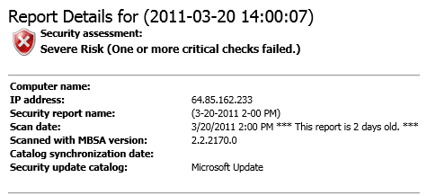
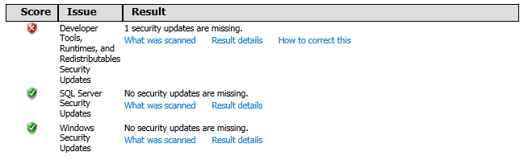
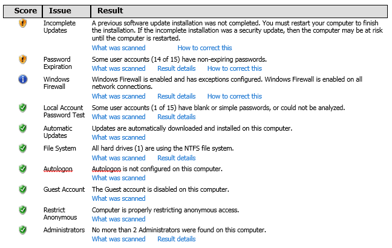
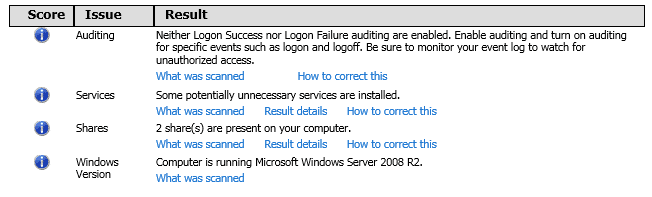
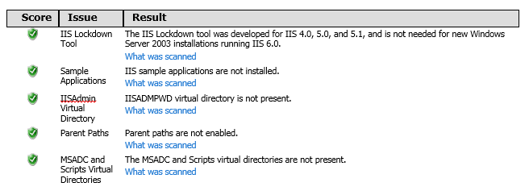
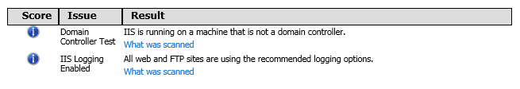
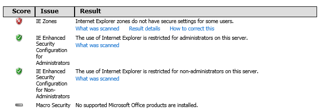
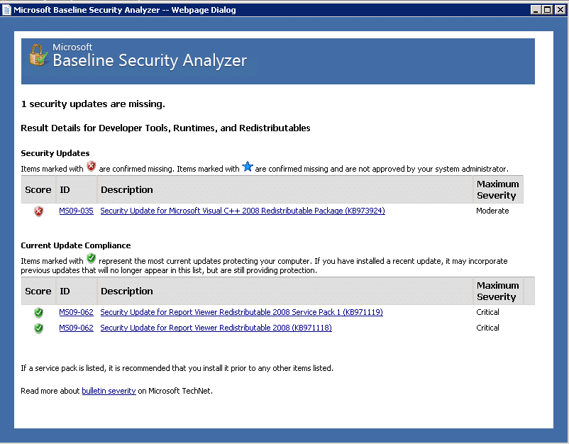
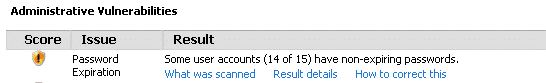

The objective of this exercise was to use Microsoft Baseline Security Analyzer (MBSA) to identify improper configurations and missing security updates that could lead to vulnerabilities.  The system this was tested on is a dedicated server located at Core Networks (http://www.corenetworks.com).  The server is used to host small business websites, from freelance web development work.  Up until recently a shared hosting plan was used at a company called Wiredtree, however the need for more server resources meant it was time to move to a dedicated server.

The server itself is unmanaged, meaning that Core Networks provide only the hardware lease and therefore the responsibility of installing and maintaining the operating software and web hosting platform (Internet Information Services) is my own.  The server was recently installed with the web edition of Windows 2008 R2 and currently runs IIS 7, Websitepanel (formerly DotNetPanel), MySQL, PHP, ColdFusion and several other web hosting server languages and platforms.  The results of the lab follow along with addressing the following concerns:

1. Review of the overall “security assessment” risk rating from the report generated by MBSA and consideration of the results.
2. Overview of weak and strong passwords and how MBSA runs such checks as well as an explanation as to why it is important to have a password expiration policy set.
3. Review of Malware and how it can disrupt Windows platforms along with the different types that can be used.
4. Explanation of the importance of patches using the Conficker case as an example of exploited system vulnerability as well as reviewing how corporations can use MBSA to detect missing patches.
5. Suggestion for an additional feature that could be potentially added to a future version of MBSA.

## MBSA Security Report

\[line\]

### Security Update Scan Results

\[line\]

### Windows Scan Results

Administrative Vulnerabilities

\[line\]

### Additional System Information

\[line\]

### Internet Information Services (IIS) Scan Results

Administrative Vulnerabilities

\[line\]

### Additional System Information

\[line\]

### Desktop Application Scan Results

Administrative Vulnerabilities

\[line\]

## The Security Assessment Risk Rating

MBSA was run on Windows Web Server 2008 R2.  The server had been updated using Windows Automated updates and the assumption was that MBSA would not find anything out of the ordinary.  The initial scan revealed that several critical issues existed which were overlooked previously.  The overall security assessment risk was given as **“Severe Risk (One or more critical checks failed.).”**  Upon further analysis of the report it was discovered that two critical issues and several other warnings were present.  The first critical risk involved an update patch shown in the screenshot below, which had never been applied to the server.  In order to fix this issue MBSA provided a link to download the patch in question, which was then installed on the server.

The second critical issue involved a security setting in Internet Explorer where it was revealed that Internet Explorer zones do not have secure settings for all users.  This involved a few security setting changes in Internet Explorer 8 on the different zones.

After applying the above fixes and re-running MBSA, the new security risk rating was dropped from severe risk to “**Potential Risk (One or more non-critical checks failed.)**.”  The remaining item was a warning that several users do not have a password expiration policy set.

Administrative Vulnerabilities

The users in question are web users generated by an application called Websitepanel, which is a web hosting toolset that manages multiple websites and domain accounts.  These users typically only have access to the website space that they are assigned to and have no further access to other system resources.  They are managed through Websitepanel via Windows Server Internet Information Services (IIS) and while they pose less of a threat, further investigation will be needed on how to properly manage password expiration policies for these users through IIS and Websitepanel in future.  The remaining report bullets were informational and no other warnings were present.

## Weak and Strong Passwords

MBSA checks for weak passwords during its security scan of the system it has run on.  Weak passwords can often lead to vulnerabilities through ease of them being broken by common techniques such as brute force or dictionary attacks.  Yan (Yan, J, Blackwell, A., Anderson r. & Grant, A., 2004) describes a brute-force attack as method of using all possible combinations of keys when trying to discover a password.  Dictionary attacks on the other hand focus on a list of most likely used words.  “MBSA tests for blank passwords and common password patterns (such as the machine name, the user account name, and "admin"),” (Fahland, M., & Schultze, E., 2002).  Strong passwords are extremely important in corporate environments where users have access to restricted information.

The MBSA review of the Windows 2008 server revealed that neither login success nor login failure auditing was enabled.   If a brute-force or dictionary attack had taken place, there would be no evidence to support this because no logs would have been generated.  While this was an informational bullet in the report, it is an important piece of information that reminds us that we should always be vigilant regarding the traffic coming into our servers.  In a corporate setting it could be disastrous if a hacker was able to gain access to legitimate user accounts that had access to highly confidential information all because of an exploited weak password.

Kessler (2001) lists, “Lack of strong password policies, such as auditing user passwords, forcing password expiration, and encouraging users to employ good passwords” as one of the commonly overlooked security measures.  Password expiration policy is essential to ensure that users do not have a tendency on using the same password over a long period of time with different systems.  By forcing a user to change their password on a regular basis overall password security is increased but also it acts as a fail safe for those individuals who had accounts that were never deactivated when they should have been.

## Malware

Vacca (2009) describes malware as “software designed to infiltrate or damage a computer system without the owner’s informed consent.”  Viruses, worms, backdoors and Trojan Horses are all forms of malware.  Moser, (Moser, Kruegel, & Kirda, 2007) analyzes the patterns of malware and describes it as a profitable business for many cyber criminals.  Malware is often installed on a user’s computer unknowingly through a web link, e-mail attachment or some other form of malicious code.  According to SpamLaws, it can attach “itself to the components of a web page, pop-up advertisements, toolbars, free stuff that you download, and games, to name a few.”   Once installed on large numbers of machines, they can be linked together to form “botnets”, which can be used for larger attacks such as denial-of-service or spam relays.

While later versions of Windows have come with greater security protection, users who unknowingly are tricked into installing a piece of malware have become compromised.  Malware has the ability to prevent system updates and make changes to firewall settings as well as antivirus definition files.  According to Moir, R. (2003) the two biggest concerns for computer users are viruses and spyware.  Both can be prevented by keeping the computer patched and up to date with the latest operating system updates as well as using a Virus protection application with updated definition files.  He also recommends only downloading files from reputable sources as well as installing and maintaining a firewall.

## Patches and Conficker

Conficker is a “worm that has grown to be one of the most technologically advanced and resilient botnets to date”, (Fitzgibbon, & Wood, 2009).  There have been several different versions of Conficker over the years including Conficker.A, and Conficker.B which primarily concentrated on spreading infection.  Conficker.C has focused more on developing a more robust and stealthy operation.

Conficker.A originally exploited the MS08-067 RPC NetPathCanonicalize vulnerability, which was described by Microsoft as a vulnerability in server service that could allow remote code execution.  According to Microsoft (2008) Conficker is a remote code execution vulnerability where “An attacker who successfully exploited this vulnerability could take complete control of an affected system remotely.”

A patch was released by Microsoft in October of 2008, however many computers did not apply this patch immediately, which resulted in their infection of Conficker.  This is why it is so important, especially in any corporate environment to implement proper patch applying policies.  MBSA is a tool which can be used to scan for missing patches and therefore could be easily executed in a corporate environment.  If an organization chooses to manually install patches in their network, they should be aware of the current highly critical patches needed to defend their systems against malicious attacks.  If computers had been patched properly, the spread of the initial version of Conficker would have been much smaller.  Since Conficker.A, the worm has used a combination of highly sophisticated malware techniques and has continued to spread through social engineering and peer-to-peer distribution systems.

## MBSA Suggested Feature

While MBSA does a great job of detecting missing patches and identifying different types of vulnerabilities present within a Windows environment, it does not accommodate for third party applications in the process.  According to Beaver, K (2009), MBSA doesn’t scan for anything outside of Microsoft software, while third party applications remain the source of many Windows vulnerabilities.

Many configuration problems tend to occur when a larger mix of third party applications are installed.  While it would be difficult for Microsoft to incorporate the many third party software applications into its MBSA product, it could devise a way for plug-in support, which would involve development from the third party software organization.  Regardless if this ever becomes a feature or not, MBSA provides a useful security baseline tool, which should be utilized by corporations to ensure they have the latest patches and are protected against many malicious threats both now and in the future.

## References

Beaver, K. (2009). _Why should Windows shops use Microsoft Baseline Security Analyzer?_ Retrieved from http://searchenterprisedesktop.techtarget.com/tip/Why-should-Windows-shops-use-Microsoft-Baseline-Security-Analyzer

Kessler, C., G. (2001). Nontechnical Hurdles to Implementing Effective Security Policies. _IT Professional Magazine, 3(2), 49-52._  Retrieved March 20, 2011, from ABI/INFORM Global. (Document ID: 1028002491).

Fahland, M., Schultze, E. (2001). _Microsoft Baseline Security Analyzer V1.1. Symantec_. Retrieved from http://www.symantec.com/connect/articles/microsoft-baseline-security-analyzer-v11

Moir, R. (2003). _Defining Malware FAQ._ Microsoft. Retrieved from http://download.microsoft.com/download/d/b/f/dbf7a49f-ab1b-4de4-b7bd-45d01aecd89a/malwarefaq.doc

Moser, A., Kruegel, C. & Kirda, E. (2007) In Proceedings of the 2007 IEEE Symposium on Security and Privacy.  _Exploring multiple execution paths for malware analysis_.  Retrieved from http://citeseerx.ist.psu.edu/viewdoc/download?doi=10.1.1.72.5497&rep=rep1&type=pdf

Microsoft. (2008). _MS08-067 Knowledge Base_. Retrieved from http://support.microsoft.com/kb/958644

SpamLaws. (2011). Retrieved from http://www.spamlaws.com/how-malware-works.html

Vacca, J. (2009). _Computer and Information Security Handbook._ Burlington, MA: Morgan Kaufmann Publications.

Yan, J, Blackwell, A., Anderson r. & Grant, A. (2004). Password Memorability and Security: Empirical Results. _IEEE Security & Privacy Magazine_, p. 27. September/October, 2004.
