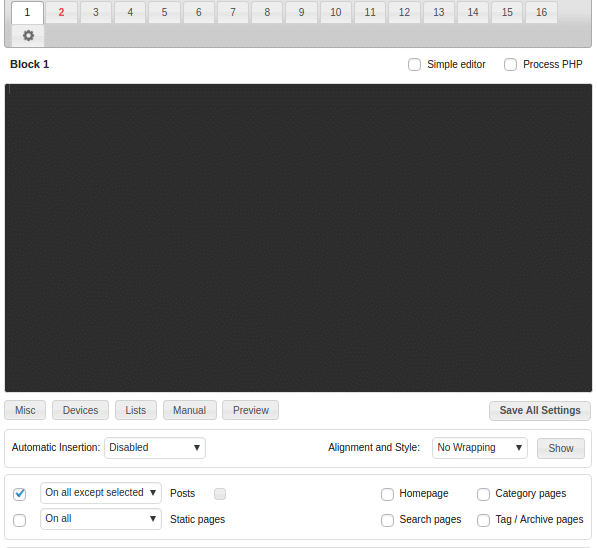
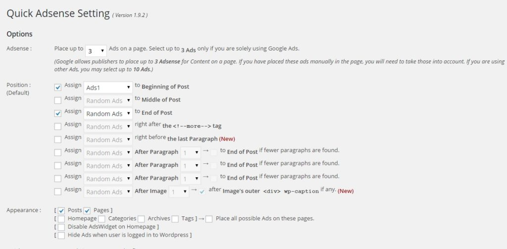
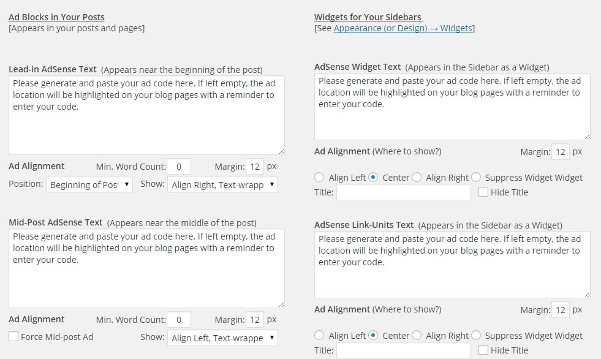
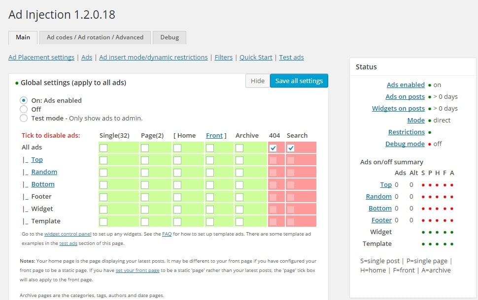

Adsense is being used on millions of blogs, and it is a source of online income for many bloggers. Have you ever wondered how the webmasters manage to add advertisements to the best and hottest positions? Most blogs are using either WordPress or Blogger CMS.

Blogger comes with an inbuilt utility to insert ads in various popular areas, i.e., above, middle and below post content. On WordPress, you don't have to be a PHP and HTML programmer to add Google AdSense unit to your favorite position. Simply install any of the below **best Adsense plugins for WordPress** and follow its setup instructions.

### Ad Inserter

AI is the most powerful WordPress plugin. It can insert AdSense ad units between, after, at the beginning of post, sidebar or after certain paragraphs.

AI comes with support for 16 ad blocks. It can process PHP Ad codes. Ad Inserter plugin allows users to blacklist categories, tags, URLs, referrers, and post. Once you blacklist a page, AI will not insert ads in it.

If you configure AI correctly, you can prevent accidental clicks that can be a threat to your AdSense account. You can configure Ad Inserter to hide or show Ad units on the desktop, mobile devices or tablets. To detect the screen width and height, AI can employ PHP or JavaScript code.

The plugin displays a shortcode for the add block which you can enable. It lets you insert AdSense units via a PHP function. AI enables you to preview ad units. I'm using Ad Inserter on multiple sites and have never been disappointed with it.

Download link

### AdRotate

AR is a great plugin for creating and managing AdSense ad units. AdRotate lets you track clicks on ad units. It allows you to set an expiry time for ads and lets you preview them from the WordPress dashboard.

The AdRotate plugin supports ad injection with PHP function, shortcodes, and WordPress widgets. It can insert your ad code after a number of paragraphs, between post, etc.

If you're using an AdSense alternative, you can configure the plugin to refresh the ad unit after certain seconds.

Download AR plugin

### Quick Adsense (QA)/WP Quads

This is the easiest to use and advanced ad plugin for WordPress. QA doesn't come with any limitation as you can use it with any advertisement network. You can use this plugin to display max ten ads on a given page or post. QA supports sidebar too. Just put your ad code in the sidebar section of this plugin page and Quick Adsense will generate a widget on behalf of you.

Just drag and drop the widget to your favorite position. QA supports inserting of ads at various positions in a post. This plugin is light-weight, and it will never cause resource usage exceeded problem on your blog. I've been using this plugin for 1.5 years, and I never faced any problems with it.

Quick Adsense developer has not updated the plugin since a couple of years. But it works on all released versions of WordPress.

The above plugin is outdated but if you like its feature, install the WP Quads plugin instead of QA. QP Quads is based on QA.

Download URL

**Google Adsense (GA)**

Google engineers have coded this plugin. It allows you to verify your Google webmaster tools account (or site) through the dashboard. GA supports automated mobile advertisements. It comes with an option to manage ad units. To use this plugin, you must verify your AdSense account.

GA highlights important and best AdSense positions on your site automatically. You don't have to use a heat map tool for the same. You can configure GA to prevent inserting ad units in particular pages or post. The is a good Adsense plugin for WordPress.

Try it out

### Easy Adsense

If you don't want to see ads on smaller posts of your site, use easy AdSense. Unlike the above two plugins, EA gives you the option to add ad units only on the articles whose length exceeds the number n ( you set n). It can also add titles for ad units.

If you're using affiliate pictures on your blog, Easy AdSense can be configured to display a border when a user hovers on the ad. Thus it helps to improve the conversion rate for an affiliate network. If you are using this plugin, don't turn on this option for AdSense units as it is violating Google terms and conditions.

Download link.

### Ad Injection

Ad injection is a powerful Adsense plugin with plenty of options. It has a module to insert advertisements after n words or characters. This plugin can be configured to avoid placing ads in HTML elements like blockquote, div, unordered or ordered list, tables, etc. It supports sidebar, footer, and random ads.

If you want to disable adverts for some users or keywords, add their IP addresses or keywords on this plugins settings page.

installation link

**Conclusion**: The above plugins are used and trusted by most of the bloggers that use WordPress content management system. So make sure that you install any one of them. Don't install a plugin that has registered 10, 20 or few hundred downloads or has o or 1 reviews as it might risk your AdSense account.
