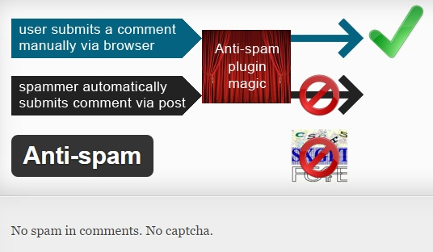

Akismet is no doubt one of the best plugins to avoid trackback, pingback and comment spam. It is free for WordPress sites. Paid version of this service will cost the user within 5 to 30 dollars. The pro version (security and enterprise) will give WordPress users access to the backup tool and advanced reports. They'll also get quality support from Akismet team.

Once you install Akismet, you'll have to have to enter API key by creating an account on the official website of this free service.

Akismet is active and in development since the year 2005, and it is based on a robust algorithm that will detect all types of WordPress spam.

According to the official WordPress.org page of this plugin, when someone posts a new comment on your blog post or page, the comment will be first scanned by Akismet servers after which it will be classified as a clean or a spam comment.

In case you're searching for the best Akismet alternative plugin for 2015, install anti-spam on your site.

This is an entirely free plugin (Pro version is also available) that uses very less CPU and RAM. Thus it doesn't affect your hosting service. It doesn't add a captcha form to your post nor does it affects its loading time.

Antispam doesn't have a settings page nor does it requires any particular configuration. Install it and done! Your WordPress blog or website will be safe from spam comments.

Antispam will automatically update the comment form on your WordPress site with a code that will safely block spammers from using it. It also keeps harmful bots away from your site. Unlike Akismet, useless comments with links will never appear in your WordPress dashboard.

This plugin will display the number of spams it has blocked your site in the dashboard. I'm using it on one my blogs and the results have been good so far. Try it out if you're looking for a free Akismet Alternative.
