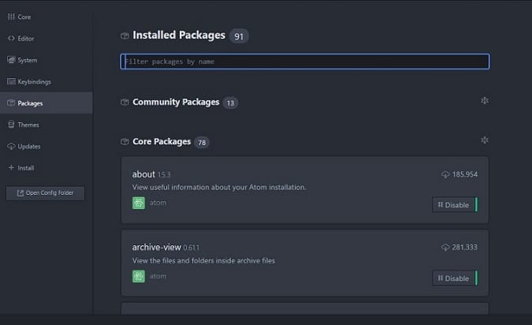

The black background of the text editor soothes my eyes. The text color is great and the interface of the Atom editor is awesome. If you don't like the default Look and Feels, you are free to change it as per your preference or download a new Atom theme. My favorite color is black so I don't find it necessary to change the theme.

The atom editor gets updates on a regular basis. Since I've started using the editor, GitHub has rolled out many updates. Each update makes the editor better. I'm interested only in code. Hence, I haven't checked the full features of Atom editor. For me, Atom is the best tool for web development.

I'm coding a new PHP site and Atom along with WPN-XN stack has made things easier for me. It is a great alternative to notepad++, WordPad, Netbeans, Eclipse, and many other IDEs. The Atom Editor is a lightweight software with neat UI. I'm in love with it.

Atom supports many programming and scripting languages.

Whenever I open Atom, I don't feel like switching to any other program. If you've downloaded Atom and want to use it for website development task, make sure that you download the below top packages for Atom.

Note: Visit file --> settings --> Install to download and install new Atom packages. The editor will take care of downloading the package.

## Best Atom packages for web development

**Linter**: Atom offers powerful linters for HTML, CSS, Python, PHP, JS, LESS and many more languages. Linter packages, when installed and activated will highlight erroneous code. You don't have to open the web page or use developer tools of browsers to find errors in code.

**Atom-beautify**: The beautifier package for Atom will make the ugly looking code beautiful. It has the option to beautify code when the user saves the file.

**Remote Edit/FTP**: Want to make changes to code in a file saved on a production server, you don't need putty, terminal. Simply install the Remote Edit/Remote FTP package and use it.

**Autocomplete**: As you're using the Atom text editor, you might be knowing a language well. Else you have switched to a drag and drop based tool. The autocomplete packages for Atom editor are important for users who want to complete their projects faster.

**Code Snippets**: Some Atom packages lets you add code snippets to a file when you type some keywords in it. The package makes the development of websites faster. Atom provides code snippet packages for Bootstrap, Jquery, JavaScript, etc.

**GIT Plus**: Yet another great Atom package, GITP ensures that you don't have to open GITHUB site to save your project or code. Before using this awesome package, make sure that you configure the git config file correctly. The Atom editor, when used with the GIT plus package is capable of processing commands like push, pull, commit, etc.

**Save Session**: If you're using a PC or laptop with average configuration, ATOM might get less amount of RAM to use. The program may crash. If this happens, the user may lose unsaved work. To avoid this, the user must install the save session package.

**WordPress api**: If you are a WordPress theme developer, this is the must have package for you.

You can find and download the packages mentioned above from the editor itself from the official package website of Atom.
