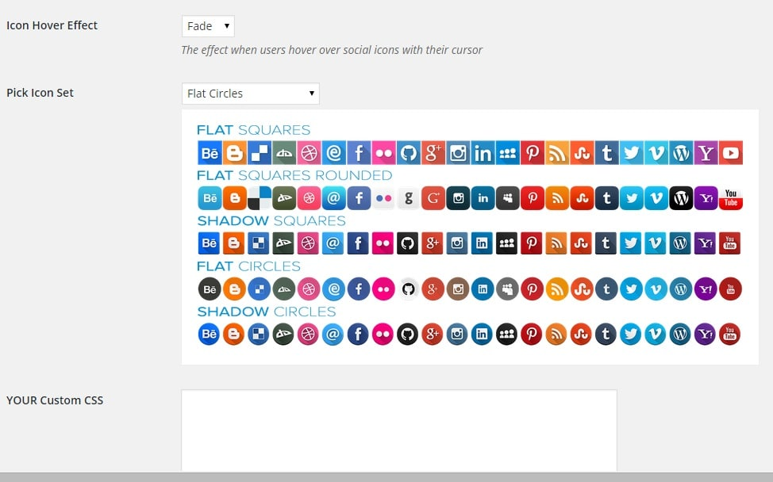
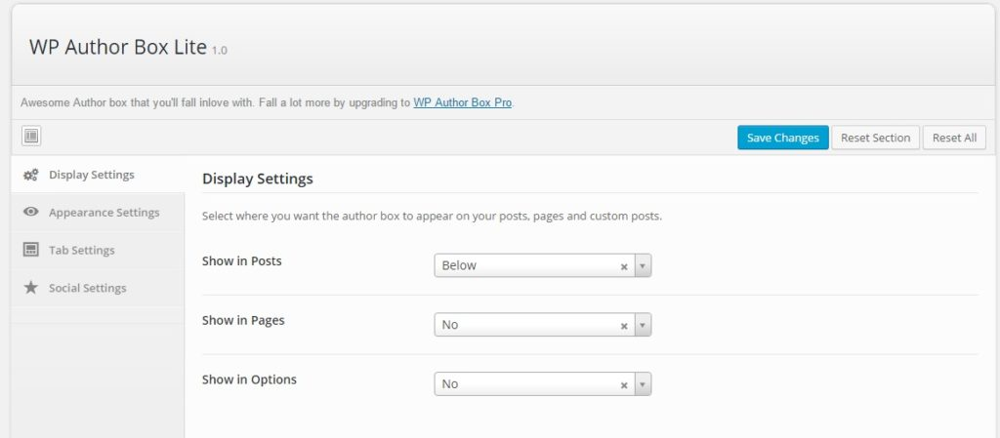
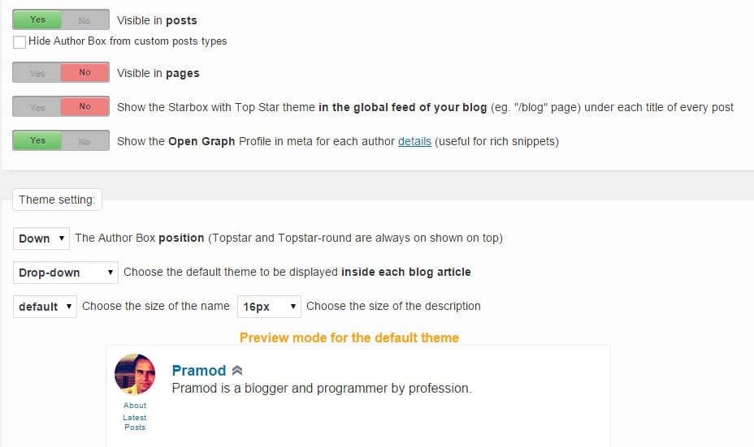

You may have seen author bio widget below posts on many popular blogs. Bio section is important as it makes website users aware of the writer's skills, hobbies, experience, etc. Just like about me, disclaimer, privacy policy pages, the bio section is one of the most useful elements of a WordPress site. Most WordPress themes include the author bio box and to display your information in it, navigate to your profile page by hovering your mouse cursor over users menu (This menu appears on the left side of your WordPress dashboard). If your theme lacks this widget, make sure that you install any of the below plugins.

**Fancier Author Box by Thematosoup**: This plugin inserts a tabbed box below/above your blog posts. The 1st tab has the details and the 2nd display's recent posts of the author. Social network buttons accompany the bio added by this plugin. You can configure this plugin to insert the author box in pages and posts. FAB supports color customization. It has been downloaded over 10000 times. The count will increase if your install FAB on your WordPress CMS powered blog.

\[gallery link="file" columns="2" ids="681,682"\]

Installation link.

**Sexy Author Bio**: The plugin features a single configuration page where you'll find a lot of customization options. SAB allows you to choose one of several social button styles. Ii gives you the option to make social network links nofollow. If you know CSS coding, you add your custom code as well. SAB looks gorgeous. Thus it is a must have plugin if your blog or theme doesn't have an author bio box below post and page content.

Download link.

**WP Author box**: It has a similar design as the 1st plugin we've shared in this article. The coolest feature of this free WordPress plugin is that it allows you to set colors for active and inactive tabs. Along with your bio, you can add around ten social network links to the author bio box. WAB supports Facebook and Google authorship (although Google doesn't show profile picture in search results now). It generates responsive author bio widget. Thus it is mobile friendly.

Installation link.

**Star Box:** This is a widely used and most popular WordPress author bio plugin. Star box supports custom images. Thus if you don't want to use Gravatar service for hosting display picture, install this plugin. Star box includes some beautiful themes. It can be configured to show the author information when the user clicks on a drop down button. This feature is a part of the pre-installed drop down theme. Star box displays latest post published by an author. You can add links to your social profiles as well.

Download link.

**Conclusion**: If you use any of the above plugins, make sure that you don't add a very long bio as it might cause duplicate content issues on your site. Your bio should have just 10 to 15 words describing yourself. You can add complete details on the about me/us page of your blog.
