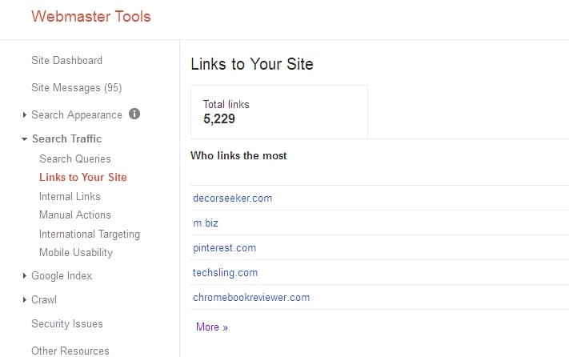
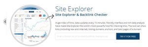

One of the most discussed topics in SEO is backlink. Backlinks help a blog to get higher ranking in search engines. But they can be a reason for the death of your blog too. Backlinks can be created manually by the user or artificially via software. If you write a high-quality article which has unique content, your article will be referred to another website via a backlink.

Natural links are useful, and you should avoid creating links using any other method. Google has explicitly mentioned in its webmaster guidelines that it will show no mercy on sites that participate in link exchanges, link trades, 5etc. Google's Penguin algorithm has proven to be a sworn enemy of websites with bad link profiles. The Penguin algorithm is refreshed every 3 or 4 months. Tools such as Mozcast and algoroo can make you aware of any Google update. Today, I'll be sharing the best five most powerful tools to check backlinks. These tools can generate a report on the daily, monthly or yearly basis.

**Webmaster tools:** Google has added a backlink checker tool in its webmaster tools. You can locate it under the search traffic option. The data shared by Google is accurate. You're allowed to generate a CSV file that covers each link tracked by Google search engine.

**Majestic SEO**: This is the best backlink checker, and it is free to use. You can use it without logging into the site. But if you'd like to know your backlink profile, you should create a majestic account. I've been using it for two years, and it has helped me to get rid of the bad neighborhood and spammy links. With Majestic SEO tool, users can download their backlink profile. This tool shows the anchor text used for backlinks.

**Ahrefs**: This is yet another popular SEO tool to check backlinks. It has the same features as Majestic. But unlike majestic, this tool is not free. Some important features of Ahrefs are:

- **Top pages**: As backlinks help website pages to rank high, ahref will display the pages with the most number of backlinks in this section.
- **Social network popularity**: Ahrefs can show the number of Facebook likes, Twitter tweets and Google +1s your content has managed to get.

**Ranksignals**: This is a useful tool. When I was a newbie blogger, I used ranksignals to find backlinks of competitor sites. Before 5 or 6 months, this tool didn't require you to create a profile. But now, you have to register an account before you start exploring backlinks via Ranksignals.

**OpenSite Explorer**: Developed and maintained by Moz, this tool displays 2 of the most important metrics (the domain and page authority) that decide search visibility of a website. Both PA and DA are considered as a page rank alternative. Google has not updated page rank since a year. Thus, you can use this tool to web sites power in search engines. Opensiteexplorer displays Dofollow/Nofollow, 301 or 302 redirected backlinks. It also shows the backlink source.

The hope that you've found the list of SEO tools I've shared in this article useful.
