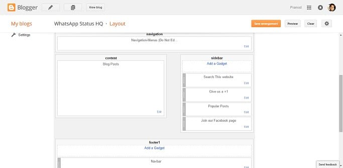
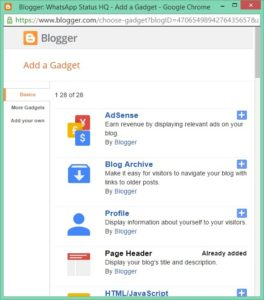

Blogger might not be offering too many fancy and responsive templates as WordPress, but it is a powerful CMS.

In WordPress directory, there are a lot of plugins but in blogger, there are a few but useful widgets. Thus if you're a person who doesn't like to explore and try out new things, Blogger is the best CMS as you just have to add your favorite widgets by navigating to the layout page in Blogger and on that page you've to click on add gadget link.

Frankly speaking, you don't have to decorate your blog with useless widgets as it can annoy the visitors. The below best widgets are what you need to focus on.

### RSS Subscription

This blogger widget will give your site regular and loyal visitors/readers. The user will have to enter their email address, and they've to confirm the subscription to get emails. This widget will add Feedburner subscription system. If you don't want to use Feedburner, try out its best alternative MailChimp.

### Recent Posts

When a visitor is going through a blog post, he might be interested to know the latest articles that you've published. He can easily find the most recent content on the homepage. To be honest, there are very fewer chances that a user will visit other pages on your blog unless you have published very high-quality content. Thus you should add recent posts widget to the sidebar of your website.

### Popular Posts

This is an important element on a site because it can reduce your blog bounce rate as well as increase the page-views. Blogger has a well designed popular posts widget that displays thumbnails as well.

The above two blogger widgets will improve your site structure, and they'll increase traffic to the top posts of your website.

### FaceBook like box

Creating a like box widget for the blogger is easy. Facebook has developed a tool for creating them to all sites regardless of its content management system. All you have to do is, visit this page, select a box type and click on generate code. Add the script just after <body> HTML element and the other code to an HTML widget.

### Google+ Badge

When it comes to SEO, Google plus can play a significant role for your site. If your posts have received heaps of +1s, expect them to rank high in Google. +1s are not the only reason why you should add a Google+ badge to your site. If you want some people to regular visit your posts and promote them, create a Google+ page and add its button to the sidebar of your blogger template. Use this official Google tool to create badges.

**Conclusion**: Widgets are crucial elements of a website. They not only make your site easy to navigate, but they also increase page views and followers of your site.
