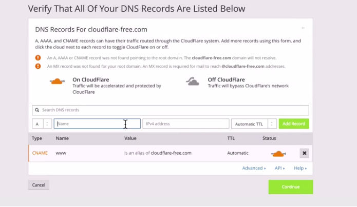
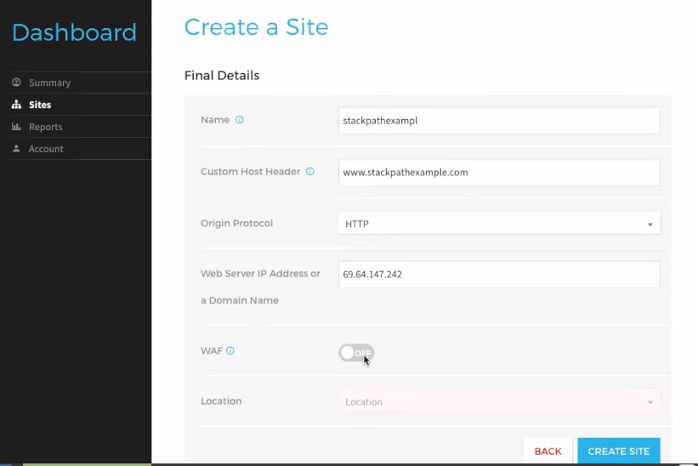
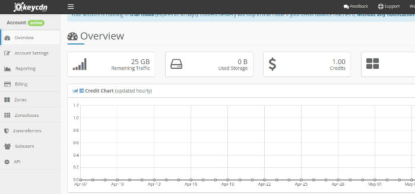

CDN aka content delivery networks improves the performance of your site. They reduce the latency by serving JavaScript and CSS files from the location closest to the visitor.

A CDN provider may have several data centers spread across the world. When you signup for the CDN service, the service will cache static resources of your site on a server nearby the location you specify. You'll have to install a CDN plugin so as to change the website resource URL.

For example, the plugin may change the URL in following format http://example.com/d1/d2/d3/d4/style.css to cdn.example.com/style.css.

If the CDN service provider has several data centers, your site's assets will be synced to many machines. When the visitor tries to access your site, the server nearest to the users will send the cached files as a response.

The CDN services support minification of files and they also compress images so as to improve their loading time.

## Best CDN providers of 2017

### Cloudflare

Cloudflare is the world's largest CDN service provider. Apart from improving the load time of the web pages on your site, CloudFlare keeps your site safe from hackers, bad bots, etc.

When you enable CloudFlare for your site, the ping time will reduce significantly. CloudFlare is easy to setup. It has a wizard tool that makes sure that users don't get a headache while setting up CloudFlare. CF scans the DNS records of your site and recommends some changes.

Cloudflare uses a powerful DNS service that filters malicious requests. It has a report section where you can see the amount of bandwidth the CDN network has saved, the number of genuine/bad visitors your site received, etc.

CloudFlare features a built-in JS Script, CSS, and HTML file minifier. It allows you to turn on the Rocket script feature that loads all JS files on your site asynchronously. CloudFlare CDN offers a free plan. It provides paid plans for the users who want to enjoy better features.

CloudFlare has 1+ million users. If your site is targetted by DDOS attacks and you're searching for a free solution to mitigate it, you should begin using CF.

Visit CloudFlare

### StackPath

MaxCDN has been rebranded to StackPath. The company is running since 2009 and it has a large number of users. Unlike CloudFlare, StackPath doesn't have free plans. However, it allows you to try the full features for free. The free trial offer is valid for 15 days. The cheapest subscription plan of StackPath costs $20.

StackPath has imposed monthly transfer limits for each plan. It protects your website from DDOS attacks. It provides a powerful web firewall that protects your website from rogue users and malicious bots. StackPath offers free SSL certificate and 24 x 7 support for its customers. It supports two-factor authentication.

StackPath CDN provides a real-time analytics tool. To improve the performance of your website, the CDN enables users to set EdgeRules. The CDN provider has datacenters in the US, Asia, Australia, and Europe. It has a powerful control panel.

Signup for StackPath

### KeyCDN

KeyCDN is a yet another leading CDN service provider. It allows you to manage CDN zone for your site. KeyCDN comes with a web analytics tool and it has the option to check raw access logs.

KeyCDN servers are powered by the fastest SSDs in the markets. It supports HTTP2 protocol and has the option to turn off the free LetsEncrypt SSL certificate on your site. It enables you to purge website resources on a single click of the mouse.

KeyCDN allows you to the see the files with maximum requests. It lets you disable hotlinking of files and block IP addresses. You can turn on GZIP compression for the files and set custom expiry headers for the static resources with KeyCDN.

The CDN provider owns 25 data centers. It has cheaper plans than StackPath.

Signup for KeyCDN and get free $10 credit.

### Amazon CloudFront

If you're using Amazon AWS, you must consider using Amazon CloudFront CDN service to speed up your website. Cloudfront is tightly integrated with Amazon AWS cloud hosting and has a powerful dashboard.

Amazon CloudFront supports dynamic content and HTTP Post/Put requests. It allows users to use third-party SSL certificates. It supports wildcard CNAMES and allows you to turn on regional caches.

The CDN provider allows users to set TTL for data packets and it supports URLs with complex query strings. It comes with a function to detect the user agent of the visitor. CloudFront gives users access to HTTP requests and response logs. It also generates reports of various types.

Visit Amazon CloudFront

### JetPack Photon and JSDelivr

If you're using WordPress, you can use use the JSDelivr and WordPress Photon CDN service to improve the load time of your blog.

The 1st CDN i.e. JSDelivr hosts commonly used JS and CSS files. When you install the JSDelivr plugin, the plugin will find and replace code that loads CSS/JS files that are hosted on your server and are supported by JSDelivr.

The JetPack Photon CDN supports images only. You can enable this service by installing the free JetPack WordPress plugin.

**Conclusion**: CDN services we've mentioned above are reliable. They provide several features and have reporting section where you can check the top referrers, pages, etc.
