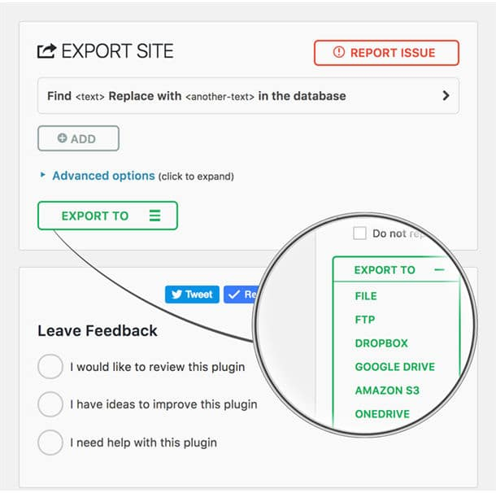
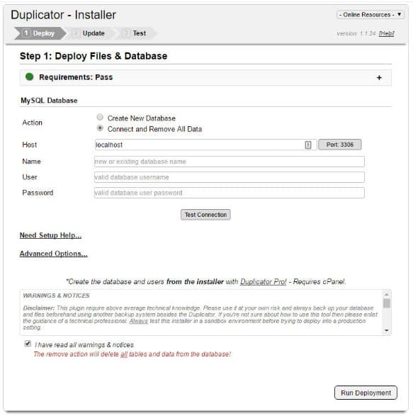
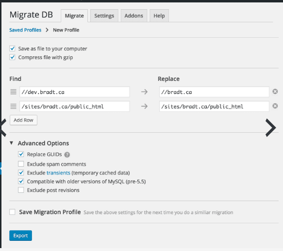

Even though I have a technical background, I was not comfortable in moving my sites during my initial days of online career. At that time, 2 of my biggest worries were:

1. Incorrect site configuration can lead to tons of soft 404 or 404 errors.
2. If DNS isn't configured correctly, search bots and visitors would fail to access my sites.

I started my online journey in May 2013. I've changed my hosting platform and moved my websites several times in the last four years without losing website traffic. Right now, my websites are hosted on an unmanaged Linode cloud server. Before switching to Linode, I used Digital Ocean. To move my sites, I follow the below steps:

1. Backup the DB and entire website directory on the old server.
2. Log in to the new server over an SSH connection
3. Install the web server, PHP, MySQL on the new host.
4. Login to the old server using SFTP.
5. Upload the backed up files to the new server and extract them.
6. Create a new DB with user ID and password mentioned in the wp-config.php file of the website.
7. Move the directory and edit the web server configuration file so that PHP can execute the code.

If you don't want to follow the above steps, install one of the free website migration plugins we've mentioned below.

### All-in-One WP Migration

All-in-One WP is the best plugin for moving WordPress sites. 3350 WP users have rated this plugin. Out of 3350, 3000 people have given 5 stars to All-In-On WP plugin.

Shared hosting providers restrict users to upload files of megabytes size at a given time. All in One WP plugin can bypass this restriction by breaking a large file into smaller chunks and uploading it sequentially.

The plugin doesn't require special PHP extensions or MySQL drivers. It supports PHP 5.2/WordPress 3.3 and its successors.

All-In-One WordPress plugin supports all major hosting service providers, Windows, and Linux OS. Using it doesn't require technical knowledge.

Download All in One WP

### Duplicator

Duplicator is a robust site migration tool for WP. It is free and has excellent features. Duplicator enables users to backup their sites. It lets you clone a live site on PC so that you make changes to the code and test it in the localhost environment. Duplicator allows you to move a localhost site to a production server.

The plugin replicates an entire site without making users type commands. It has a wizard based interface. Hence, Duplicator is easy to use.

Before creating an archive of your site for migration, Duplicator will scan your site to make sure that the site deployment task on the new server is error free and smooth.

Download Duplicator

### WP Clone

A good alternative to the Duplicator and All-In-One WP migration is WP Clone. The plugin migrates your entire site to the new host without prompting you to upload files or type commands. File transfer takes place over an HTTP connection.

Migrating a small site takes 1 or 2 minutes but if a website is large, the transfer process can take several minutes with the WP Clone plugin. Removing useless files from the WP installation directory will reduce the archive size containing your site's files, images. Thereby improving the transfer speed.

Download WP Clone

### WP Migrate DB

WP Migrate DB is a free plugin that generates a backup file of your database. The file in .sql format. You must upload it to your new host with the PHPMyAdmin tool.

This plugin handles serialized data very well. It provides an option to find and replace string in the database tables. This is a useful feature if you're changing the domain name. Before running the export operation, you can configure this plugin to replace GUIDs, exclude spam comments, transients, post revisions.

Download WP Migrate DB

## A couple of things you should remember before changing host

**Backup the DB and the WordPress installation directory**: Your post data, theme and plugin settings are saved to a MySQL database. If the database is corrupt, your site may crash. If you've backed up your site's DB, you can restore the tables immediately when the site isn't opening on the visitor's device.

**Don't change DNS**: If you own a busy website, change DNS of the site only when the migration is complete. If your site isn't deployed correctly on the new server, users won't be able to access it. Hence, before modifying the DNS settings, make sure that the configuration file data is correct and the database has been set up correctly on your new host.

Conclusion: Moving a WordPress site from one hosting provider to another is an easy task for an experienced webmaster or a person with good knowledge of MySQL, Unix commands, and web server configuration. Newbies must follow the right instructions else they might end up losing important files. If you want to avoid the headache of typing MySQL or Unix commands, edit files in the terminal, install and use one of the above free Wordpress migration plugins

### Bluehost - Limited time offer

Get a free domain name and website builder. Install WordPress with one click. Get 24 x 7 support for a price starting at $2.95 More details
