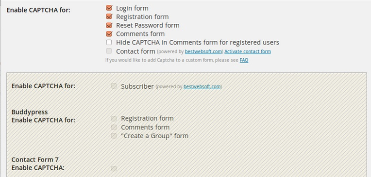
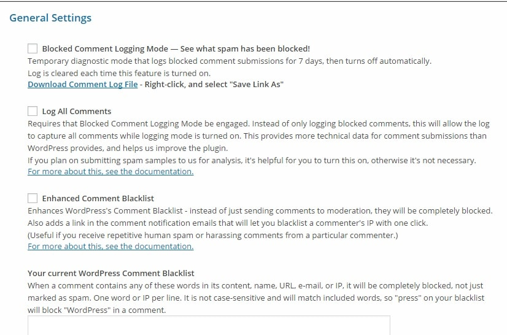
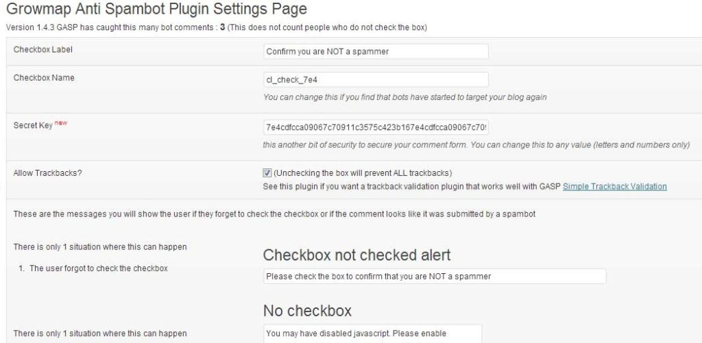

As WordPress content management system has a commenting and trackback system, it's always on the target of spammers. Trackback links are added below the post content. A spammer who wants his website or YouTube videos to rank high in Google or Bing will drop useless comments with some URLs.

If you're allowing dofollow backlinks, link juice will be transferred to the commentators website. To avoid this, install and activate the ultimate nofollow plugin on your blog. This plugin will allow you to convert all dofollow links in comments to nofollow. To block spam comments on your WordPress website, you install any of the below free plugins:

**Akismet**: In my perspective, Akismet is the best WordPress spam blocker plugin for 2015. It has been maintained and developed by Matt Mullenweg (the founder of WordPress CMS) and his team. When you activate this plugin, all comments posted on your blog will be scanned by Akismet servers. If the comment is clean, it will appear in the pending section of your comment dashboard. Akismet is free to use on a single website. You'll have to enter your API access key to start using this plugin. To use Akismet on multiple blogs, you'll have to upgrade your free account to pro version.

**Download Akismet here**

**Captcha by BestWebsoft:** Akismet is an excellent plugin, but it doesn't block spambots from accessing your blog's comment form. To block bad bots, you must install a captcha plugin. This plugin will present you options to add image and number based captcha system on your comment and contact form. A user won't be able to submit the form unless he/she enters the correct code. Thus spam will be blocked. BestWebsot has published several plugins in the WordPress directory. Its plugins have excellent ratings and reviews from WordPress users.

**Click here to install this plugin**

**WP-SpamShield:** This spam blocker plugin offers the option to disable pingbacks and trackbacks on your site. It can protect registration and comment forms with a captcha system. WP-SpamShield can block users that are using proxy servers to comment on your blog. It can be configured for discarding comments left by users who have added irrelevant keywords as their name.

**Installation link**

**GASP**: This is a simple but one of the most capable Anti-spam WordPress plugin. When you add GASP to your blog, it will automatically add a small tick box to your comment form. Users will have to check mark the tick box else their comments won't appear in your WordPress dashboard. I've already shared information on Gasp in my ComentLuv review article. Go through it to get more details on the GASP plugin.

**Installation link**

**Disqus**: This plugin will replace the ordinary comment form on your blog with an excellent interface. It has a very powerful spam detection and blocking system. Disqus supports blacklisting of users. It has a JavaScript-based user interface. As commentators data and CSS or JS files of Disqus is not saved to your website's database or installation directory, your site will load a bit faster when you activate this plugin.
