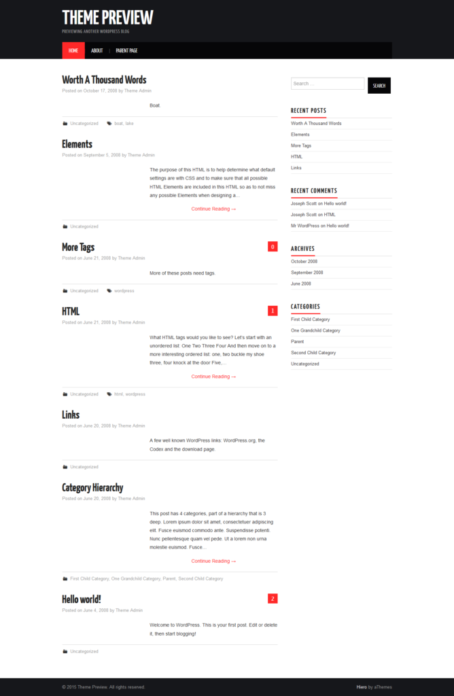
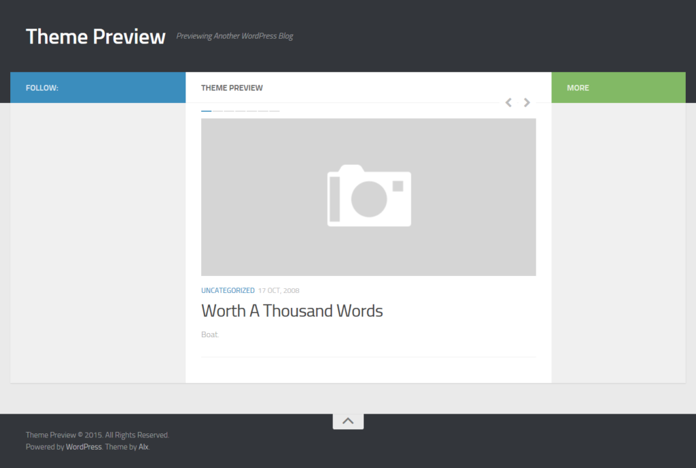
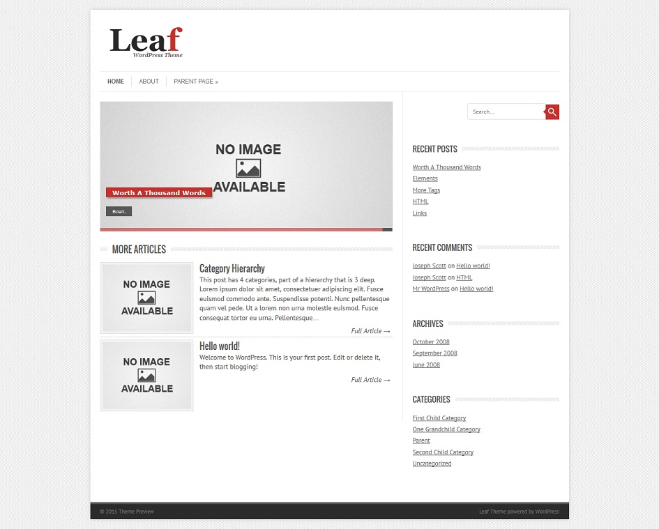
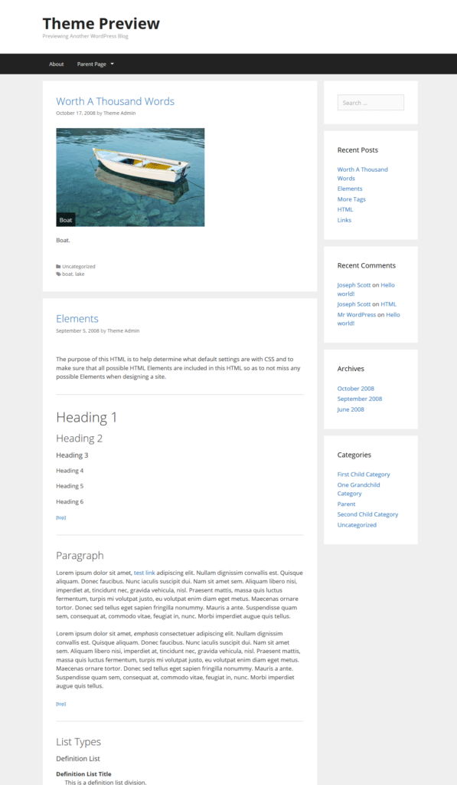
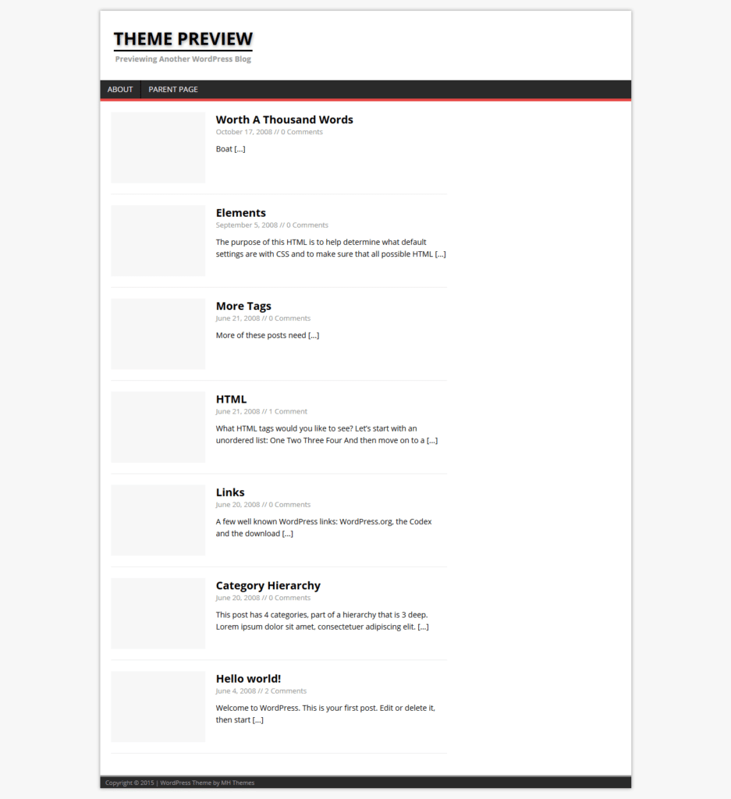
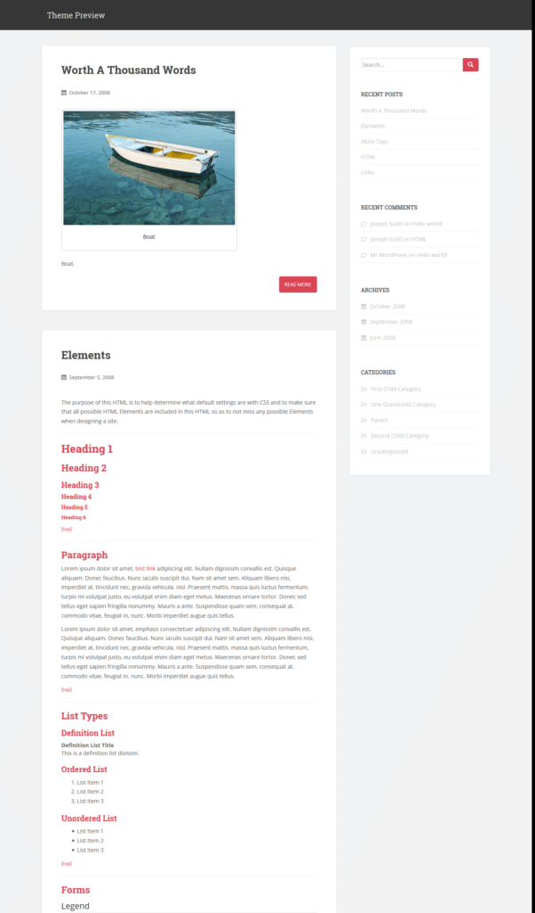

Last month, Google had rolled out its mobile friendly algorithm update. As a part of Google's strategy to improve the user experience of search engine users, websites that were not having responsive design or websites whose theme was not mobile friendly were penalized. Immediately after the Google algorithm update, Bing updated its search algorithm to improve rankings of responsive and mobile friendly websites. If you're a webmaster or a newbie blogger, you should use the below **free themes for WordPress:**

## Best stylish and free WordPress themes that are responsive (2016)

**Hiero**: This is a free responsive wp theme. Hiero features a black color header and red color hyperlinks. You can change the colors if you've CSS code editing skills. This theme features a tabbed widget that displays tags in one tab and most recent and popular posts in separate tabs. Users are allowed to change the number of articles displayed in this widget. Hiero doesn't feature a paging navigation. You can use wp-page navi to add a paging navigation to the hiero theme. This responsive theme is fast, and it has a responsive mobile friendly navigation system. It is easy to customize. When I had started my blogging career, I used free blogger template for some months. After moving my site to a self-hosted platform, the first WordPress theme I used was hiero. Due to its SEO friendly nature, the traffic to my site increased to over 2000 UV/day.

**Check heiro theme demo or download it here.**

**Hueman**: This is one of the most beautiful free WordPress themes that you'll ever come across. Hueman features a slideshow widget (featured articles) on the homepage. This is an excellent feature as slideshows have proven to increase user engagements. This free responsive theme has a left and a right sidebar. The sidebar on the left can be used to add important widgets like Recent, Popular posts, and comments. You can also add social network icons to increase the fan following. The right sidebar is hidden. Clicking the more button will make it visible. Hueman features a superb paging navigation system. It has a back to top button in the footer section. Archive and the home page of this responsive theme display post in a grid layout.

**See demo or download hueman theme here.**

**Leaf**: This is what I am using on Hostileblog.com. Leaf is a responsive and one of the lightest theme that you can use for free. It packs with a slideshow maker. You're allowed to change the slider effects, speed, transition, etc. This theme supports two layouts, i.e., box and wide. It has an option to use Oswald or PT Sans Google font. Leaf responsive theme for WordPress allows users to change or specify the column width. It allows webmasters and bloggers to add custom CSS without creating a child theme or editing the style.css file. Leaf users can modify the theme accent colors quickly. If your need a straightforward and fast responsive theme, download leaf and install it.

**See demo or download Leaf theme here.**

**GeneratePress**: This is a W3TC standard compliant and validated responsive them with excellent features. GeneratePress allows you to change theme colors and typography. This free WordPress theme includes schema.org microdata that makes it possible for Google, Bing, and other search engines to understand the content on your site. GeneratePress code supports Internet Explorer and the other main web-browsers i.e. Chrome and Firefox. It can be used with Woocommerce plugin. GeneratePress has three footer widgets. It can be easily translated to your favorite language. You can use BuddyPress forum with it.

**Download here or check the demo.**

**MH Magazine**: This is a WordPress magazine theme that allows you to disable author box, post attachments and comments quickly. You are authorized to change the background color or image of MH Magazine. This theme is responsive, and it has four footer widgets and a single sidebar. Users can change the sidebar location from right to the left. MH Magazine theme can be used on technology and news websites.

**Check demo or download here**

**Sparkling**: This theme is built with the latest Bootstrap technology. Thus it is fast and responsive. Sparkling displays featured images on excerpts. It has a clean popular and category widget that can be added to the right sidebar of this theme. Sparkling features CSS3 and HTML5 elements. Its code is clean and SEO friendly. This theme supports footer and header menu. You are allowed to change or add a header and background image in the Sparkling theme. This template is suitable for photography, design, and personal blogs.

 

**Check demo or download this theme here.**

Stay tuned! We'll keep adding more templates to this article.
