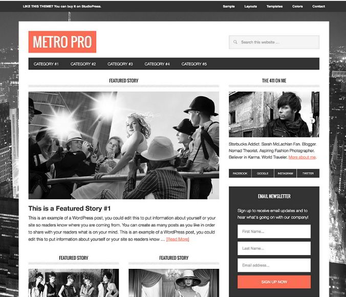
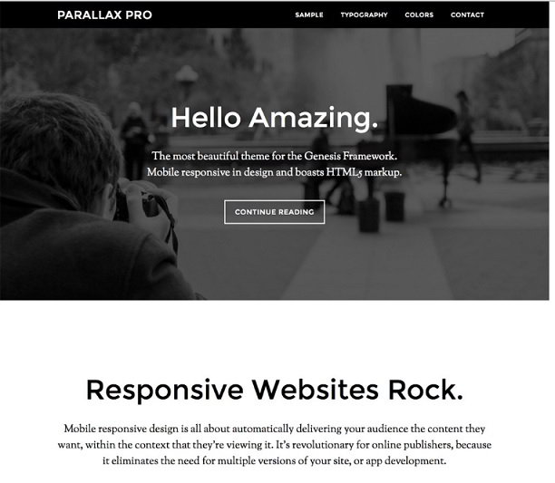
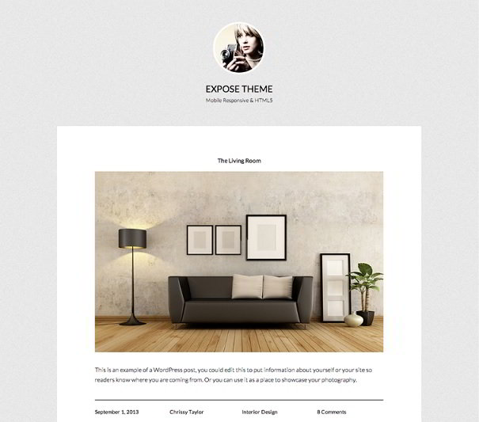
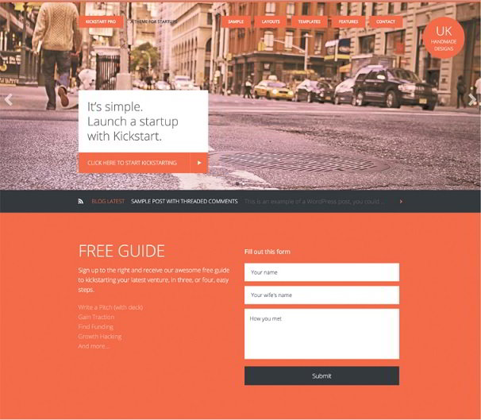
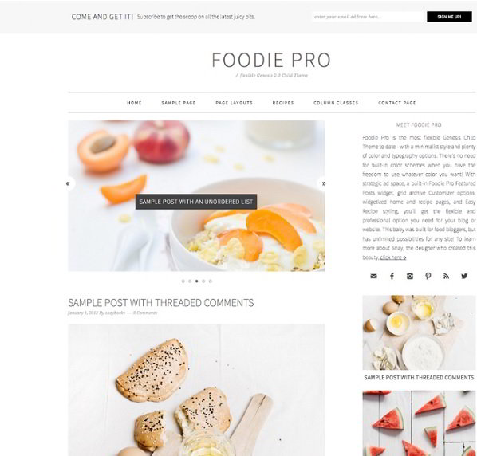
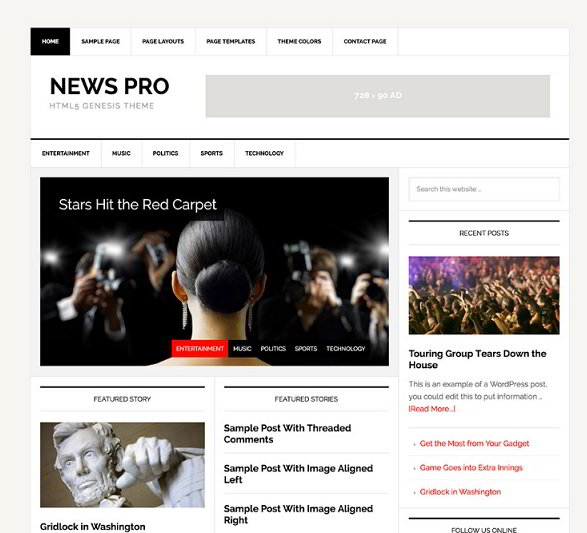
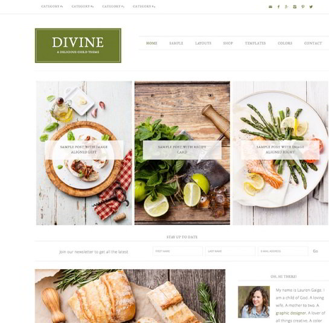
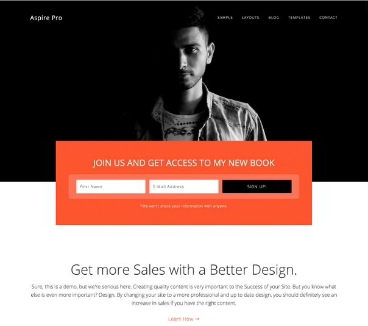
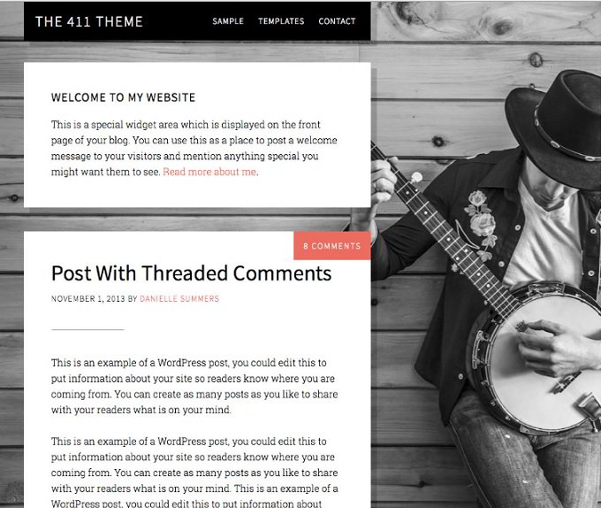

Genesis Framework is a WordPress product from the owners of Copyblogger content marketing blog. It is so popular that every blogger using WP is aware of the Genesis Framework and its premium themes. If your site is using this framework, then you'll not face any SEO issues unless you do something wrong Ex: changing code. Genesis Framework powers many top websites and blogs built with WordPress.

All the themes launched by StudioPress Genesis Framework are SEO friendly, responsive, Google AdSense ready, and adhere to HTML5 standards. As they are designed and developed by experts, the templates performance will be great even if the user is using shared hosting service. In case you're planning to purchase the StudioPress Genesis Framework, go through the paragraphs we have shared below as today we've shared the top best Genesis Child Themes for 2016.

### Metro Pro

Metro Pro is an elegant child theme which you can use on blogs of any niche. I've seen the Genesis Metro Pro template on many successful blogs. The theme is visually stunning and beautiful layout which makes navigation easy.

This Premium Child theme from Genisis Framework offers support for the background picture, feature image, and after post widget. Many themes don't allow the users to add a widget below the post content, but Metro Pro does. This Child template provides six layout options and five color styles for blogs. It supports customization of the header and has a dedicated landing page template.

This Child Template has a unique about Author widget that makes the visitors aware of the blog owner. Metro Pro theme also features an inbuilt opt-in form for increasing the Newsletter subscribers.

**Demo/Download link.**

### Parallax Pro

Parallax Pro is the best Premium WordPress theme for business or portfolio websites. It is based on a minimal design with parallax effect for fast loading speed and better conversion rate. This template offers Green, Blue, Orange, Pink, and Red color styling options. It supports footer as well as header menus.

Parallax Pro has superb design wich attracts the visitors attention and makes him explore your website further. It lets you add a background picture. This Genesis Child theme has a beautiful landing page, and it supports blog posts as well. It is mobile-friendly, SEO friendly, and compatible with all modern browsers.

**Check demo or download.**

### Expose Theme

Expose is a Genesis Child theme highly suitable for photography and design blogs. As per its name, the theme has been designed to expose your work to others.

In Expose template, the items in the menubar at the header and footer section of the website are center aligned. Each post you publish on a site using this theme will have an XL sized featured image. The Meta information  i.e. category, tags, post date, author name, the number of comments will be displayed below the blog post.

The Expose Genesis theme also features a widget area below blog posts so that you can add a gallery widget to showcase your work. It is beautiful and fast.

**Download or see the demo**.

### Kickstart Pro

If you're planning to launch a website for your startup, then the Kickstart Pro Child theme is an excellent option to consider. The theme is visually stunning, and it offers many useful features to make your website complete. It has a beautiful newsletter subscription form through which visitors interested in your startup can get updates from your site to their email address.

Kickstart Pro theme lets users add up to seven widgets on the homepage (four on the footer section). It provides three layout options and allows you to add a homepage slider.

**Download or see the demo.**

### Foodie Pro

Another widely used Premium Child Theme from Genesis Framework, the Foodie Pro has plenty of options to configure. It offers multiple styles of the sidebar and full-width content. The users are allowed to place widgets on the homepage of their websites.

This Child Template from StudioPress Genesis Framework has excellent typography. It has unique recipe widgets which can be used for various purposes. The theme is compatible with the widely used Easy Recipe Plugin for WordPress. If you're planning to start a Food Blog, then consider buying the Foodie Pro template.

**Demo/Download.**

### News Pro

News Pro is one of the most widely used child themes from Genesis Framework. Because of its magazine style layout, NP is highly suitable for a news website.

The user is allowed to add up to twelve widgets on the homepage. He can choose one of the five predefined layouts for the blog. This theme is easy to set up. It supports customization of every essential element that you'll find in the template.

**Download or see the demo.** 

### Divine Pro

Divine is a unique theme from Genesis Framework, which can be used on blogs and websites of all types of niche. The template features primary and secondary menubars. The user can configure it to show social network icons on the top menubar.

Divine Template has a fantastic layout, and it makes use of immaculate and eye-friendly fonts.Because it supports various sizes of images, you can use this Chil Theme on photography, food, design, and fashion blogs. Divine supports woo-commerce. It offers three layout options and different widgets for making your website more productive.

**Download/demo.**

### Aspire Pro

Aspire is yet another unique template from StudioPress, which can be used to showcase a product. The homepage has various sections in which you can add information to your product.  The theme features full-width menubar and multiple homepage sections.

Aspire Pro theme has a beautiful design. Moreover, this template is search engine friendly and mobile friendly.

**Check the demo or download the theme**.

### 411 Pro

411 is a minimalistic theme with a solid design. It is intended for bloggers who are interested in presenting the content more than filling the sidebar or the header section with ads. It has a special homepage section for greeting the visitors. The widgets offered with the 411 Pro Child Theme are attractive.

411 Pro supports customization. It has unique layout options and SEO friendly code. This template is mobile-friendly, and it supports full-width background picture.

**Demo/Download.**

**Conclusion**: We believe that the above Genesis Child Themes are the best in the world. Because of their unique and eye-catchy design, your blog will benefit from it. StudioPress offers excellent customer support and updates. It is a company which you can blindly trust.
