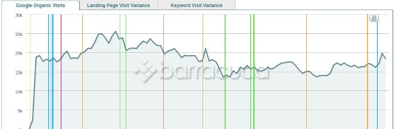

1000s of changes have been made to Google Search Engine since it was launched in 1998. Engineers working at Google don't reveal what changes were made, but they do warn or alert webmasters that their website traffic may be impacted by an update.

In case your blog or website is not performing well suddenly in Google, you must know that your site has suffered a Google Penalty. To know which Google Algorithm has affected your site, you can either post help message in the webmaster central forum or use the Baracuda Panguin tool.

### How to use Barracuda Google Penalty Checker tool?

Open the Barracuda tool and click on the large button with Log into the Google Analytics label. You'll now be asked to log into your analytics account. After you log in, you'll be prompted to give Baracuda the permission to access your reporting data. Grant the permission by clicking on the Allow button.

Once Baracuda finishes reading your data, it will show a list of your GA profiles. Select a profile that you want to check and wait for a few seconds. The Panguin tool will display a graph of the following type.

To the right side of the graph, you'll see toggle buttons to highlight the following updates:

- Google Penguin.
- Panda.
- Structural (Phantom, Mobile Friendly, etc).
- Local.

Below the graph, you'll find the options to select a date range, filter data by keyword, landing page, etc.

To know which Google Algorithm has knocked your site down, observe the graph closely. Once you find the culprit algo, make changes to your site accordingly and wait for the algorithm refresh. Penguin and Panda are real-time algorithms. Hence, the changes made to your site will reflect early if one of these two algorithms has punished your website

**Conclusion**: Google makes several changes to its core algorithm. If your website traffic is down, the Baracuda tool will help you find the algorithm responsible for the same.
