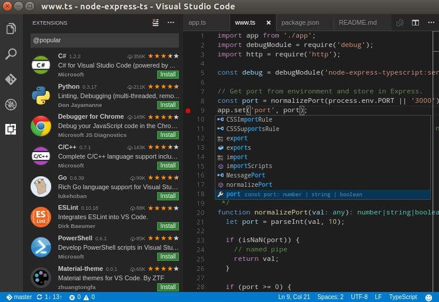
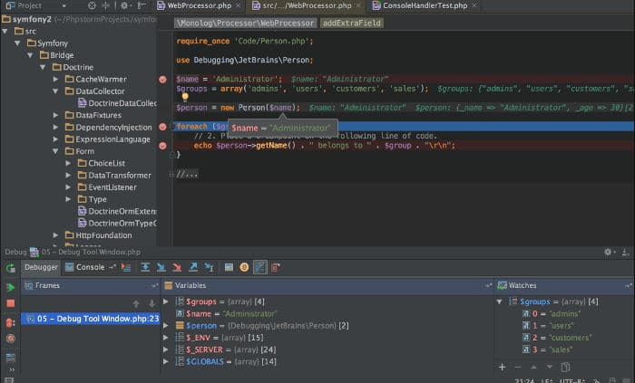
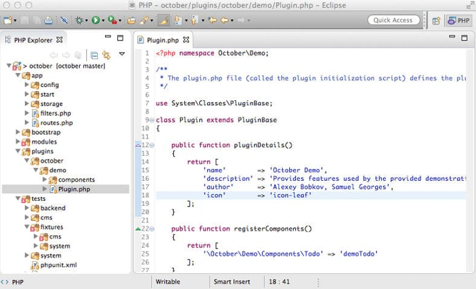
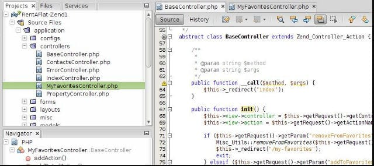

PHP is a scripting language that powers over some of the busiest websites on the web. Several languages have been introduced since 2005. None of them have affected the popularity of PHP. Before IDEs were launched, seasoned developers and beginners used vi or notepad to write PHP code. Once the code was ready, developers moved the PHP file to the webapps folder of the web server to check whether their code is working as expected or not. If the browser didn't display error, developers used to check log files.

IDEs have made the lives of programmers easier. They improve productivity by automatically completing the code. IDEs make users aware of typo mistakes and errors in real-time. To do so, they compile the code as soon as the user saves the file.

If you're writing a database driven application in PHP, you can manage the database with the IDE. As IDEs allow users to group files, they make project management easy. IDEs display the project structure in their sidebar. To move a file, you have to select it with the mouse/trackpad. Then, you must drag the file to the folder of your choice.

Unless a project has a couple of pages, it doesn't make sense to save the code files in one folder. Grouping files saves time as you can find a file you want to edit quickly.

The integrated development environments can prevent "missing HTML tag" errors by completing the HTML tags automatically. They allow you to install composer, a tool that manages PHP dependencies automatically. Some IDEs provide a code refractor tool with which you can make bulk changes quickly.

Here is the list of the best PHP IDEs for Windows, Linux and MAC operating systems:

### Visual Code

VSCode is a TypeScript, CSS, and JS powered editor which you can use as an IDE by installing extensions. It gives you access to over 50 powerful HTML, CSS, and PHP extensions. You can install and use the extensions to improve your productivity.

VSC can automatically complete CSS code. It also suggests styles in a drop-down list when you're editing a CSS file. It allows users to change the color theme. VScodes supports many object-oriented PHP frameworks.

Unlike PHPStorm, VSCode is an open-source IDE. Its source code has been published on the code sharing site Github by Microsoft Corporation. If you spend some time in installing plugins, you can make VSCode the most powerful PHP IDE.

Download VS Code

### PHP Storm

Developed by JetBrains, PHPStorm supports many popular PHP frameworks such as WordPress, Drupal, Yii, etc. The latest edition of PS supports SSH protocol. Hence, you can quickly login to a remote server for deploying a project. PHPStorm supports DB connectivity. It provides SQL editor tool which highlights SQL functions/keywords. It supports light/dark color themes.

Once you install this IDE, you can get started with your project without finding and installing extensions. PHPStorm is a great IDE, but it isn't free for commercial use. If you're a professional developer, you can use it for 30 days for free. Once the trial period expires, you must buy a license by paying $89/$189 every year or $8.9/$64 each month.

Students, teachers, and open-source project developers can continue using the IDE after 30 days by providing a proof.

Download PHP Storm

### Eclipse PDT

Eclipse Foundation has launched separate IDEs for PHP and Java. Eclipse PHP IDE enables you to define new web-servers and edit their configuration files. Like other PHP IDEs, Eclipse supports code formatting, refactoring, auto-completion, etc.

Eclipse marketplace provides many PHP extensions/plugins. Unfortunately, it doesn't offer extensions for Bootstrap, the popular front-end framework. The IDE ships with a built-in web-browser. It displays syntax errors in real-time. Eclipse supports font and color customization.

Do you know? Eclipse is the most popular IDE for writing Java applications. It has been built using Java and C.

Download Eclipse

### Netbeans

Like VSCode, PHPStorm, NetBeans supports various PHP and front-end frameworks. NB allows users to create PHP projects. While creating a project, you can select encoding type and configure the Run configuration. NB supports file transfer protocol to make project deployment task easy for the developers. It provides GUI for database management.

NB highlights syntax. It supports code completion and debugging in command line mode.

Download Netbeans

**Conclusion**: JetBrains PS, MS VS Code, Eclipse PDT, and NetBeans are the best IDE for PHP web development.
