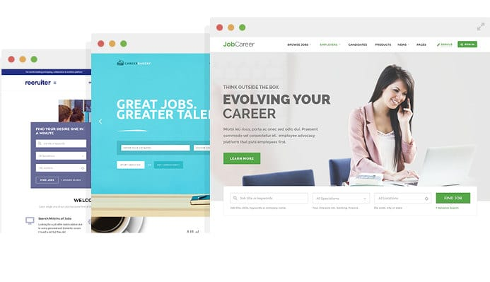
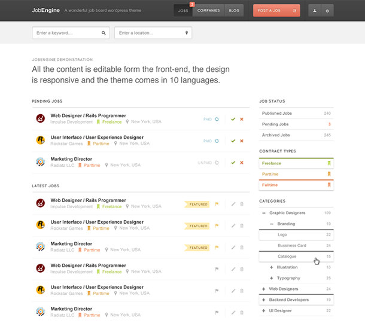
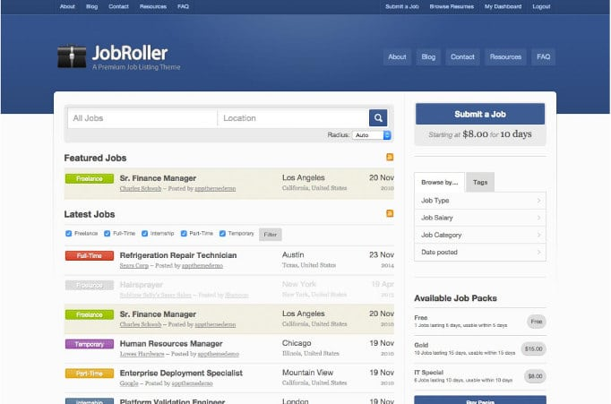

Recruiting a right person is crucial to the success of a business firm. Creating a website that allows you to publish job listings and managing them is not a huge task for a website developer. The developer can take anything between 20 to 50 days to create a job board site and he'll charge you over $500 as a fee. If you're are looking for a cheaper option, consider using WordPress content management system and buy one of the best Job Board Themes for WordPress we have shared in this article.

The themes we have shared here pack with detailed documentation and believe me, they have a professional design, plenty of features, and more importantly, the themes are easy to manage. You don't have to write a single line of code. All you have to do is enable or disable settings of your choice.

With the WordPress Job Board templates, you can manage listings from the WP dashboard. They also provide advanced filters so that visitors can shortlist jobs as per their preferences. Here are themes:

### JobCareer Theme for WordPress

The WP development firm ChimpStudio published JobCareer on the ThemeForest marketplace this year. JC is one of the most stunning and complete JobBoad themes for WP.

JC offers drag and drop interface, with which users can place the following elements at any position of the page:

- Email and Job alert for visitors.
- WooCommerce payment module.
- Resume manager, application deadline.
- Free job submission, search by geolocation.
- Social app login, application tracking, resume builder.
- And plenty of other useful add-ons.

Other JobBoard themes provide the add-ons mentioned above for an extra price but this is not the case with JC. Once you download this template, you've full access to all add-ons.

JobCareer is a responsive theme which works great with other popular plugins such as Yoast, All in Once SEO, WordPress Total cache, etc. It supports MailChimp email marketing platform and integration with PayPal, Skrill, Contact Form 7, etc.

ChimpStudio has designed JC template for the desktops and mobile devices. Hence, its template looks beautiful on mobile and PC browsers. This WordPress Job Board theme is SEO friendly and the developer updates it regularly. It packs with different demo layouts which you can use it on your site.

Download or see demo

### Job Engine WordPress theme

JE is one of the most downloaded premium Job Board themes of all times. It provides a wizard web interface for setting up a beautiful job board.

JE offers a beautiful header menu where you can add your logo, small description of the site, and menu items to allow visitors post advertisements, login, etc.

Job Engine has a style customizer feature, with which users can define menu color, fonts, page layouts, background pattern/color, etc.

The theme offers Ajax based filter module through which you can shortlist jobs by  the following conditions:

- Contract type.
- Category.
- And more.

It has a load more option so that users can find more relevant jobs. The theme features a powerful search tool which uses Ajax as well.

One the front end of the job board created with JE, user will find the option to delete or approve a listing. Hence, you don't have to find posts individually in the WP dashboard. The theme includes an especially designed introduction page where you can add details about your business, full-screen background image, etc.

Job Engine has a dedicated mobile theme and has a job map slider. It has an interface to manage core features, payment plans, payment gateways, sidebars, translation, etc. The Job Engine theme is compatible with the free Yoast plugin. It has Schema friendly code.

See demo or download.

### JobRoller theme for WordPress

Yet another top-rated template for creating online job boards, JR is a premium template create by developers at Appthemes. Job Roller is easy to setup and configure. It provides many models of monetization.

The theme has the option of creating as many job types as you want. It creates a special database table for storing resumes of job seekers. Once the payment is made by the job publisher, the theme will keep a record of it and will display the same in the WordPress dashboard.

The AppThemes job board template provides apply to job form. It resizes images uploaded by the job publishers automatically. JR has a dedicated blog section which you can use to add content to your website.

JR uses Jquery and Ajax to make the site blazing fast and user-friendly. It has special features for recruiters. JobRoller is an SEO friendly responsive theme with following cool features:

- Custom logo, Facebook and Twitter support.
- Email alert system, multiple currency support.
- Advanced security, widgetised sidebar.
- And more.

Demo or download.

**Conclusion**: Because of the WordPress CMS and the above powerful themes, you can easily launch a job board site in few minutes. We have shared information on just three templates because we believe they're the best.
