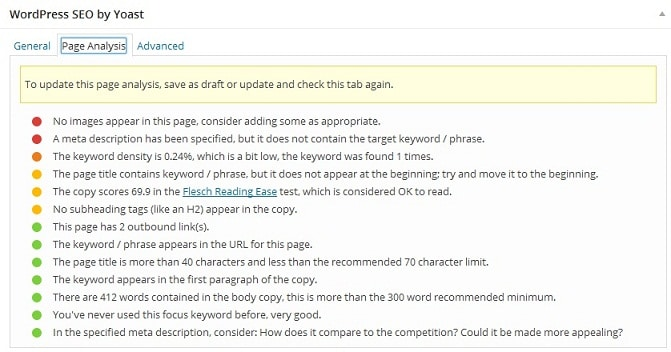
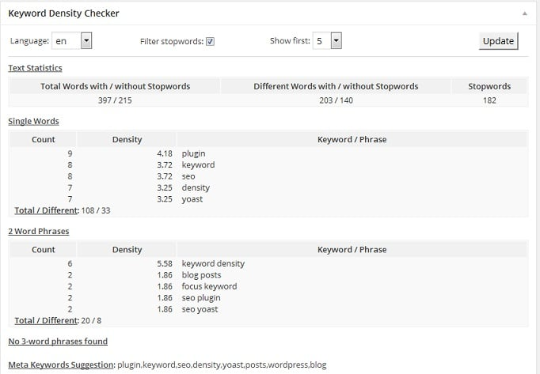

My technology blog was penalized at least 4 to 5 times. In my initial days of blogging career, I was not aware of terms like keyword density, on page SEO, backlinks, etc. I indulged myself in link building activities, and I was not focused on sharing top quality content. These three blogging mistakes killed my blog's traffic up to 70 to 80%.

As they say, we learn from our mistakes and hard work pays off, I worked hard for 3 to 4 months to regain the lost traffic and rectified all errors that I committed. In those four months, I removed around 400 blog posts and improved the content quality.

My articles were short, and they were stuffed with keywords. For a first few days, I used online tools to check reading level and keyword density of my posts.

This was a time-consuming method. I did a bit of research and found two excellent WordPress plugins that made my job easier. These plugins are the keyword density checker and Yoast SEO plugin.

**WordPress SEO Yoast**: This is one of the most rated and the top WordPress SEO plugin.

Millions of blogs are powered with Yoast because it offers as many SEO settings as the All in One search engine optimization plugin. If you configure this plugin correctly and follow Google webmaster guidelines, traffic to your site will increase day by day. Yoast plugin will display a powerful utility to optimize your blog posts for SEO. It can generate XML sitemaps too.

To check your article's SEO score, you just have to save the draft and enter a focus keyword. The score will be updated automatically.

If the score is good, the color of ball icon below published immediately option icon will turn green. Every option displayed by the Yoast SEO tool is useful.

**Keyword Density**: Its developer has not updated this plugin since two years. But you shouldn't worry about this. The KD plugin works on all latest WordPress platforms. When you install and activate it, this plugin will automatically display a small tool to check keyword density whenever you edit your posts.

The tool shows the content length and a submit button. When you click on the button, the keyword density will be displayed on the fly.

The only reason why I use this plugin alongside SEO by Yoast is that Yoast will show the frequency of the focus keyword. This plugin will scan your full post, and it will make you aware of all repeated terms.

I use the above two WordPress plugins at the same time. They're are compatible with each other, and they don't require a very high volume of RAM. Thus, you can use them with any hosting plan. If you're using some other blogging platform, you can use this online tool to check the density of keywords. In addition to the above two plugins, I use this online keyword density checker to check whether the ratio of keywords is right or not.
