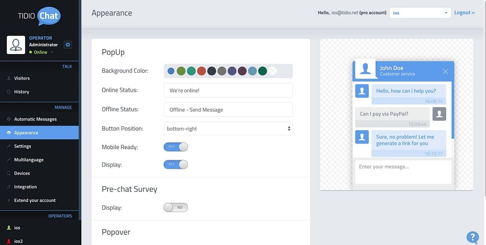
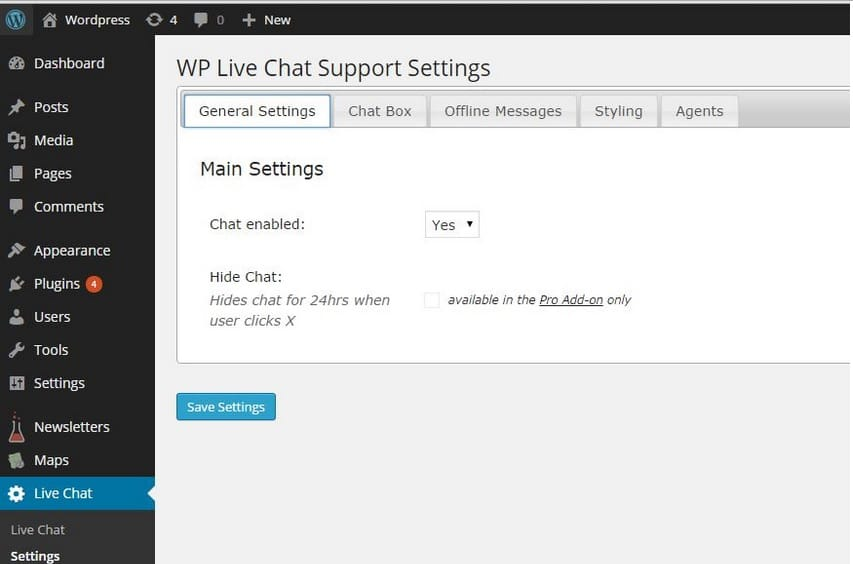
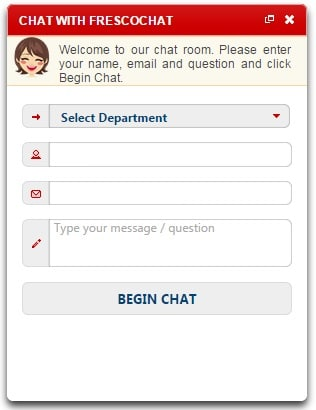
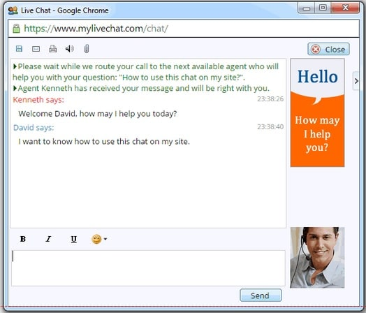

Live chat system is an application that you'll find on many websites. When a customer has some doubts about a product or a service, he can use this web-app to get his doubts cleared before making a purchase. This application is used by costumers as well as support teams at the same time.

WordPress is a robust content management system, and you can create any website with it. Developers have published several plugins for WordPress and webmasters use live chat plugin on many business websites.

In case you've launched a new website and if you're searching for the live chat application to embed on your site, have a look at the plugins we've shared below.

### Tidio Live chat

Tidio is a free plugin from the WordPress development firm called Tides. The plugin has been designed to make live communication between the user and support team easy.

Tidio plugin hides complex modules from the webmaster. When you install it on your WordPress site, you can set up live chat system within a minute. Tideo allows you to contact any online visitor of your site. It maintains a list of visitors and their email addresses so that you can stay in touch with the customers easily.

Tidio comes with four stylish designs, and it supports more than 139 languages. It supports color customization and integration with popular newsletter/customer support services like Zendesk, Mailchimp, GetResponse, etc. Tidio live is a free live chat plugin for WordPress. When you install it, Tidio will not request you to register an account or pay the license fee.

download

### WP Live Chat:

This plugin is more popular than Tidio. It features a responsive administration page. Its chat window can be moved anywhere on the website.

This plugin comes with a notification panel that makes users aware of missed conversations/inquiries. It has an option to turn on the interface on the mobile device. It allows visitors to initiate a chat session by entering an email address or a name.

WP Live Chat features an IP blocker utility. In case someone is trying to spam your site, you can thus easily block the spammer IP address. The chat window generated by this plugin is free from all types of links. Thus you can say that WP live chat is Google friendly.

This plugin can be configured on your WordPress site within 35 seconds. It has quick overview utility. Hence users can get familiar with the features of this plugin easily.

download

### FrescoChat:

This plugin is based on Jabber technology which powers popular instant messaging applications like Google Talk, WhatsApp, etc. FrescoChat comes with an auto login feature. It will keep users logged in on multiple computing devices.

This plugin supports chat transfers. It allows webmasters to change the appearance, box sizes, position, etc. FrescoChat supports chatting between multiple agents and intelligent routing. This plugin is useful for businesses that have various departments.

Install

### MyLiveChat

This is one of the simplest WordPress live chat plugins. According to the publisher, MyLiveChat is faster than most other similar plugins and can support 100s of live sessions at a time. It gives you the option to know your visitors by maintaining the keywords that users use to find your site in the search engines. It can make webmasters aware of real time traffic/visitors.

You can use this feature to increase conversion by connecting with the visitor as soon as he/she opens your website. This plugin is powered by cute chat which is based on Microsoft's ASP technology.

install

### Zendesk Live Chat

With 90000+ active users, Zendesk is one of the most popular live chat plugins for WordPress platform.

To get started with this plugin, users must create a Zendesk account and enter its login credentials in the Zendesk LC settings page of the WordPress dashboard.

The ZLC plugin supports customization and different chat window layouts. It enables you to set the chat Window title, color theme, window size, default widget position.

Zendesk Live Chat allows users to align the chat badge (image) to the left or right of the text message. ZLC supports Zopin integration. Once you enable Zopin support, you can check the visitor's activity on your site.

The plugin works with all types of desktop and mobile phone browsers.

Download Link

**Conclusion:** Installing anyone of the above live chat plugins for WordPress will increase customer engagement which in turn will improve your sales. If user's/your clients are not happy with the support team, install one of the plugins we've shared above.
