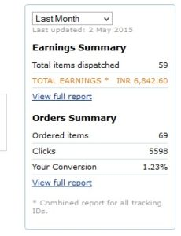

Have a blog and want to start making money online with it? We've shortlisted the most widely used website monetization strategies through this article. Many bloggers around the world use these monetization methods and they have been successful so far. To execute these strategies successfully, make sure that your website gets minimum unique 200 visitors every day through search engines or social networks. If you don't have a blog, go through this article Blogger vs WordPress and read our review of Hostgator and A small orange. You'll get an idea of what online career and blogging is all about. Here are the 4 **most widely used methods to monetize a blog**.

**Affiliate marketing**: Whether it's a 6 months old or 10 years old website, Affiliate marketing can be experimented on all types of websites. If you're blogging on SEO, WordPress, etc, you should try hosting, WordPress theme affiliate programs. Some blog hosting companies like Hostgator, A small orange, pays 50 dollars (3000 + Rupees) for every new lead. If you own technology niche blogs, you can earn handsome commission by promoting Amazon or Flipkart products. Once you've created an affiliate account, you'll be provided with a tool that generates affiliate links or banners to any product page.

You've to pace banners or links in your posts that get the most traffic. Don't add too many advertisements on a page as Google Page layout algorithm has been recently updated to penalize websites that display more than 2 ads above the fold. Affiliate marketing is not as easy as you might be thinking. Before you start using Affiliate links, make sure that there are at least 300 daily visitors to your blog. If you're a newbie, you can promote your blog posts in Facebook or linkedIN groups, Google\+ communities, etc. Don't promote your posts in dofollow or spammy forums as your blog might get penalized by Google Penguin algorithm as building backlinks violate Google link scheme webmaster guideline.

**Cost per installation marketin**g: With this program, website owners will be paid for every app that user installs on his PC, tablet and phone. Many bloggers earn more than 1000 dollars per month with CPI programs. When you'll signup for the cost per installation program like leadhug, commission junction or link vehicle, you'll be provided with links to download apps or games. You'll have to place these links strategically in your blog posts. When a visitor opens the link and installs the promoted software, he'll earn anything between 0.10 to 2 dollars.

**Google Adsense**: If you've failed with the 1st two blog monetization strategies, you should try your luck with Adsense. CPC and CPM rate in Adsense depends on the traffic location. If your blog gets few hundred visitors from Australia, United Kingdom, Canada or the USA, you can easily earn over 300+ dollars per month. To earn decent money with AdSense from a blog that gets 70 to 80% traffic from Asian countries, your blog should have minimum 3000 visitors per day. If your website is not getting approved for AdSense, you should go for Chitika, Infolinks or Media.net.

**Advertisements**: A blog with a good reputation, page rank, domain authority (DA) or Moz rank can generate 100s of dollars income by displaying third party advertisements. Create an advertisement page on your site and mention the minimum amount you'll accept to promote a product or company. Accept paid reviews only if you're allowed to add nofollow link to your articles. With this method, you can monetize a blog without ads. Techcrunch, one of the largest tech blog in the world has an annual revenue of over 2 million dollars. It has been monetized with this method.

The above 4 methods are easy to implement. So make sure that you try them out.
