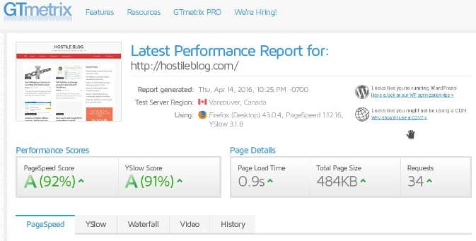
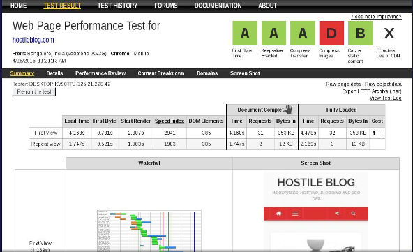

A website which opens quickly in the browser ensures the best user experience and higher rankings in Google search engine. Thus, the first thing that you should do after launching a new website is to check the page loading speed.

Pingdom is one of the most widely used website speed checking tools, but it offers limited features due to which many people will use its below 2 top alternatives:

### GTmetrix

This is a free online tool that not only analyzes the page speed but also helps you in making your slow loading website faster. To get started with GTmetrix, the user should enter the URL of his website and then he must click on analyze button.

Once you do so, this tool will run a test to determine the loading time of your website. Once the analysis is complete, GTmetrix will display page load time, the number of requests it serves and the total size of the page.

If you're not satisfied with your website's performance, see the recommendation section where you'll find some useful tips to optimize the website load time. GTmetrix creates optimized version of unoptimized image files which you can download on your PC. It also compresses or minifies CSS and JS files.

### WebPageTest

The only problem with the above tool is that the GTmetrix servers are hosted in the American region. If your website is hosted in the same country, i.e America the time to first byte will always be high. You will not be able to check website speed when accessed from other countries. In this case, webpagetest.org comes in handy.

WPT allows you to choose the test location, browser and connection type i.e. T1, 2G, 3G, etc. There are more than 10 locations to choose from. This tool has an option to run repeated tests.

Once the test is complete, WPT will display comprehensive information on the performance of your website. It displays first byte time, time taken to render the page, speed index, number of DOM elements, etc.

GTmetrix and webpagetest are the best Pingdom alternatives. You should use only the above two websites to optimize the page load time.

If you find that the TTFB is very high, install a caching plugin for WordPress or modules like PHP OpCache, Memcached. Ensure that you enable query caching in the SQL server.

If the page size is large, use autoptimize or its alternatives to minify JavaScript, HTML code and Cascading style sheets.
