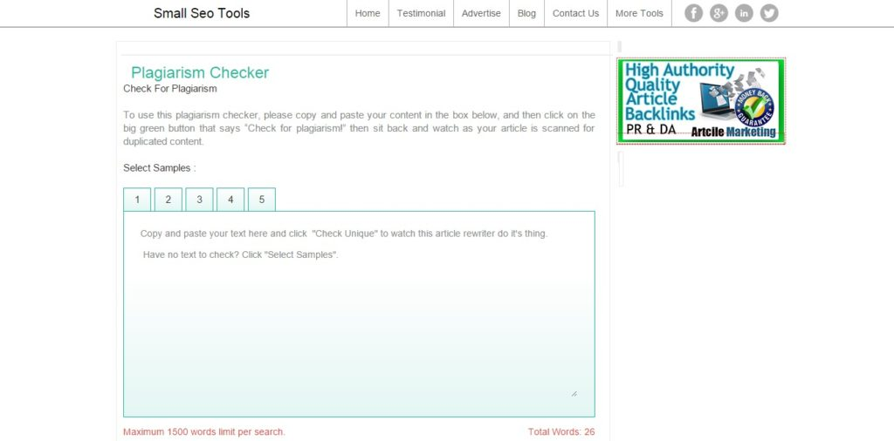
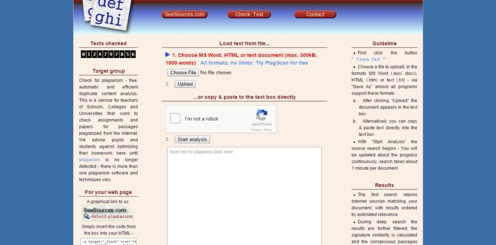
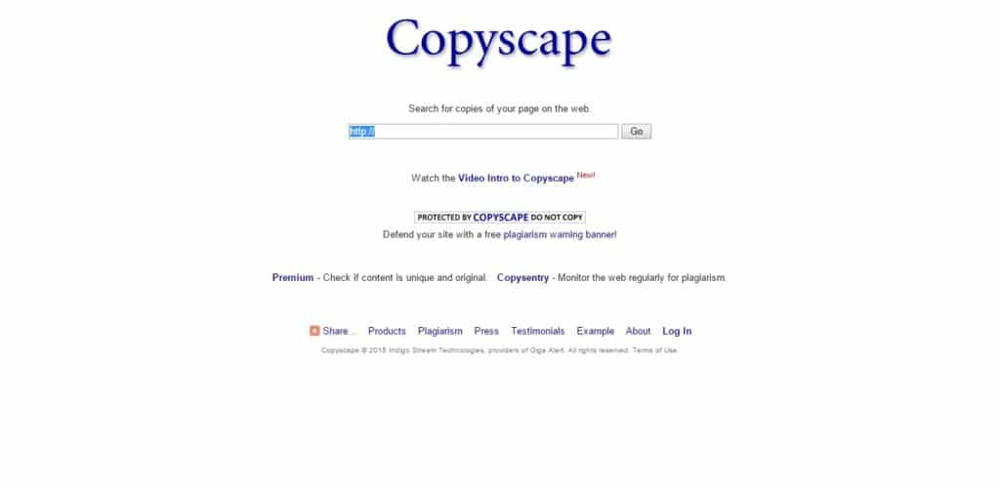

Plagiarism in the online world is the art of stealing others content without the copyright holder's permission. It is bad for bloggers because duplicate content can affect their blog's search engine visibility. Bloggers are not the only professionals worried about Plagiarism. Teachers always fear that their students might copy the homework from any one of the billions of sites available in Google's search index. If you think that your hard work has been copied or if you're a teacher who wants to check the genuineness of student's homework, use the below tools to find all websites that have duplicate content.

**Small SEO tools (SST)**: I am a huge fan of this tool because of its simplicity and ease of use. The tools available on this site are very popular in the blogging world. I use its keyword density checker every day. Anyways, the plagiarism checker of SST accepts maximum 1500 characters. After entering the content in the text area, the user must solve the captcha problem to find sites that have stolen their articles. Small SEO tools are completely free. You can use it as many times you want to.

Visit website.

**Plagscan**: This tool has Ajax technology powered interface that displays a text box and a captcha system. It has an upload button that supports HTML, TXT, and Document files. You have to enter the paragraphs in the box after which you must solve the captcha to make the Plagscan search for duplicate content. You can use it without registration.

Visit site.

**Copyscape**: It is one of the best online plagiarism detectors. This tool accepts a source website URL after which it will display websites (along with their title and meta-description) that have copied any paragraphs from the source. Copyscape is free to use only for limited period of time. It has a monthly limit. When user's search request has reached the limit, they'll have to signup for the premium version to keep using Copyscape. It has an automated premium tool i.e CopySentry that will regularly check for copied content.

Visit website.

### Who can use these free online plagiarism checkers?

- People who own large websites with multiple authors.
- Any other person who owns a blog.
- A professional blogger.
- Teachers.

### How to avoid plagiarism?

You should make others the consequences of copying without permissions. Add a copyright notice to the footer section of your blog. You can also add a DMCA label for the same.

Well, if you've become a victim of Plagiarism, read our below guide on how to remove copied content from Google index.

### What to do after you detect duplicate content?

When you've found the site, open and use the Whois tool to find the copier's email address. If you've found the email id, drop an email requesting that person to delete the copied post from his site. If he/she doesn't remove it follow the below guide:

Well, Google has become smarter than it was in the late 2000s and it rarely improves the visibility of a website that publishes copied content. However, it is an automated program and Google has to deal with billions of web pages every day. If you find a website that has published your content in Google search result pages (in the top position), you should file a DMCA complaint. This complaint will be reviewed manually by Google employees and if they find your complaint legitimate, they'll remove the copied content from the Google search index.

**Conclusion**: Plagiarism is nothing but cheating and theft. If you want to publish other's article on your site, you should first get in touch with its author else you might get in legal troubles. Most established blogs hire lawyers who will file a case against a website owner that copies other's work without any permission. They do this because the website owners pay writers for articles.
