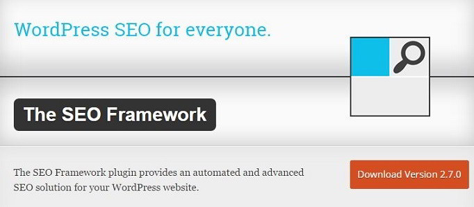
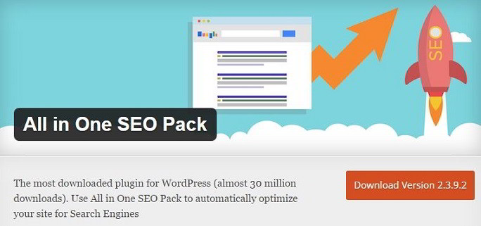

SEO is not a child's play. One wrong setting can impact search engine rankings dramatically. Although WordPress is a decade old CMS and powers millions of sites, it is still suffering from various SEO issues. To fix the problem, the must install one of the 100s of SEO plugins available in the WordPress repository.

You should not install plugins which have poor ratings and promise plenty of features. I did the same mistake in the past and I still regret it. In the year 2013, my site lost 90 to 95% organic traffic because of a bad WordPress SEO plugin. Today, the best SEO plugins provide plenty of useful features. They let users optimize their site for higher local search rankings, add breadcrumbs to the website, add XML sitemaps, etc. Moreover, they work great.

If you are a new user of WordPress, you must consider installing one of the below three best SEO plugins for WordPress.

### Yoast

The last 3 updates of Yoast has made me a huge fan. Apart from the Yoast settings, the plugin now provides better content checker module. You can now review your article's quality without depending on third-party grammar checker tools like Grammarly, After the deadline, Ginger, etc.

Yoast also includes a bulk post editor module through which users can make changes to the post's SEO title and meta description easily. The only drawback of the bulk editor is that it doesn't have a search feature. If you're using Yoast SEO plugin for WordPress on a big site, editing meta description and title becomes a pain in the a\*\* task.

### The SEO Framework

TSF may not be a popular plugin, but it's a hidden gem. It provides all important settings for managing WordPress SEO on a single page. The plugin has a superb rating of 4.9. Its user base is growing very fast. The last time I reviewed The SEO Framework, the plugin had 4000 to 5000 users. The number of users has doubled in the last 3 to 4 months.

### All in One SEO

AIE SEO was the most popular SEO plugin for WordPress before Joost De Walk introduced Yoast. Many established and high authority blogs still employ this plugin to handle SEO.

### Common features between the above best SEO plugins

**Meta description generator**: Yoast, AIO, and TSF can generate meta description automatically for every post on your blog. The plugins use an excerpt from 1st paragraph of your article for the same.

**No index control**: The plugin allows users to control no index meta robots tag on your site. You can configure the SEO plugin to prevent indexing date, archive, author pages for avoiding the duplicate content problem.

**Sitemap**: Once you install any of the SEO plugins mentioned above, you don't have to install a separate XML sitemap generator plugin.

**Open Graph protocol support:** The plugins let you make your site Social network friendly. They have settings to automatically add twitter cards, facebook/Google open graph tags in the heading section of your site.

Other plugins suck. Don't waste your time with them and remember one thing, the above three plugins offer tons of features free of cost. Some premium plugins cost 5o to 100 USD. Ignore paid SEO plugins and use Yoast, AIO SEO, TSF.
