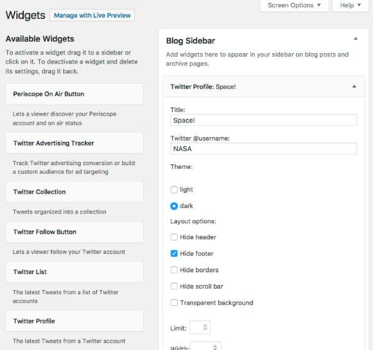
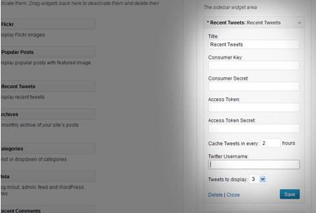
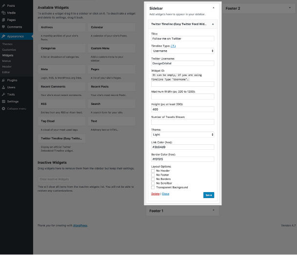
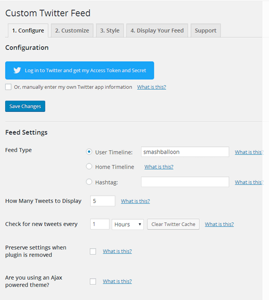

Twitter is the world's most popular microblogging site. Twitter has 200+ million users thereby making it one of the best platforms to promote your product. Like Facebook, this site enables webmasters and developers to integrate user activity feed on third-party websites.

The Twitter feed aka Embedded Timelines widget displays a list of your recent tweets and retweets from users who have enjoyed reading your post, watching your video, or seeing the picture you've shared. The feed gets updated in real-time and it increases user engagement.

Blogs have a higher bounce rate that eCommerce portals. Apart from adding related posts below post content, you can improve bounce rate of your site by adding Twitter feed widget in the sidebar.

Adding Embedded Timeline to a website is easy. Once you log in to your WP dashboard, open the widgets settings page, drag and drop the text widget to the sidebar. Then, tap on the widget and enter the Twitter Feed code in the text section.

Save the widget so that the site saves the code. Now, open any page of your site. You should be now able to see the Twitter Feed for your website.

If you don't like the default look and feel of the feed, install one of the following top Twitter Feed widget plugins.

### Twitter

Twitter had launched its official WordPress plugin 5 years back. The plugin enables you to integrate some of the coolest features of Twitter with your WordPress site.

With the official Twitter plugin for WordPress, you can embed single or multiple tweets in blog posts with or without shortcodes. You can also embed your profile timeline or a vine video in the post.

The plugin lets you preview the content you want to share with other users. It has the option to customize the color of links and border of a Twitter timeline. Users can configure this plugin to hide the scrollbar, border, header, footer area of the timeline.

The Twitter plugin includes an option to make background color transparent. You can specify the width of the embedded timeline and the number of tweets you want the plugin to show at a time. You can also add a tweet or follow button to your site with the Twitter plugin.

\[themify\_button bgcolor="red" link="https://wordpress.org/plugins/twitter/" target="\_blank"\]Download \[/themify\_button\]

Also see: 5 smart ways to reduce blog bounce rate

### Recent Tweets Widget

You can consider Recent Tweets widget as a toned down version of the above plugin. RT Widget is easy to use. Once you install this plugin, activate it and navigate to the Widgets section in the WP dashboard. Drag and drop the widget to the sidebar and click on its title. Now, enter the consumer key, consumer secret, access token and access token secret. To get the keys and tokens, visit the Twitter Developers portal.

Enter the tweets cache duration, a number of recent tweets you want to see on your sidebar and your username. Now, click on the save button.

\[themify\_button bgcolor="red" link="https://wordpress.org/plugins/recent-tweets-widget/" target="\_blank"\]Download \[/themify\_button\]

### Easy Twitter Feed

This plugin enables you to add a Twitter feed to your site within a minute. Unlike the above plugin, ETF doesn't prompt users to enter tokens or keys.

The plugin supports dark and light theme. It has options to change the color of the hyperlinks and border, make the background of Twitter timeline transparent, hide scrollbar, footer, or the header.

The plugin allows users to set maximum width and height for the widget.

\[themify\_button bgcolor="red" link="https://wordpress.org/plugins/easy-twitter-feed-widget/" target="\_blank"\]Download \[/themify\_button\]

Must read: Best WordPress popular post plugin

### Custom Twitter Feeds

CTF is popular Twitter feed plugin. It is feature rich plugin that supports customization. CTF adds responsive Twitter Timeline to your WP site. You can configure it to show feeds from multiple Twitter accounts.

The plugin lets you enable infinite loading feature for the embedded timeline. If you have knowledge of CSS, you can customize the Twitter feed with your own CSS code.

CTF supports translation and caching. Caching of feeds ensures that only 1 API request is made for cache duration. The plugin allows visitors to your site to reply to tweets. CTF is updated on regular basis.

\[themify\_button bgcolor="red" link="https://wordpress.org/plugins/custom-twitter-feeds/" target="\_blank"\]Download \[/themify\_button\]

**Conclusion**: With the above free plugins, it is possible to add a great looking Twitter Feed aka Embedded Timeline to your site with ease. The plugins are easy to work with. They have easy to understand features.
