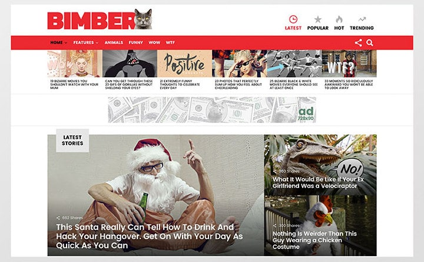
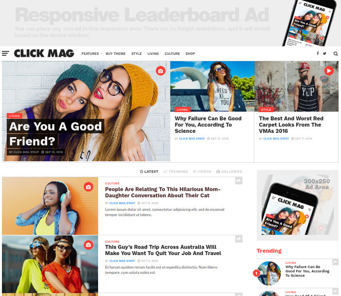
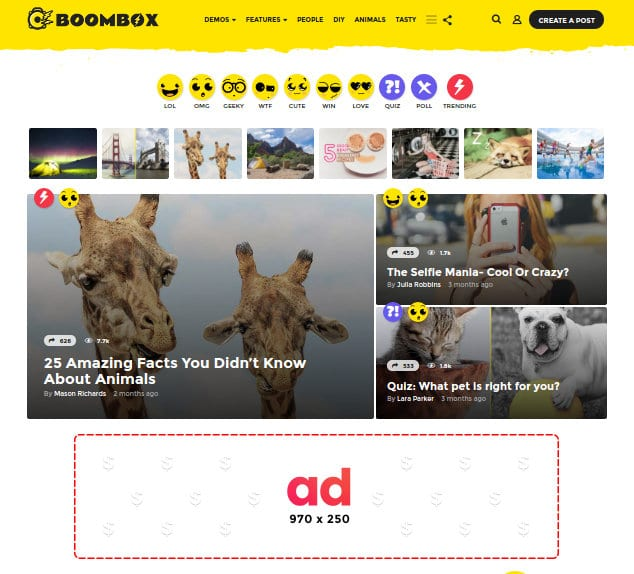
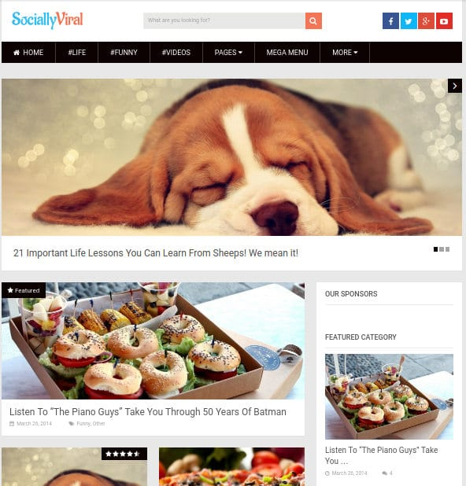

A viral theme is one which helps website owners in garnering tons of traffic from social networks such as Twitter, Facebook, Instagram, Linkedin, etc. It should have excellent layout and beautiful social network icons. The icons in a viral WordPress theme must be placed at the best position so as to increase the chances of a visitor sharing the content.

If you're planning to launch a viral WordPress site and looking for a good theme which above mentioned features, consider using the following templates:

### Bimber Viral WordPress Theme

Although it was launched this year, Bimber became the best-selling Viral theme for WordPress CMS on the ThemeForest marketplace. Bimber is unique and more importantly, it looks stunning.

The WP theme provides special modules for creating viral content. Some of these mods are as follows:

- Trending lists, hot, popular posts.
- Option to show comment count only when there's comment.
- NSFW label to attract visitors.
- Option to create lists of videos, GIFs, pictures, etc.
- Smart social sharing counter, which appears only when the post is shared 1 or more times.

Bimber has powerful social sharing buttons powered by the mashsare plugin. It supports sticky sharing buttons to keep the share counter increasing with every visitor.

Bimber packs WP-Quads plugin, which allows users to insert advertisements after or before post content, n paragraphs, sidebars, etc. It offers 5 unique and beautiful homepage layouts and option to:

- Adjust colors.
- Enable or disable sticky header menu.
- Turn on/off infinite pagination.
- Enable full-width layout.
- And more.

See demo or download.

### ClickMag Viral Theme

CM is one of the latest WP templates for creating viral websites on the WordPress platform.

To help you monetize the website, ClickMag provides several ad unit spots. It has a special slot for a responsive large leaderboard in the header section.

The theme is retina-ready which means that it looks sharp and clean on retina devices. It supports mega menu and multilevel menu navigation system. It ships with a sticky sidebar plugin which keeps the sidebar position fixed on desktops. Activating this feature will improve bounce rate if you add relevant content in the sidebar.

ClickMag Viral WordPress theme packs seven unique widgets to make your site more productive and beautiful. It supports footer menu bar and lets you add social profile icons in the footer and top menubar.

Other features offered by the Clickmag WP theme are:

- Sticky sidebar, custom image gallery.
- Post slideshow, review plugin.
- Button with continue reading label.
- BBpress compatibility.

Download or view the demo here

### BoomBox Viral WordPress Theme

BoomBox is an SEO friendly responsive theme which has W3 compliant code. The theme is RTL ready and comes with advanced options for managing GIF files. BoomBox has the option to upvote or downvote a post. It is compatible with contact form 7. It supports integration with MailChimp newsletter and lead generation service.

BoomBox offers special badges to make the site user-friendly. Some of the unique badges are:

- LOL, WTF, Geeky badges.
- Unique reaction badges.
- And more.

The theme lets users customize the color of the badges. It has a well-designed post ranking system, which you can configure to show posts by popularly, upvote/downvote counts, view count, etc.

Boombox has multi-layered footer module with the option to add three widgets. It provides eight unique list styles and different background patterns for the header/footer section.

Download or see the demo.

### Socially Viral WordPress theme

SociallyViral template from MyThemeShop is inspired by popular viral sites such as BuzzFeed, Business Insider, ViperChill, 9gag, etc. MTS has designed its SociallyViral theme for getting maximum social shares in minimum time.

SV offers beautiful social share icons of all popular social networks and allows users to show most viral posts in the sidebar. It is AdSense ready theme. Hence, you can easily place Google Adsense code in predefined areas.

SociallyViral WordPress theme provides four different loading animations. It packs a free subscription box widget for increasing email subscribers. It is responsive and loads fast on mobile phones, tablets, desktop computers, etc.

SV includes support for megamenu navigation and parallax scrolling. It comes with clean code, shortcode support, rating module, and many more exciting features.

Download or watch demo.

**Conclusion**: The most popular viral sites created till date use layouts and design as found in the themes we've covered above. Hence, if you use WP CMS and want to launch a viral website, you should consider using one of the templates we've mentioned above.
