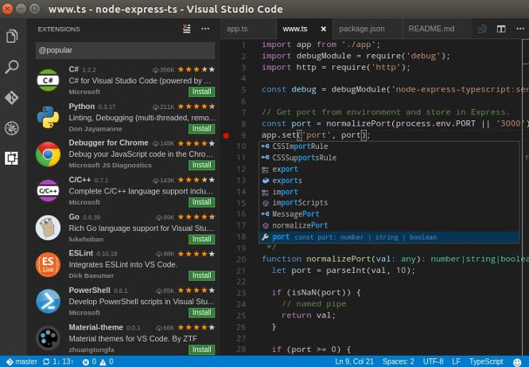

Because of erroneous PHP and Java extensions, I've switched from Atom to Microsoft's VSCode aka Visual Code Editor for writing applications.

VSCode is a powerful editor. With the help of some extensions, you can use VSCode as a replacement for RAM hogging Integrated Development Environments.

If you've just installed VScode and you're searching for extensions that will improve your productivity, you're at the right place. Below, I've shared the list of best Visual Code extensions.

## Best Vscode extensions

**MySQL**: If you're looking for a simpler alternative to MySQL WorkBench or SQLite tool, you should download VSCode and install the MySQL extension.

Once you enable the extension, click on the "MySQL" option that appears at the left bottom corner of the editor. Now, you'll be asked to enter the database name, user ID, and password. Enter the required details and click on the submit option. The extension allows you execute MySQL queries and see the result of the query.

**Autoclose tags**: A missing HTML tag may make the webpage/pages on your website look horrible. To prevent this problem, you must install the Autoclose tags extension.

**Bootstrap 4 & Font awesome snippets**: BS is the world's most popular front-end development framework. If you install this extension and enable it, you can create bootstrap powered pages quickly.

**Trailing Spaces**: Most developers forget to delete the trailing spaces after writing a line of code. Although compilers and interpreters ignore the space, when you open the page in an IDE or code editing tool such as VSCode, you'll see a dark space block after the line of code. This space makes the page code look ugly. VSCode's Trailing Spaces plugin lets you remove this space with a single click.

**CSS Peek**: This extension allows you to see the CSS code of the HTML element without opening the stylesheet. Once you enable this extension, hover the mouse cursor on the class name or ID of the HTML element to see the code.

**Prettier**: The VS Code extension beautifies the code by adding new lines, space, etc.

**VS Code Styled Components**: If you want to highlight the syntax of code with colors, install this extension.

**Code Runner**: CR is a great extension for testing code on the fly. When you enter the code, select a language. That's it! The extension will display the result in the output section of the editor.

**Language Support for Java**: If you're searching for an alternative to Eclipse and Netbeans for developing Java SE applications, install this plugin. LS for Java has been developed by one of the top software development firms i.e. RedHat.

After switching from Atom IDE to VSCode, I tried various extensions listed on Microsoft Visual Code Marketplace. I found the above extensions useful. If you're using an extension other than the ones mentioned above, please share it with us.
