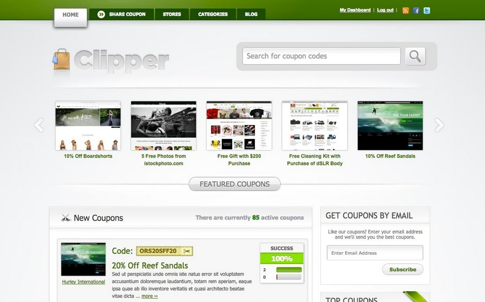
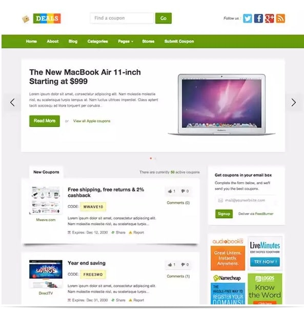
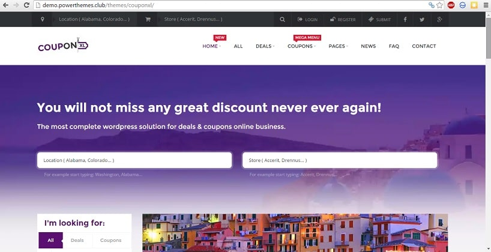
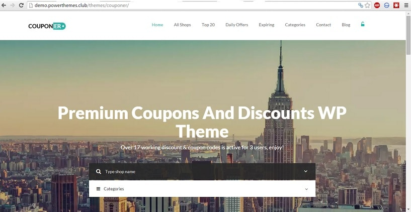

Coupon websites can be very profitable if you bring traffic to it. For example, RetailmeNot consistently earns over 100 million dollars in revenue it has millions of monthly unique visitors. It is nothing but a well-designed coupon site. Coupon Raja was bought by one of the India's largest media hours, i.e., Times Group. Before being purchased, it had reported over five crores of revenue.

In such sites, you will find short posts with an affiliate link to eCommerce portal or any other service. This post includes rating, code, social sharing links, and a small description. When the user clicks on your link and makes a purchase from the affiliate, you'll earn a commission. By the month end, you'll receive payment via cheque, PayPal or net banking. All affiliate account include a dashboard where you can find details on the clicks, conversion rate, returns, etc.

When you launch a coupon portal, don't expect too much of traffic as Google and other search engines will take some time to index your site and rank it on their pages. Initially, you can drive traffic to your coupon site using Google Adwords or Bing Ads.

If you don't have money to invest in advertising, grow your followers count on social media sites and design your coupon site in such a way that Google loves it and drives visitors to it. To be a successful coupon site owner, you should work hard.

You will have to partner with various services like McDonalds, Dominos, PizzaHut, Amazon, etc. The more coupons you add to your site, the more profitable it can become. Add a blog section and publish killer articles. In the sidebar of your blog, you can display your coupons.

WordPress, our favorite content management system allows you to create such sites easily with any of the below best coupon themes that are responsive (support mobiles and tablets):

## 5 Best WordPress Coupon themes of 2017

### Clipper

Clipper from AThemes is one of the most popular coupon templates. It supports payment via net banking and PayPal. This is a useful feature as you can use this to accept payment from users who want to publish their coupons on your website.

Clipper WordPress theme includes a link cloaking module that can track the number of clicks, PVs and click through rate. This template allows and search engines to explore your site by category and store. Thus navigation is easy on Clipper.

This theme has error reporting system. In case a user is not able to use the coupon, he can easily contact you via this module.

In Clipper, you can easily integrate premium newsletter plugins like Aweber, Mailchimp as it includes subscribe to coupon feature. You can integrate your favorite service from the WordPress dashboard itself.

To make sure that your coupon ranks high in search engine, Clipper has been designed by keeping latest SEO standards on the most top priority. This WordPress coupon theme supports multiple languages. It has a great support team and open source code.

Clipper theme is easy to use and install on any hosting platform. It has the option to change theme color. 1000s of people are successfully using it. Clipper is thus one of the best WordPress coupon themes.

**Check demo or download this theme here.**

### Deals

Deals are one of the cheapest and best themejunkie template. It is an XHTML validated theme with an excellent layout that has been optimized to increase conversions and user interaction. Latest W3C standards have been implemented on the deals theme. Hence, it is compatible with all browsers that you know.

For monetizing a site, Deals WordPress theme offers ad management system. You can change the language, i.e., translate the theme into any language with the easy to use .mo and .po files. For better engagement of the users, Deals include custom widgets like Twitter, Flickr photos, etc. It has a smart control panel and compatibility with latest WordPress versions. This theme has like/dislike button, subscription module, report invalid coupons and a lot more useful features. It supports 4 column footer.

**Download or check deals theme demo here.**

### CouponXL

This is a WordPress coupon theme for people (site owners/webmasters) who love modern design. It has many amazing features for an unbelievable price tag. CouponXL supports fixed navigation menu which helps in improve bounce rate.

It supports custom notifications for the users/visitors. This theme allows users to register an account on your site. It has a good design and clean dashboard that makes you aware of conversions, members, CTR, etc. It has latest Ajax technology based smart search system.

CouponXL supports breadcrumbs. This is a good SEO feature. This WordPress deals template has random code generator. In case you have just affiliate links, this automated feature will take care of generating coupon code.

Font awesome icons power this premium theme. It supports grid and list layout. CouponXL includes 20+ widgets, rating system, integration with PayPal, Stripe, and many other payment services, etc. This SEO friendly and responsive theme support 100s of cool Google fonts and colors.

**Check demo or download CouponXL ThemeForest theme here**.

### Couponer

This is responsive WordPress coupon theme which is powered by the latest JavaScript bootstrap framework. It supports WPML and lets users submit discount codes/coupons. This template is beautiful, and it is optimized for SEO. It includes advanced search utility that makes it easy for the visitors to find relevant discounts on your site.

It gets frequently updated with new and better features. This retina ready WordPress template includes daily offers module. It includes membership feature. Thus anyone who loves your site can create a free account.

This theme features coupon expiry time utility that makes visitors aware of valid and invalid discount code. This feature ensures that the visitor will not be frustrated. He'll be made aware of expired coupons beforehand. Like other ThemeForest templates, support offered by the developers of Couponer is excellent.

**Download Couponer theme here.**

### Couponize:

This theme is developed by BestWebsoft - one of the top WordPress developer. It has GD star rating utility and flex slider that can be used smartly to attract visitors attention.

Couponize has been built on one of the best responsive website framework, i.e., Foundation. It is based on CSS3 and HTML 5 technology that ensures the fast performance of the site. Couponize has custom design based buttons. It is clean code and easy to use dashboard. Other features of Couponize as same as the above theme.

**Download Couponize or check the demo here.**

**Conclusion:** The above templates will cost you within 45 to 100 dollars. They've excellent reviews and awesome ratings. They're the best WordPress Coupon themes that you can buy. Use them and create Retailmenot or Groupon-like the website.
