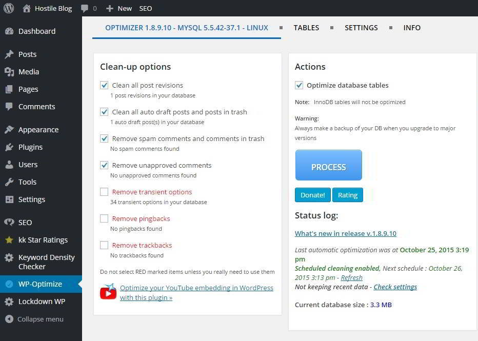
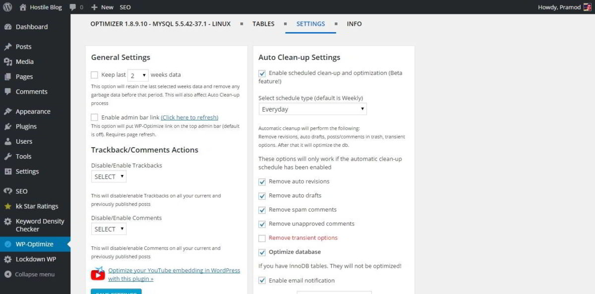
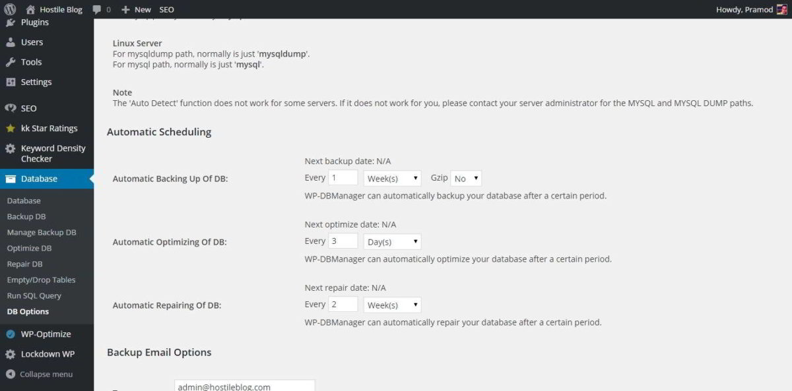

Databases like Oracle, MySql, PostgreSQL are designed to store data of the user securely. They're fast and highly secure. Databases are the backbone of almost all types of web applications. Due to incorrect configuration or lack of maintenance, your site or application will slow down. In severe cases, it may also crash.

In the major multinational companies, you'll find DB Administrators who will take care of the data. The DBA guys work in shifts so that the firm's applications are always running. If DB server is down, the revenue will be affected.

Blogger platform's backend aka Database is managed by the engineers at Google. In WordPress platform, the webmaster or the site owner should take care of the DB himself. If you don't have good and working knowledge of databases (MySQL), you should never run any SQL queries or use PHP Myadmin to edit tables and data.

WordPress platform stores each of your posts, pages, hyperlinks, passwords, usernames, etc in MySQL. Your images are stored in the uploads folder, and themes are located in the WP-Content folder. Whenever, a search bit or any user requests your page or posts, WordPress will fire an SQL query to get the required data.

After this, the CMS and the WordPress theme renders the data on the screen. The performance of database and theme is thus crucial. Thus it is high priority job for the webmaster to take care of it. People use CMS because they're easy to use, and WordPress is no different. In WordPress, you don't have to open PHPMyAdmin and manually optimize table. Nor you have to remove the useless data by running SQL query.

The below **WordPress Database Optimizer and Cleaner plugin will make things easy for you**.

### WP-Optimize:

I consider WPOptimize as one of the best plugins for WordPress platform. It has powerful interface that presents the below optimization options:

- Clean post revisions, auto drafts and pages/posts in the WordPress thrash.
- Delete spam and unapproved comments data from the database.
- Remote transient options, trackbacks, and pingbacks from other websites.
- Optimize tables.

WP-Optimize displays the database size in megabytes, and it shows the total space that can be freed (occupied by junk data).

This plugin allows to you check WordPress database table size, record count, index size, overhead, etc.

WP-Optimize allows you to disable or enabled trackbacks and comments. It can be configured to clean a WordPress database automatically. It is one of the best WordPress database plugins.

Download WPO.

### WP DB Manager:

This is a powerful plugin with many advanced options. It displays the database name, username, version on its settings page. DB Manager ll has a utility that allows you to create WordPress database backup in .sql or compressed .gzip file format. The DB backups will be sent to the user specified email address.

WP-DB Manager allows you to choose the tables that you want to optimize. If you're facing some issues with the database, this plugin can fix it with its repair tool. This plugin lets you drop or empty tables. You can run SQL queries with it right from the WordPress dashboard. You can fire delete, select, alter, replace, queries in it. Like WP-Optimize, WPDBM supports scheduling of optimization tasks.

This free WordPress database plugin is useful, but its ability to modify your data from the dashboard can be a worrying thing for the user. If a hacker's attempt to log into your WordPress site is successful, this plugin will allow him to delete your DB completely.

Download link

Must Read: WordPress Post dates – Don’t be a fool to hide them

**Conclusion:** Running database backup tool in the dashboard can be problematic on shared hosting platforms. If your hosting provider has a tool for the same in the CPanel, you should use it instead of using any third party plugins. WP-Optimize is a safe plugin. You can use it without any worries because I consider it as the best WordPress database optimizer.
