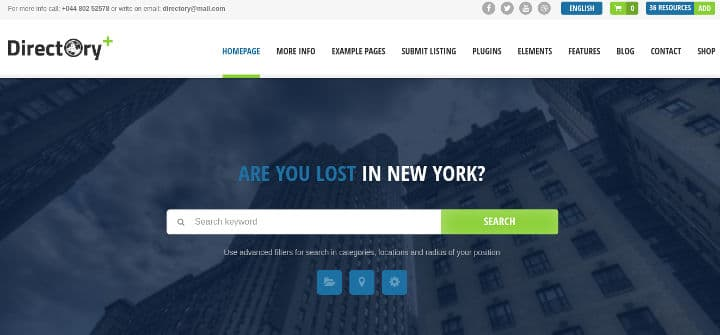
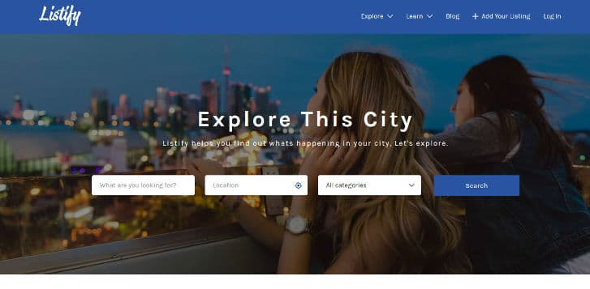
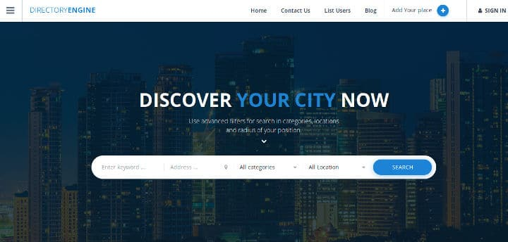
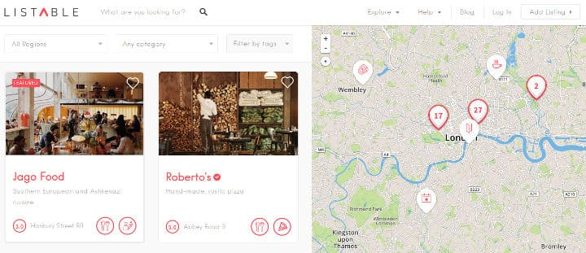
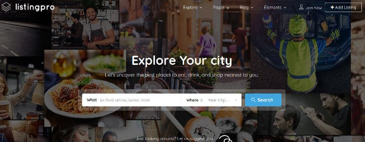

A directory site has a massive listing of businesses. If a site is successful, it will have a listing of 1000+ business. A small site may have fewer listings.

SEO plays a key role in deciding the fate of a directory site. A well-optimized website will rank high in search engines. A good example of this is Yelp, a large restaurant directory site that ranks at number 1 position in Google SERPs for several 1000 keywords. We must not forget that Yelp has 100s of employees working 24 x 7.

Creating an SEO friendly directory site from scratch isn't an easy task. You must have strong knowledge of web scripting languages, CSS, HTML, database and website design. If you're searching for an easy way to launch directory website, use WordPress.

WordPress provides powerful page caching and SEO plugins. Hence, it is a great platform for launching a fast SEO optimized directory site. There are plenty of free directory themes but none of them are complete. If you want to be a successful directory website owner, you must download and configure of the following premium themes.

## Best directory themes for WordPress

### Directory+

Directory Plus is the best selling WP directory listing theme. It has 13000+ users and a good rating of 4 on the ThemeForest marketplace.

The theme offers 7 header styles and has the option to embed one of the following elements in the header:

-  Image, Google Map.
- Street and business view.

Apart from the above four elements, this WP template offers 26 additional elements to make your directory site powerful and user-friendly.

D+ has a responsive full-width design. It features a drag-and-drop page builder tool, with which you can design your pages. This theme supports Google Rich Snippets and has compatibility with several top WP plugins.

You can configure this theme to show the business location distance in kilometers or miles. It has a special interface for managing sidebars. It also includes a page for managing website SEO.

Directory Plus gives you access to 1000+ high-quality icons. You can change website font and colors easily in this directory theme.

The price of Directory+ template is $69.

Download Directory+ 

### Listify

Listify is yet another top directory theme. It enables you to design your pages in drag and drop mode. It has a special function that detects the location of the website visitor and displays the listings that are relevant to them.

The theme allows website visitors to submit and claim a listing. It has subscription system and different site monetization options.

The Listify WP theme enables users to make reservations and book appointments. It features WooCommerce and has a subscription system to get loyal visitors.

Listify comes with an advanced sorting option. It lets users set business hours. It comes with an option to import demo content. Listify is an SEO optimized WordPress directory theme with code optimized for good page speed. It supports several premium plugins.

Download Listify

### DirectoryEngine

DirectoryEngine is a customizable directory theme with several features. It is an SEO friendly template that renders well on mobile phones, tablets, and computers.

DirectoryEngine supports integration with different payment gateways. It enables visitors to rate and review a business listing. DE allows users to create event listing. It lets you create price tables.

The theme supports translation. It features a notification system where you'll find the details of user activities on your website. It comes with an option to share the listing on social networks.

DE allows users to monetize their directory sites by providing several ad spaces. It supports unlimited colors. Hence, you can make your site look different from other directory websites by simply changing colors of HTML elements. DirectoryEngine has a powerful menu system.

Download DirectoryEngine

### Listable

Yet another premium directory theme, Listable offers website monetization methods to the users. Listable has an excellent design and it provides various style presets. You can customize the theme by dragging and dropping elements at your favorite positions.

Listable provides an advanced filter that allows website visitors to find listings by category, price, keyword, tags, location, date, etc. The theme lets you rate businesses. It also allows you to write a review of the business. Listable has a search box that can highlight the business on Google Maps.

LT is an effective directory theme because its design is based on feedback from users. It is compatible with the latest version of WordPress.

Download Listable

### ListingPro

Although it is a new directory theme, ListingPro has reached a milestone of 1000 downloads on the ThemeForest marketplace. LP employs a powerful search algorithm to recommend relevant businesses. In addition, it comes with an advanced filter system that alows users to shortlist listings.

Like other themes, users can rate business. They can also share their review, testimonials, and pictures with other users. LP allows webmasters to make money from their sites by providing an option to create category specific ad spots.

The theme comes with an intuitive dashboard through which you can manage listings, see the number of views the listings have got, etc. ListingPro supports Font Awesome icons. It is a retina ready template that lets users place interactive FAQ modules, pricing tables on their sites. LP has many features. The price of this theme is $60.

Download Listing Pro

Once you've launched your directory website, don't forget to create your free Google Webmaster Tools account. GWT Is the best free SEO tool. It provides detailed reports of your website pages performance in search engines. It makes you aware of website issues and keywords that your site ranks for.
