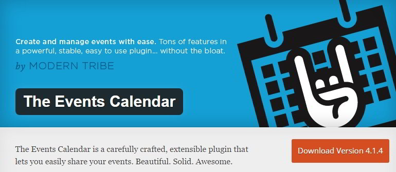
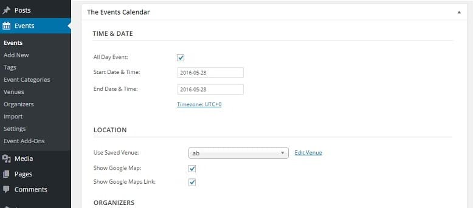
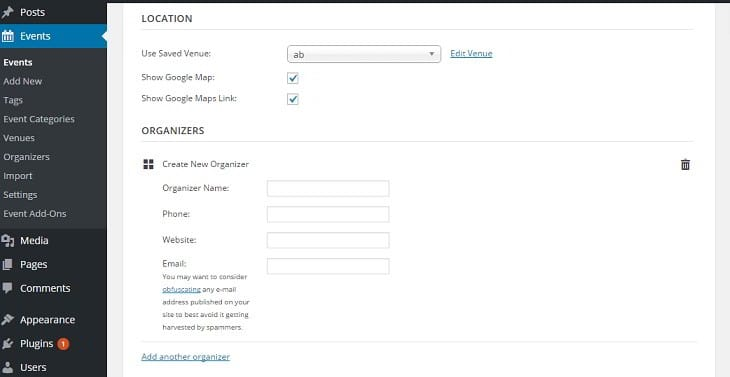
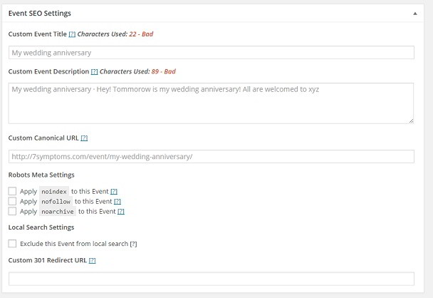
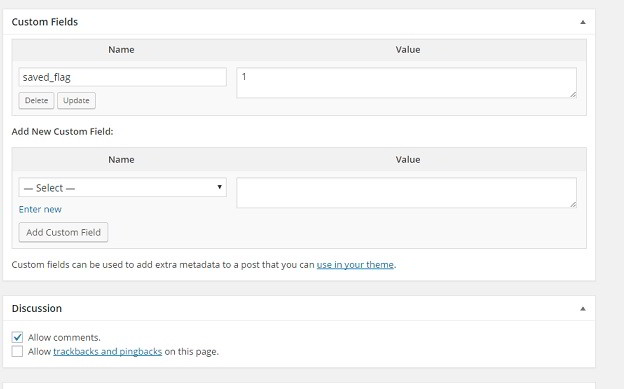
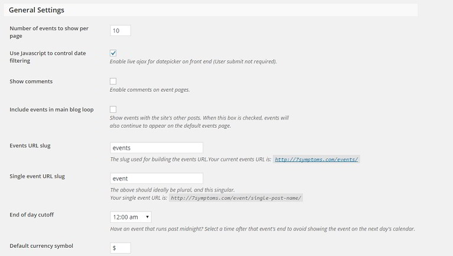
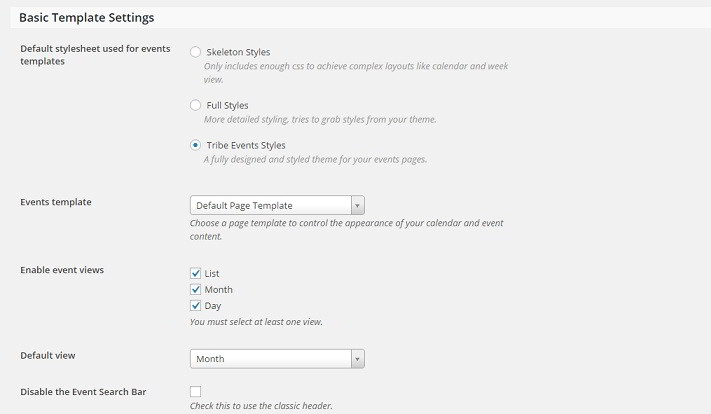

The events calendar plugin by the modern tribe is the best calendar plugin for WordPress. More than 20 developers have authored it.

The plugin is active on 0.4 million WordPress websites. It is free. Let's find it out why the plugin is so popular among the WordPress users.

## The WordPress events calendar plugin review

To get started, you'll have to install this excellent plugin from the WordPress.org repository. Once you activate it, the plugin adds event management controls below the blog post editor in the WordPress dashboard. Thus, you can quickly enter detailed information about the event in the blog post. When the post has been published, your event will be inserted right below the post content.

In the event controls, you can configure the below options:

**Time and Date**: Here you have to enter the time, start date and end date of the event. Dates can be inserted quickly as the plugin has a date picker function. The date picker will appear when the user clicks on the date field.

The plugin allows you to change the timezone.

**Location**: Here you must specify an event location so that people will be able to reach at the event location on time. The plugin asks you to enter the below details of the venue:

- Name, address, city, country.
- State or Province, Postal code.
- Phone number, website.

The plugin supports Google maps. Thus, the venue location will be highlighted on the Google map. The events calendar plugin for WordPress will save the details of the place for later use.

**Organizer**: People may not be interested in the event, or they may not visit the venue if they don't know who the event organizers are. The event calendar plugin includes an option to add new organizers. It asks the user to enter the name, phone number, website and email address of the organizers. You can add as many organizers as you want.

**Event website**: If you have launched a separate website which has complete details on the event, enter its URL in this field.

**Event cost**: If you're organizing the event for earning money, you can specify the event cost. The plugin has a field to set local currency symbol. You can add useful features like ticket sales, event registration to your WordPress site through add-ons.

Add-ons are not free. You'll have to buy them. If you don't want to purchase the extension, go through this list of free WordPress ticket sales plugins which support event registration.

**Event SEO settings**: Here you can manage SEO of the event page. In this section, you'll have to enter the event title and meta description. You can prevent search bots from indexing the event page by checking noindex or nofollow option. If you don't want the event to appear in the local search results, select exclude this event from local search option.

**Custom fields**: If you want to add a new option to the event, this feature will help you to do so. The plugin accepts two parameters for the custom field, name, and value.

The Events Calendar plugin adds an events settings page to the WordPress dashboard to fine tune the events. The settings page is divided into three sections - general, display and help.

In general settings, the user can configure the below options:

- A number of events to be displayed per page.
- Enable JavaScript support for the date control.
- Enable or disable WordPress comments.
- Include all the events in the main loop of your WordPress blog.
- Slug name.
- EOD cutoff time.
- Default currency symbol.
- Enable or disable Google Maps.
- Change the value of maps zoom level.

In this section, you'll also find an option to enable debug mode. If the plugin is not working on your site, check this option to learn why the plugin is not functioning.

In the Display settings, you can choose one of the below three templates for the events: **Skeleton style**: This style ensures the best performance. It uses CSS to build complex event calendar layouts.

**Full styles**: When this option is selected, the plugin will try to borrow styles from your current WordPress theme.

**Tribe Event styles**: This option will force the plugin to use its style sheet to build the events interface.

In DS, you can change the default page template, enable event views, specify the default view of the event (month, list or day), activate or disable the event search bar, enable the plugin's month view cache function which will improve the performance and change the date format.

You can also enter custom HTML code which will appear before the event contents.

### Other features:

The plugin allows users to display upcoming events through the events calendar widget module.

The plugin supports Google calendar, and it lets users export events in the form of ICS file for ICAL web calendar service. It is compatible with a lot of premium and free WordPress themes and popular plugins. The plugin makes use of Microformats in the content of the event for making events SEO friendly.

The WordPress events calendar plugin creates SEO friendly as well as responsive events.

**My Verdict**: The events calendar plugin is easy to configure and use. It doesn't impact website speed, nor it does it report any errors. This plugin has more than 30 options to configure.

\[themify\_button bgcolor="blue" link="https://wordpress.org/plugins/the-events-calendar/" target="\_blank"\]Download\[/themify\_button\]
