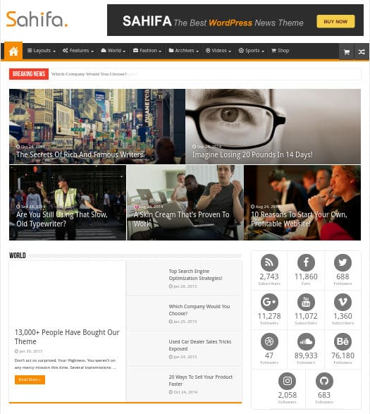
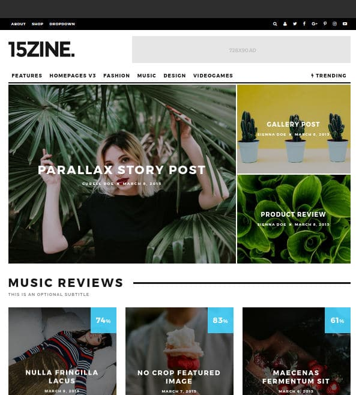
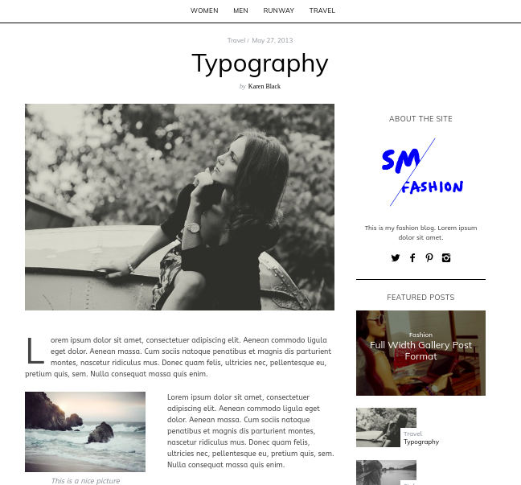
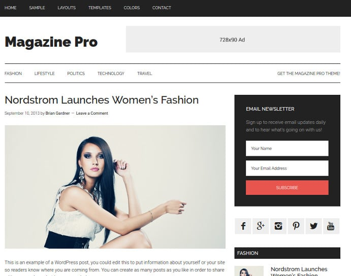

Magazine themes are used on WordPress News sites of all types of niches. A news website may have several categories and tags. To make sure that the visitor doesn't get bored while browsing the site, your site should have attractive pages and powerful navigation system.

Furthermore, the theme must allow users to customize pages with easy so that you can test the performance of various layouts. Frankly speaking, free themes have limited features and customizing them is a difficult task. Only the users with good knowledge of PHP and CSS can customize their sites.

Even if you have a strong background in PHP programming, you'll have to spend several weeks in customizing the WP site. To avoid a headache, you must consider buying a premium magazine theme.

Premium themes have several advantages over free WP templates. They have plenty of features and different layout options. Below are the best magazine themes for WordPress.

## Best WordPress Magazine themes

### TagDiv NewsPaper

The Newspaper theme from TagDiv is a premium WordPress theme that ships with 4 premium plugins - TagDiv Speed Booster, Social profile icons, Revolution Slider, and Visual Composer.

The VC composer enables you to create new pages or customize the existing pages of the theme. Speed Booster is a plugin that uses minified JS and CSS files to decrease the page size. To boost page load time, the plugin moves the theme CSS and JS file to the footer section.

TagDiv Newspaper has a responsive design and a powerful control panel through which you can enable or disable various features of the theme, fonts of various elements, text size, etc.

The theme has built in ad inserter function and it allows you to use your own CSS and JS code.

The theme provides a toggle option to enable breadcrumbs, related posts, etc. It offers various pagination styles and has a live ajax search module. Newspaper supports left/right sidebar and full-width page layout. It has been bought by 40000+ users.

The theme offers different header styles. It has a powerful review system and an option to create smart lists of various styles.

Download Newspaper

### Sahifa

Sahifa is the 2nd best-selling theme in the Magazine category of the ThemeForest marketplace. It has 20000+ users. Sahifa is an RTL ready WordPress template that comes with 5+ premium plugins worth $75.

Sahifa allows you to create SEO friendly WordPress posts slideshow. It loads off canvas navigation system when the visitor is browsing your site from a mobile device. It has one click option to make sidebar sticky.

Sahifa offers a beautiful template for media content and has a homepage stylish grid slider. The magazine theme has predesigned pages which you can enable on your site. It allows you to customize ar archive, category, and tag pages of your WordPress website.

The theme includes shortcodes for inserting buttons, sliders, etc. It has user\-friendly responsive design and SEO friendly code.

Download Sahifa

### 15Zine

15Zine is an HD magazine WordPress theme with 13000+ users. The theme supports RTL, WPML and it includes a live search feature that uses ajax for generating search results in real-time.

15Zine employs HTML5 code to render web pages perfectly on mobile devices or desktops. It has code to insert rich snippet codes in the blog pages or posts.

15Zine provides a powerful drag and drop page builder tool. It has 10+ blog styles and a color picker tool. Like the above theme, 15Z comes with an option to change the pagination style. It supports infinite scrolling and includes a review system.

The theme enables you to change fonts of the headings, header, post content, etc. It comes with 9 different blog post and 15 featured image styles.

Download 15Zine

### Simple Mag

SimpleMag is a WordPress theme that allows you to change the theme module colors as per your requirements. It includes a powerful page builder tool that enables you to create pages with the following widgets:

- Latest post by category, post format, etc.
- Latest reviews on your website.
- Slider, carousel, etc.

The Simple Mag theme provides shortcodes for inserting images, accordions, tabs, boxes and many more elements in the pages. The theme is fast, SEO optimized, and multilingual ready.

Download SimpleMag

### StudioPress Magazine Pro

Magazine Pro is a powerful WordPress theme that features multi-column footer layout. The theme enables you to use two sidebars on posts and pages. It has a multi-level menu system and option to change the color of the menubar, heading, etc.

Magazine Pro theme features a stylish author box module and several widgets to make your news site exceptionally powerful. The template supports featured images. It allows users to use two menu bars in the header section.

Download MagazinePro

### StudioPress Metro Pro

Metro Pro is yet another great WordPress magazine theme from StudioPress. It has a stunning design and easy to understand functions.

Like Magazine Pro, Metro Pro WP theme is powered by the Genesis Framework. The template offers 5+ color schemes and it packs six powerful layouts. Metro Pro resizes the images on the fly to make sure it doesn't break the post or page layout.

The theme comes with after post widget area. It allows you to change the default alignment of images. It allows you to insert SEO friendly breadcrumbs in the archive, category, tag pages and single posts with a single click.

The theme ships with a specially designed landing page and it supports featured images. Metro Pro is one of the fastest WordPress magazine themes.

Download Metro Pro

**Conclusion**: The WordPress magazine themes mentioned above have plenty of features. They provide different blog post and page layouts.
